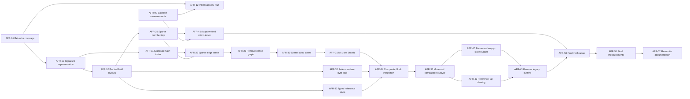

# Epic: Archetype Footprint Reduction

> Status: in progress. AFR-01, AFR-02, and AFR-10 are implemented and verified.
> AFR-11 is next.

## Related Documents

- [Archetypal implementation direction](ECS.Archetypal.md)
- [Theory and cost model](ECS.Archetypal.FootprintTheory.md)
- [AFR-01 and AFR-02 baseline](ECS.Archetypal.FootprintBaseline.md)
- [Current archetypal source](../src/AlvorKit.ECS/Archetypal/)

## Progress

| Task | Status | Implementation |
| --- | --- | --- |
| AFR-01 | Complete | Direct behavior, graph, compaction, reference-tail, and alloc-owner concurrency tests |
| AFR-02 | Complete | Isolated benchmark workers, versioned reports, and quiescent footprint diagnostics |
| AFR-10 | Complete | Four-byte cumulative signature ends and linear sorted insertion |
| AFR-11 onward | Planned | Signature hash indexing is next |

## Outcome

Replace dense arch-by-field metadata and per-active-arch arrays with sparse
catalog structures and alloc-local shared blocks while preserving the public
archetypal API and the existing ownership model.

The completed implementation should retain memory in proportion to materialized
signatures, observed transitions, active alloc-local states, and actual
component payload:

\[
O(M + S + E + R + Q + \text{payload})
\]

It must not retain an `M × N` graph or alloc-local directory, and it must not
allocate storage for unexplored signatures from the possible power set.

## Stable Public API

The epic does not change these methods:

- `GetArchetypal<T, N, A>()`
- `HasArchetypal<T, N, A>()`
- `SetArchetypal<T, N, A>(in T value)`
- `UnsetArchetypal<T, N, A>()`

Field count remains unbounded by a fixed-width signature mask.

## Invariants

### Threading

- Shared signature interning, global arch creation, and sparse-edge insertion
  remain serialized by the group catalog lock.
- One owning thread mutates one alloc's archetypal states, slabs, and free lists
  for a group.
- Different alloc owners may concurrently use the same group and global arch.
- `GetArchetypal`, `HasArchetypal`, and overwriting an existing field contain no
  lock, managed allocation, or `Volatile` operation.

### Storage

- Exact sorted signatures remain the authority for arch identity.
- Hash collisions always resolve through exact signature comparison.
- A reference-free `T` uses the shared alloc-local byte allocator.
- A reference-containing `T` uses a typed GC-visible allocator shared by fields
  with that same `T`.
- Reference-free blocks intentionally remain dirty when released.
- Reference-containing blocks are cleared before reuse.
- Dense row compaction remains swap-back and repairs the moved Ent's `loc`.

### Scope

Ent lifecycle, arena disposal, sparse page integration, and other interaction
with the rest of the Ent system remain outside this epic.

## Non-Goals

- No hard limit on fields per group.
- No fixed-width arch mask.
- No global arch-ID eviction or reuse.
- No new public query or iteration API.
- No native-memory allocator in the initial implementation.
- No general-purpose defensive validation of controlled internal states.
- No global shared allocator on alloc-local hot paths.
- No `ArrayPool<T>.Shared` replacement for active arch storage.

## Epic Acceptance Criteria

### Correctness

- All existing sparse and archetypal behavior remains unchanged through the
  public API.
- Different field-add orders intern the same exact signature.
- Forced signature-hash collisions resolve to distinct exact signatures.
- Add and remove cache both directions of a structural relationship.
- Swap-back movement preserves every retained component and repairs `loc`.
- Removing the last field exits the group without creating an empty arch.
- Reference-containing blocks retain no removed component references.
- Dirty reference-free blocks are never observable through an active row.
- Different alloc owners can use the same group concurrently.

### Footprint

- No retained group-global structure has `O(MN)` cells.
- No retained alloc-local structure has one slot for every global
  `(arch, field)` pair.
- Materializing a global arch creates no managed object when shared catalog
  arrays or pages have spare capacity.
- Activating an alloc-local state creates no managed object when suitable free
  blocks are available.
- Global object count scales with shared arrays/pages and registered fields, not
  materialized arches.
- Alloc-local object count scales with slab pages and storage classes, not
  active arch-field memberships.
- The initial row capacity is four.

### Hot Path

- `EntArchLoc` addresses an alloc-local state directly.
- Ordinary point access does not consult the signature hash index, sparse edge
  arena, or alloc `archId -> stateId` map.
- Small-signature membership uses a contiguous packed lookup.
- Wide-signature indexing is introduced only where measurement shows a win.
- Reference-free access performs direct typed reads and writes over the shared
  byte block.
- Reference-containing access performs direct typed array access over its
  shared typed block.
- Heterogeneous virtual dispatch remains outside ordinary point reads and
  writes.
- Steady-state `Get`, `Has`, and existing-field `Set` allocate zero bytes.

### Measurement

- Baseline and final results report elapsed time, steady-state allocations,
  retained bytes, object count, shared capacity slack, and slab fragmentation.
- Measurements separate catalog creation, point access, structural movement,
  block growth, and block reuse.
- Any point-access regression is either removed or recorded with an explicit
  measured footprint tradeoff before the epic is considered complete.

## Dependency Overview



## Task Summary

| ID | Task | Depends on | Primary result |
| --- | --- | --- | --- |
| AFR-01 | Direct archetypal behavior coverage | — | Refactor safety net |
| AFR-02 | Baseline benchmark and footprint harness | — | Comparable measurements |
| AFR-10 | Cumulative signature ends and sorted insertion | AFR-01 | Compact canonical signatures |
| AFR-11 | Collision-correct signature hash index | AFR-10 | Expected constant candidate lookup |
| AFR-12 | Initial row capacity four | AFR-01, AFR-02 | Lower sparse-row payload |
| AFR-20 | Packed immutable field-layout metadata | AFR-10 | Storage addressing per membership |
| AFR-21 | Sparse membership lookup | AFR-20 | Remove presence dependence on dense graph |
| AFR-22 | Shared sparse transition-edge arena | AFR-11, AFR-21 | `O(E)` transition cache |
| AFR-23 | Remove dense transition matrix | AFR-22 | Eliminate `O(MN)` graph |
| AFR-30 | Sparse alloc-local state index | AFR-23 | Alloc storage proportional to active states |
| AFR-31 | Change `loc` from `ArchId` to `StateId` | AFR-30 | Direct hot state access |
| AFR-32 | Shared reference-free byte slab | AFR-20, AFR-02 | One value allocator per alloc/group |
| AFR-33 | Typed reference-containing slabs | AFR-20, AFR-02 | GC-correct shared storage per `T` |
| AFR-34 | Composite block layout and point access | AFR-31, AFR-32, AFR-33 | Zero per-field arrays on hot path |
| AFR-35 | Move, append, remove, and compaction cutover | AFR-34 | Structural use of shared blocks |
| AFR-40 | Block reuse and bounded empty-state cache | AFR-12, AFR-35 | No object allocation on reusable activation |
| AFR-41 | Decide adaptive immutable field micro-index | AFR-02, AFR-21 | Measured wide-arch lookup policy |
| AFR-42 | Reference-tail clearing through layouts | AFR-33, AFR-35 | Clear only GC-relevant storage |
| AFR-43 | Remove legacy row and column buffers | AFR-40, AFR-42 | One storage model remains |
| AFR-50 | Concurrency, growth, and correctness gate | AFR-41, AFR-43 | Full focused verification |
| AFR-51 | Final performance and footprint report | AFR-50 | Measured epic outcome |
| AFR-52 | Reconcile implementation documentation | AFR-51 | Docs match implemented constants and shapes |

## Phase 0: Baseline and Safety Net

### AFR-01 — Direct Archetypal Behavior Coverage

Purpose: add focused tests before changing internal representations.

Deliverables:

- Test-only arch groups and fields that do not reuse demo state.
- Tests for singleton entry and exit.
- Tests for add and remove across several signature widths.
- Tests for different field-add orders interning one arch.
- Tests for inverse-edge reuse.
- Tests for first, middle, and last-row swap-back compaction.
- Tests for moved-Ent `loc` repair.
- Tests mixing value-only and reference-containing fields.
- Tests for independent groups and allocs.
- Cold concurrent signature and edge resolution from different allocs.

Acceptance:

- Tests fail against intentionally broken signature identity, copy direction,
  compaction, and reference clearing.
- Tests do not depend on private numeric arch IDs except where an internal
  catalog test explicitly owns that contract.

### AFR-02 — Baseline Benchmark and Footprint Harness

Purpose: establish the measurements used to choose thresholds and approve
tradeoffs.

Scenarios:

- `Get`, `Has`, and existing-field `Set` for `K = 1, 4, 8, 16, 32`.
- Present-field and absent-field membership.
- Missing-field `Set` with cached and unknown transitions.
- `Unset` with cached and unknown transitions.
- First, middle, and last-row movement.
- Cold creation of many unique signatures.
- Many low-occupancy arches and a few high-occupancy arches.
- Reference-free scalar, larger struct, reference type, and struct containing
  references.
- One alloc and several concurrent alloc owners.

Report:

- Nanoseconds or operations per second.
- Allocated bytes per operation.
- Retained managed bytes.
- Managed object count.
- Catalog capacity and slack.
- Row capacity slack.

Acceptance:

- The harness does not use the stress demo's boxed expected-value machinery as
  its timing loop.
- It can compare the current and final layouts with equivalent workloads.

Implementation:

- Direct coverage lives in
  [`EntArchetypalTest`](../tests/AlvorKit.ECS.Test/EntArchetypalTest.cs),
  [`EntArchCompactionTest`](../tests/AlvorKit.ECS.Test/EntArchCompactionTest.cs),
  [`EntArchGraphTest`](../tests/AlvorKit.ECS.Test/EntArchGraphTest.cs), and
  [`EntArchetypalConcurrencyTest`](../tests/AlvorKit.ECS.Test/EntArchetypalConcurrencyTest.cs).
- The existing
  [`AlvorKit.ECS.Demo.Bench`](../demos/AlvorKit.ECS.Demo.Bench/) executable now
  accepts `--suite archetypal` and runs every raw sample in a fresh child
  process. This keeps cold signatures, transitions, and persistent generic
  state isolated between samples.
- The benchmark contains separate point, cached-movement, growth,
  unknown-transition, compaction, occupancy, and alloc-owner concurrency cases.
- `EntArchDiagnostics<A>.Capture()` scans the catalog and alloc-local storage
  only after all alloc owners are quiescent. It adds no hot-path counters.
- Deterministic logical bytes and owned object counts describe archetypal
  storage. Process-wide retained-heap deltas are recorded separately as a
  secondary noisy measurement.

List the stable case IDs:

```powershell
dotnet run -c Release --project demos/AlvorKit.ECS.Demo.Bench -- --suite archetypal --list
```

Create the repeatable quick baseline:

```powershell
dotnet run -c Release --project demos/AlvorKit.ECS.Demo.Bench -- --suite archetypal --quick --label afr02-current --json out/ecs-archetypal/afr02-current-quick.json
```

## Phase 1: Compact Signature Catalog

### AFR-10 — Cumulative Signature Ends and Sorted Insertion

Purpose: reduce per-arch signature metadata and preserve canonical ordering
without a general sort.

Changes:

- Replace `(Start, Count)` with one cumulative packed-field end per arch.
- Derive start and count from consecutive ends.
- Insert a newly added field into the already sorted src signature.
- Preserve the current remove-by-prefix-and-suffix copy.

Acceptance:

- Signature metadata is four bytes per arch before shared capacity slack.
- Add resolution performs no general-purpose sort.
- Every materialized signature remains exact and sorted.

Implementation result:

- `signatureEnds[archId]` stores the cumulative packed-field end. Because real
  arch IDs and signatures are appended in the same order, the previous end is
  the current start.
- `InsertFieldId` performs one ordered scan and two span copies. No duplicate
  branch is required because add resolution is reached only for an absent
  field.
- Exact variable-width signatures, middle insertion, canonical interning, arch
  growth, and different-alloc concurrency pass all 77 ECS tests.
- Across all 47 AFR-02 cases, logical catalog bytes and estimated managed bytes
  fell by exactly `4 × ArchCapacity`; object counts and every row/component
  metric were unchanged.

Selected quick-profile comparisons:

| Case | AFR-02 logical bytes | AFR-10 logical bytes | Delta |
| --- | ---: | ---: | ---: |
| Point access at `K = 32` | 107,040 | 106,784 | -256 |
| Unknown add at `K = 8` | 412,384 | 410,336 | -2,048 |
| 128 Gray-code signatures | 211,872 | 210,848 | -1,024 |
| Four-alloc concurrent resolution | 1,328,064 | 1,323,968 | -4,096 |

The complete comparison report is generated at:

`out/ecs-archetypal/afr10-cumulative-ends-quick.json`

### AFR-11 — Collision-Correct Signature Hash Index

Purpose: replace the quadratic scan of all historical signatures.

Initial implementation:

- Hash the complete sorted signature without allocation.
- Narrow candidates through a shared hash index.
- Confirm every candidate through exact packed-signature comparison.
- Insert the new arch only after its canonical signature is stored.
- Keep all lookup and insertion under the existing catalog lock.

Acceptance:

- No array, list, or signature object is allocated per lookup.
- Forced equal-hash signatures remain distinct.
- Catalog growth preserves every index entry.
- Cold creation scales with signature work and expected hash probing rather than
  scanning all `M` existing arches.

Follow-up decision:

- Begin with the clearest shared index.
- Replace it with an arch-ID-only open-address table only if AFR-02 measurements
  show worthwhile retained-byte savings.

### AFR-12 — Initial Row Capacity Four

Purpose: reduce payload slack for low-occupancy arches.

Changes:

- Change the initial row capacity from 16 to 4.
- Preserve power-of-two growth.
- Record row slack separately from allocator fragmentation.

Acceptance:

- First activation reserves four rows in every current parallel buffer.
- Existing growth and compaction behavior remains unchanged.
- Allocation and timing effects are reported separately from catalog changes.

## Phase 2: Sparse Global Metadata

### AFR-20 — Packed Immutable Field-Layout Metadata

Purpose: give each materialized field membership the information required to
address shared blocks without allocating an object or dense arch-field cell.

Layout responsibilities:

- Identify reference-free byte storage versus typed reference storage.
- Store the byte-column prefix for a reference-free field.
- Store the type-local column ordinal for a reference-containing field.
- Expose whether the field requires reference clearing.
- Remain parallel with the canonical packed field signature.

Acceptance:

- Layout storage is `O(S)`.
- Layout entries are immutable after arch creation.
- Ordinary point access can obtain the layout from the field's local ordinal.
- No per-arch layout object is created.

### AFR-21 — Sparse Membership Lookup

Purpose: remove field-presence dependence on a dense transition cell.

Initial implementation:

- Search the exact packed signature and return the local field ordinal.
- Measure contiguous span search and binary search across the AFR-02 widths.
- Keep field lookup immutable and allocation-free.

Acceptance:

- Membership cost depends on `K`, not `N`.
- The returned ordinal directly addresses packed field-layout metadata.
- `Get`, `Has`, and existing-field `Set` no longer require a transition
  self-loop.

### AFR-22 — Shared Sparse Transition-Edge Arena

Purpose: replace one transition cell for every `(arch, field)` pair with storage
only for observed relationships.

Representation:

- One edge-head index per arch.
- Shared append-only arrays for `fieldId`, `dstArchId`, and `nextEdge`.
- Two directed entries for one resolved add/remove relationship.
- Shared capacity growth under the catalog lock.

Acceptance:

- Transition storage is `O(M + E)`, not `O(MN)`.
- Cached lookup cost depends on observed degree `D`.
- Resolving an unknown edge interns or finds the exact dst signature.
- Both directions are cached atomically with respect to catalog mutation.
- No edge-node object is created.

### AFR-23 — Remove the Dense Transition Matrix

Purpose: complete the global sparse cutover.

Changes:

- Switch structural resolution to the sparse edge arena.
- Switch membership to AFR-21.
- Remove transition self-loops, dense rows, and unused-capacity allocation.
- Remove the transition-only root representation if it no longer serves a
  separate purpose.
- Preserve `NoArchId` as the outside-group location state.

Acceptance:

- No retained group-global array has one cell per `(arch, field)` pair.
- Materializing an arch with spare shared capacity creates no managed object.
- Current public behavior and threading tests pass.

## Phase 3: Sparse Alloc States and Shared Blocks

### AFR-30 — Sparse Alloc-Local State Index

Purpose: make alloc-local metadata proportional to active or intentionally
retained states.

Representation:

- A sparse alloc-local `archId -> stateId` index.
- A dense state array.
- Recyclable state IDs.
- State metadata containing `ArchId`, `Count`, capacity/order, and block-handle
  ranges.

Acceptance:

- An alloc with no active state for an arch retains no full row/column
  directory entry for it.
- Destination lookup is expected constant time in the sparse state index.
- State mutation remains single-owner and lock-free.

### AFR-31 — Change `loc` From `ArchId` to `StateId`

Purpose: prevent the alloc-local sparse map from entering the ordinary point
path.

The three stored integers become:

- `AllocId`
- `StateId`
- `Row`

The state supplies the global `ArchId`.

Acceptance:

- `EntArchLoc` retains its existing size.
- `Get`, `Has`, and existing-field `Set` index the dense state directly.
- Structural movement uses the state index only for dst lookup.
- Swap-back repair updates `Row` while retaining the same `StateId`.

### AFR-32 — Shared Reference-Free Byte Slab

Purpose: store `EntMut` and every reference-free component type in one
alloc-local byte allocator.

Deliverables:

- Reference classification at field registration.
- Geometrically growing byte backing storage.
- Block allocate, grow, copy, and release primitives. AFR-40 adds reusable
  free-list rent and return.
- Offset-based block handles.
- Typed unaligned read, write, and copy helpers for closed generic `T`.
- The explicit policy that released reference-free storage remains dirty.

Acceptance:

- Different reference-free `T` and `N` values share the same byte backing
  allocator within the alloc/group ownership partition.
- Released reference-free blocks are not cleared.
- Every row is overwritten before `Count` exposes it.
- No active arch owns a reference-free `T[]`.

### AFR-33 — Typed Reference-Containing Slabs

Purpose: provide shared GC-visible storage for values that are or contain
references.

Deliverables:

- One typed allocator per distinct closed `T` in an alloc/group partition.
- Sharing across differently named fields `N` with the same `T`.
- Typed block allocate, grow, copy, clear, and release primitives. AFR-40 adds
  reusable free-list rent and return.
- Type-local column ordinals for multiple same-`T` fields in one arch.

Acceptance:

- The GC can observe every stored reference through typed managed arrays.
- A released block contains no references from its previous owner.
- Fields with the same `T` share one typed backing allocator. AFR-40 adds its
  reusable free lists.
- No active arch owns a dedicated reference-containing `T[]`.

### AFR-34 — Composite Block Layout and Point Access

Purpose: connect immutable field layouts with alloc-local blocks while keeping
ordinary access direct.

Reference-free state layout:

- One block containing `EntMut` and all reference-free columns.
- Column-major addressing through capacity, byte prefix, row, and element size.

Reference-containing state layout:

- One block per distinct reference-containing `T`.
- Adjacent columns for differently named fields sharing that `T`.

Hot-path requirements:

- `loc -> state -> field ordinal -> layout -> block -> row`.
- No signature hash, sparse edge lookup, alloc state-map lookup, allocator
  operation, shared lock, or virtual column operation.
- Closed generic code selects byte versus typed storage.

Acceptance:

- `Get`, `Has`, and existing-field `Set` allocate zero bytes.
- Reference-free and reference-containing point access pass behavior tests.
- AFR-02 records present and absent lookup costs for every signature width.

### AFR-35 — Move and Compaction Cutover

Purpose: replace current per-arch arrays in structural operations.

Changes:

- Append into composite blocks.
- Copy fields between src and dst layouts.
- Swap the last src row into a removed row.
- Repair the swapped Ent's `loc`.
- Clear only reference-containing src tail storage.
- Preserve dirty reference-free tail bytes.
- Update state counts only after required writes are complete.

Acceptance:

- Structural tests cover add, remove, singleton exit, first/middle/last
  compaction, reference fields, and several component sizes.
- No stale reference remains in a cleared tail.
- Dirty reference-free bytes are never observable.

## Phase 4: Reuse and Hot-Path Adaptation

### AFR-40 — Block Reuse and Bounded Empty-State Cache

Purpose: ensure repeated activation does not recreate arrays or retain
unbounded empty storage.

Changes:

- Power-of-two block size classes or equivalent exact reusable classes.
- Rent and return operations over alloc-local free lists.
- State-ID recycling.
- Empty-state retention measured by bytes rather than only state count.
- Oldest-empty release when the byte budget is exceeded.
- Separate reporting for row slack and slab fragmentation.

Acceptance:

- Reactivating an arch can reuse state and blocks without object allocation.
- The empty-state byte budget is enforced by the owning thread without locks.
- Reference-containing free blocks are clear.
- Reference-free free blocks remain dirty.

### AFR-41 — Adaptive Immutable Field Micro-Index

Purpose: retain a fast wide-arch point path without allocating an `M × N`
membership structure.

This is a measured decision task. If no tested signature width benefits from a
micro-index, record that result and keep packed lookup for every arch; the task
is complete without adding the optional table.

Decision rule:

- Keep contiguous packed lookup while it wins.
- Build an immutable ordinal table only beyond the measured width threshold.

Representation:

- Shared packed slots containing `ordinal + 1`.
- Exact confirmation through the packed field ID.
- Narrow ordinal storage where the signature width permits it.

Acceptance:

- Any threshold comes from AFR-02 measurements.
- If a table is selected, its storage is proportional to indexed memberships,
  it is immutable, and it creates no per-arch object.
- If a table is selected, wide-arch present and absent lookups improve over
  contiguous search.
- If no table is selected, the benchmark result and retained packed strategy
  are recorded.

### AFR-42 — Reference-Tail Clearing Through Layouts

Purpose: avoid heterogeneous clearing dispatch for fields that cannot retain
references.

Changes:

- Use immutable storage classification from AFR-20.
- Iterate only reference-containing storage classes during tail cleanup.
- Clear released reference blocks before reuse.
- Leave reference-free bytes dirty.

Acceptance:

- Value-only arches perform no reference-clear dispatch.
- Mixed arches clear exactly their reference-containing tail storage.
- Reference-retention tests and structural benchmarks pass.

### AFR-43 — Remove Legacy Row and Column Buffers

Purpose: leave one production storage model.

Remove or replace:

- Per-active-arch `EntMut[]` ownership.
- Per-active-membership `T[]` ownership.
- Dense alloc-by-arch row directories.
- Dense typed column arch directories.
- Obsolete resize/copy/clear operations tied to jagged arrays.

Acceptance:

- No production hot path dual-writes old and new storage.
- Source scans find no retained dense `M × N` representation.
- Builds, focused tests, and the demo pass with only shared blocks active.

## Phase 5: Final Verification and Documentation

### AFR-50 — Concurrency, Growth, and Correctness Gate

Verify:

- Forced hash collisions.
- Shared catalog growth.
- Edge-arena growth.
- Byte-slab growth and reuse.
- Typed-slab growth, clearing, and reuse.
- Sparse state-index growth and state-ID recycling.
- Cold concurrent graph resolution from different allocs.
- Warm concurrent point access from different allocs.
- All compaction positions and mixed storage classes.

Acceptance:

- Focused tests pass repeatedly.
- No managed allocation appears in steady-state point operations.
- No cross-alloc row, block, or free-list mutation is observed.

### AFR-51 — Final Performance and Footprint Report

Compare baseline and final results for every AFR-02 scenario.

Report:

- Global bytes per materialized arch.
- Bytes per active alloc-local state.
- Object count per global arch and active state.
- Signature-index capacity and load.
- Average and percentile observed edge degree `D`.
- Active row slack.
- Byte-slab and typed-slab fragmentation.
- Point-operation latency.
- Structural-operation latency.
- Cold signature creation time.

Acceptance:

- Global metadata follows `O(M + S + E)`.
- Alloc-local metadata follows active states and storage classes.
- Object creation follows shared capacity growth rather than arch
  materialization or activation.
- Any hot-path regression has an explicit measured reason and accepted
  footprint benefit.

### AFR-52 — Reconcile Implementation Documentation

Update:

- [Archetypal implementation direction](ECS.Archetypal.md)
- [Theory and cost model](ECS.Archetypal.FootprintTheory.md)
- Source design comments affected by the implemented layout

Record measured thresholds, actual layout widths, allocator page sizes,
empty-state budget, and any rejected theoretical optimization.

## Implementation Discipline

- Complete tasks in dependency order; do not combine catalog, alloc-state, and
  slab cutovers into one unreviewable change.
- Keep each intermediate state buildable and directly testable.
- Avoid production dual storage. New structures may be tested independently
  before cutover, but the hot path should have one source of truth.
- Preserve approved vocabulary: `Ent`, `loc`, `src`, `dst`, `arch`, and `alloc`.
- Keep generic parameters `T`, `N`, and `A` compact.
- Do not add defensive branches for states excluded by controlled invariants.
- Measure before adding an adaptive index, pages, native memory, or additional
  encoding complexity.

## Definition of Done

The epic is complete when all required AFR tasks are complete, the public API
is unchanged, focused verification passes, the final measurement report
demonstrates sparse retained structures, and implementation documentation
matches the code that actually shipped.
