# Epic: Archetype Footprint Reduction

> Status: in progress. AFR-01, AFR-02, AFR-10, AFR-11, AFR-12, AFR-20, AFR-21,
> AFR-22, AFR-23, and AFR-24 are implemented and verified. AFR-25 is complete:
> AFR-25A and AFR-25E were rejected, while AFR-25B, AFR-25C, and AFR-25D were
> accepted. AFR-26 remains the historical pre-cutover speed reference. AFR-27
> added bounded typed pooling. AFR-28 through AFR-31 are now implemented: flat
> row-set addressing, adaptive query discovery, sparse alloc-local row-set
> ownership, and `(RowSetId, ArchId, Row)` location semantics. AFR-37 adds a
> measured hybrid transition index for high-degree archs. Shared byte/native
> slab allocation remains deferred.

## Related Documents

- [Archetypal implementation direction](ECS.Archetypal.md)
- [Theory and cost model](ECS.Archetypal.FootprintTheory.md)
- [AFR-01 and AFR-02 baseline](ECS.Archetypal.FootprintBaseline.md)
- [Current archetypal source](../src/AlvorKit.ECS/Archetypal/)

## Progress

| Task | Status | Implementation |
| --- | --- | --- |
| AFR-01 | Complete | Direct behavior, graph, compaction, reference-tail, and alloc-owner concurrency tests |
| AFR-02 | Complete | Isolated benchmark workers, versioned reports, and quiescent footprint diagnostics |
| AFR-10 | Complete | Four-byte cumulative signature ends and linear sorted insertion |
| AFR-11 | Complete | Collision-correct arch-ID-only open-addressed signature index |
| AFR-12 | Complete | Initial row capacity four with power-of-two growth |
| AFR-20 | Complete | Four-byte packed immutable field layouts and compact field metadata |
| AFR-21 | Complete | Direct closed-generic column membership on the ordinary point path |
| AFR-22 | Complete | Twelve-byte records in one shared sparse transition-edge arena |
| AFR-23 | Complete | Dense transition matrix, root arch, and transition self-loops removed |
| AFR-24 | Complete | 64 full point callers, ten absolute stages, paired Release sweeps, and generated-code attribution |
| AFR-25A | Complete — rejected | Missing-field `Set` slow-path split reduced code size but did not improve the rotating full caller |
| AFR-25B | Complete — accepted | Single-snapshot `ValuesAt` directory access with unsigned alloc/arch bounds checks |
| AFR-25C | Complete — accepted | Typed `Unsafe.Add` for the final existing-component row load/store |
| AFR-25D | Complete — accepted | Cold field registration moved off absent and existing point access |
| AFR-25E | Complete — rejected | An internal value-type key retained canonical generic sharing |
| AFR-25 | Complete | Local point-path candidates resolved; specialized direct `EntArchLoc` remains deferred |
| AFR-26 | Complete | Current direct loc and typed column directory retained as the speed reference |
| AFR-27 | Complete | Exact typed power-of-two pools, 25% shrink hysteresis, and complete state return at zero entities |
| AFR-28 | Complete | Flat closed-generic `rowSetId -> T[]` directories replacing per-field alloc/arch directories |
| AFR-29 | Complete | Adaptive `O(min(matches, active))` query discovery with lazy membership bits |
| AFR-30 | Complete | Paged recyclable row-set metadata and one alloc-local arch-to-row-set map |
| AFR-31 | Complete — accepted | Twelve-byte `(RowSetId, ArchId, Row)` loc; point access improved while structural arch lookup stayed direct |
| AFR-37 | Complete | Linked transitions through degree eight and a shared sparse index above that threshold |
| Shared allocation | Deferred | Retain direct typed columns and reduce their retained capacity through pooling |

## Outcome

Preserve or improve existing-component `Get` and `Set` latency first, then
reduce structural-management cost, individual managed C# object allocations,
retained managed object count, and total retained footprint where doing so does
not weaken that ordinary happy path. The public archetypal API and the existing
ownership model remain stable.

The completed implementation should retain memory in proportion to materialized
signatures, observed transitions, active alloc-local states, and actual
component payload:

\[
O(M + S + E + U + R + Q + L + \text{payload})
\]

`U` is the number of observed alloc/arch row sets. `L` is measured
direct-locator capacity. The selected flat per-field locator follows row-set ID
capacity rather than the rectangular alloc-by-arch product.

The completed global graph already avoids `M × N` transition storage. Future
alloc-local storage should remain proportional to explored state where a direct
representation can meet the point-path gate. A compact flat or paged direct
locator may deliberately retain more slack than a hash or packed search when
that is required to preserve `Get` and `Set` speed.

Among representations that pass the speed gate, prefer a few large shared
buffers or pages over per-arch, per-state, per-membership, per-block, or
free-list-node arrays and objects. Reference-free payload and metadata may move
to uninitialized native allocations when that reduces GC-visible objects and
passes ownership and speed tests. Native bytes remain retained memory: moving a
payload outside the GC heap reduces managed bytes and objects, not total bytes.
Retained managed object count should therefore scale with shared page/buffer
count, registered fields, and reference-containing storage classes, not with
materialized arches, active states, memberships, blocks, or free-list entries.

## Priority Order

1. Existing-component `Get` and `Set` latency, direct addressing, and zero
   allocation are the primary objective. A repeatable regression is rejected;
   footprint savings do not compensate for slowing this path.
2. Add/remove management speed, compaction cost, managed allocation events,
   retained managed object count, managed bytes, native bytes, and total bytes
   are the second tier. Structural work may use locks, sparse-edge scans, and
   cold allocation where required by its existing ownership model.
3. Cold catalog creation, signature construction, and graph growth are the
   third tier. Optimize them after the two higher tiers unless they impose an
   unbounded correctness or memory problem.

## Stable Public API

The epic does not change these methods:

- `GetArchetypal<T, N, A>()`
- `HasArchetypal<T, N, A>()`
- `SetArchetypal<T, N, A>(in T value)`
- `UnsetArchetypal<T, N, A>()`

Field count remains unbounded by a fixed-width signature mask.

## Invariants

### Threading

- Shared signature interning, global arch creation, and sparse-edge insertion
  remain serialized by the group catalog lock.
- One owning thread mutates one alloc's archetypal states, slabs, and free lists
  for a group.
- Different alloc owners may concurrently use the same group and global arch.
- `GetArchetypal`, `HasArchetypal`, and overwriting an existing field contain no
  lock, managed allocation, or `Volatile` operation.

### Storage

- Exact sorted signatures remain the authority for arch identity.
- Hash collisions always resolve through exact signature comparison.
- A reference-free `T` may use the current direct typed column or an AFR-26
  selected alloc-local byte store.
- A reference-containing `T` always remains in typed GC-visible storage. A
  selected shared store may be shared by fields with that same `T`.
- Reference-free payload and reference-free allocator metadata may use shared
  native pages obtained with `NativeMemory.Alloc`, never
  `NativeMemory.AllocZeroed`, when the speed-passing design reduces managed
  objects. Their owner deterministically calls `NativeMemory.Free`.
- Values that are or contain references remain in large typed managed buffers
  or pages so the GC can see them; they are never copied into native byte
  storage merely to reduce object count.
- Reference-free blocks intentionally remain dirty when released.
- Reference-containing blocks are cleared before reuse.
- Dense row compaction remains swap-back and repairs the moved Ent's `loc`.

### Scope

Ent lifecycle, wiring archetypal-owner release into wider arena teardown,
sparse page integration, and other interaction with the rest of the Ent system
remain outside this epic. Any selected native store still implements and tests
its own deterministic release primitive; only the external lifecycle trigger is
out of scope.

## Non-Goals

- No hard limit on fields per group.
- No fixed-width arch mask.
- No global arch-ID eviction or reuse.
- No new public query or iteration API.
- No native storage for reference-containing values; they remain GC-visible.
- No general-purpose defensive validation of controlled internal states.
- No group-global shared store on alloc-local hot paths.
- No default `ArrayPool<T>.Shared` over-renting for active arch storage.
- No public generic constraint, group-marker conversion, or API overload is
  introduced to obtain an internal class/value-type specialization. Any proxy
  or specialization remains an implementation detail.

## Epic Acceptance Criteria

### Correctness

- All existing sparse and archetypal behavior remains unchanged through the
  public API.
- Different field-add orders intern the same exact signature.
- Forced signature-hash collisions resolve to distinct exact signatures.
- Add and remove cache both directions of a structural relationship.
- Swap-back movement preserves every retained component and repairs `loc`.
- Removing the last field exits the group without creating an empty arch.
- Reference-containing blocks retain no removed component references.
- Dirty reference-free blocks are never observable through an active row.
- Different alloc owners can use the same group concurrently.

### Primary: Existing-Component Point Path

- Existing-component `Get` and `Set` are measured and accepted before `Has`,
  absent access, structural movement, footprint, or cold catalog results are
  used to choose a representation.
- Their full caller remains `O(1)`, directly indexed from known values, and free
  of signature scans or hashes, sparse-edge or state-map lookup, locks,
  `Volatile`, virtual dispatch, and managed allocation.
- Candidate and baseline run as same-build A/B cases under the same runtime,
  tiering, PGO, warmup, and process-isolation settings.
- Every timing, attribution, generated-code, inlining, and disassembly result is
  produced from Release configuration. Debug output may diagnose a test but is
  never accepted, compared, or cited as performance evidence.
- Measurements compare concrete and generic call sites for both class and
  struct `A`, plus scalar and wide reference-free `T`, reference `T`, and
  reference-containing structs. This matrix diagnoses sharing; it does not
  require production groups to use struct `A`.
- Measurements rotate across multiple hot Ents, arches, and allocs so the JIT
  cannot turn a single-Ent loop into a hoisted or cached special case.
- Staged cases attribute `loc` retrieval, `ValuesAt`, and the final row access
  separately, while the full caller remains the acceptance result.
- Generated-code review records generic sharing or specialization, inlining,
  caller size, dependent loads, branches, and retained or eliminated bounds
  checks.
- Any repeatable regression outside the established same-build noise envelope
  rejects the candidate. There is no accepted footprint-for-latency exchange.

### Secondary: Structural Management and Footprint

- No retained group-global structure has `O(MN)` cells.
- No group-global dense `(arch, field)` matrix returns. Any alloc-local flat or
  paged direct-locator slack is measured explicitly and exists only because it
  passed the primary latency gate.
- Materializing a global arch creates no managed object when shared catalog
  arrays or pages have spare capacity.
- Activating an alloc-local state creates no managed object when suitable free
  blocks are available.
- Global object count scales with shared arrays/pages and registered fields, not
  materialized arches.
- Alloc-local object count should scale with shared pages and storage classes
  among candidates that pass the primary gate; the fallback may retain current
  direct column objects rather than accept slower addressing.
- State records, block descriptors, and free-list links are value entries in
  shared buffers or pages. The selected representation does not allocate one
  managed object or array per arch, state, membership, block, or free-list node.
- Native backing is reported separately and included in total retained bytes.
  A decrease in managed bytes or objects is not described as eliminating the
  memory when equivalent bytes moved native.
- The initial row capacity is four.
- Cached add/remove and compaction remain allocation-free where the settled
  storage model permits it, but their latency is evaluated only after the point
  gate passes.
- Footprint is compared only among candidates that satisfy the primary gate.
- Reports include managed allocation events, retained managed object count,
  managed bytes, native bytes, total bytes, shared page count, capacity slack,
  and fragmentation.

### Current Hot-Path Contract

- `EntArchLoc` is `(RowSetId, ArchId, Row)`. Point access uses `RowSetId` and
  `Row`; structural work also uses `ArchId`.
- Ordinary `Get`, `Has`, and existing-field `Set` use the closed-generic
  `EntArchColumn<T, N, A>.ValuesAt(rowSetId)` directory lookup. Presence is the
  resulting column reference being non-null, and value access is one direct row
  index into that same array.
- Ordinary point access is `O(1)` and does not consult the packed signature,
  signature hash index, sparse edge arena, alloc `archId -> rowSetId` map, or a
  membership hash table.
- Ordinary point access contains no catalog lock or `Volatile` operation.
- A future storage cutover must preserve direct field-specialized indexing and
  equal or improve the selected AFR-31 point path. Footprint reduction alone
  does not justify replacing it with a signature scan or hash lookup.
- Current reference-free and reference-containing access performs direct typed
  array reads and writes. A future byte or typed shared block is accepted only
  if its complete caller meets the same gate.
- Heterogeneous virtual dispatch remains outside ordinary point reads and
  writes.
- Steady-state `Get`, `Has`, and existing-field `Set` allocate zero bytes.

### Tertiary: Cold Catalog and Final Measurement

- Baseline and final results report elapsed time, managed allocation events,
  retained managed object count, managed bytes, native bytes, total bytes,
  shared page count, capacity slack, and slab fragmentation.
- Measurements separate catalog creation, point access, structural movement,
  block growth, and block reuse.
- Cold signature creation and graph growth remain visible in reports but do not
  select a representation over a faster existing-component point path.

## Fallback Policy

If no shared-block or sparse-state locator equals or improves the current
direct `ValuesAt` path, the production point representation remains in place.
The epic then continues with structural reuse, bounded retention, catalog
improvements, and any footprint reductions that leave existing-component
`Get` and `Set` unchanged. A flat or paged direct table with deliberate slack is
preferable to putting a hash, packed scan, or unpredictable branch chain into
every point access. The fallback reports its remaining per-arch, per-state, and
per-membership managed objects explicitly; it does not claim the secondary
object-reduction goal was achieved when the speed gate prevented that cutover.

## Dependency Overview

```mermaid
flowchart LR
    A["AFR-01 Behavior coverage"] --> C["AFR-10 Signature representation"]
    A --> D["AFR-12 Initial capacity four"]
    B["AFR-02 Baseline measurements"] --> D
    C --> E["AFR-11 Signature hash index"]
    C --> F["AFR-20 Packed field layouts"]
    F --> G["AFR-21 Direct point membership"]
    E --> H["AFR-22 Sparse edge arena"]
    G --> H
    H --> I["AFR-23 Remove dense graph and root"]
    I --> Y["AFR-24 Hot attribution and codegen"]
    B --> Y
    Y --> Z["AFR-25 Direct-address prototypes"]
    Z --> AA["AFR-26 Speed-first decision gate"]
    AA --> AB["AFR-27 Exact typed pooling"]
    AB --> AC["AFR-28 Flat row-set addressing"]
    AC --> AD["AFR-29 Adaptive query discovery"]
    AC --> J["AFR-30 Row-set catalog"]
    J --> K["AFR-31 loc-shape gate"]
    H --> AE["AFR-37 Hybrid transition index"]
    AA --> L["AFR-32 Reference-free byte slab"]
    AA --> M["AFR-33 Typed reference slabs"]
    K --> N["AFR-34 Composite block integration"]
    L --> N
    M --> N
    N --> O["AFR-35 Move and compaction cutover"]
    O --> R["AFR-42 Reference-tail clearing"]
    R --> Q["AFR-41 Immediate point-path gate"]
    Y --> Q
    Q --> S["AFR-43 Remove legacy buffers"]
    S --> P["AFR-40 Reuse and empty-state budget"]
    S --> W["AFR-36 Optional structural tuning"]
    P --> T["AFR-50 Final verification"]
    W --> T
    B --> X["AFR-51 Final MethodImpl tuning"]
    T --> X
    X --> U["AFR-52 Final measurements"]
    U --> V["AFR-53 Reconcile documentation"]
```



## Task Summary

| ID | Task | Depends on | Primary result |
| --- | --- | --- | --- |
| AFR-01 | Direct archetypal behavior coverage | — | Refactor safety net |
| AFR-02 | Baseline benchmark and footprint harness | — | Comparable measurements |
| AFR-10 | Cumulative signature ends and sorted insertion | AFR-01 | Compact canonical signatures |
| AFR-11 | Collision-correct signature hash index | AFR-10 | Expected constant candidate lookup |
| AFR-12 | Initial row capacity four | AFR-01, AFR-02 | Lower sparse-row payload |
| AFR-20 | Packed immutable field-layout metadata | AFR-10 | Storage addressing per membership |
| AFR-21 | Direct closed-generic membership | AFR-20 | `O(1)` point presence and value access without graph lookup |
| AFR-22 | Shared sparse transition-edge arena | AFR-11, AFR-21 | Twelve-byte records and an `O(E)` structural cache |
| AFR-23 | Remove dense transition matrix and root | AFR-22 | Eliminate `O(MN)` graph storage and per-arch transition objects |
| AFR-24 | Hot-path attribution and codegen baseline | AFR-02, AFR-23 | Same-build staged cost and generated-code evidence |
| AFR-25 | Direct-address prototypes | AFR-24 | Measured local and shared-storage address candidates |
| AFR-26 | Speed-first representation decision | AFR-25 | Proceed, revise, or retain current point storage |
| AFR-27 | Exact typed capacity pooling | AFR-26 | Bounded row/component retention without point-path changes |
| AFR-28 | Flat row-set column addressing | AFR-26, AFR-27 | Remove one dependent point lookup and per-field alloc/arch rectangles |
| AFR-29 | Adaptive active-row-set queries | AFR-28 | Candidate discovery proportional to the smaller relevant set |
| AFR-30 | Sparse alloc-local row-set catalog | AFR-28 | Paged metadata and recyclable IDs without one object per row set |
| AFR-31 | `loc` shape and direct-address gate | AFR-28, AFR-30 | Accept `(RowSetId, ArchId, Row)` by same-build measurement |
| AFR-32 | Shared reference-free byte slab | AFR-20, AFR-26 | Large managed/native pages without per-block objects |
| AFR-33 | Typed reference-containing slabs | AFR-20, AFR-26 | Large GC-visible typed pages shared per `T` |
| AFR-34 | Composite block layout and point integration | AFR-31, AFR-32, AFR-33 | Direct offsets into shared pages for the inactive cutover |
| AFR-35 | Move, append, remove, and compaction integration | AFR-34 | Allocation-free cached movement over shared blocks |
| AFR-42 | Reference-tail clearing integration | AFR-33, AFR-35 | Allocation-free GC-correct shared-range clearing |
| AFR-41 | Immediate direct point-path gate | AFR-24, AFR-34, AFR-35, AFR-42 | Accept or reject the integrated cutover by existing `Get`/`Set` latency |
| AFR-43 | Remove legacy row and column buffers | AFR-41 | Remove per-arch/state/membership buffer objects |
| AFR-36 | Optional type-erased structural movement | AFR-43 | Secondary add/remove tuning only when measured useful |
| AFR-37 | Hybrid transition-degree index | AFR-22, AFR-23 | Preserve low-degree lists and bound high-degree lookup constants |
| AFR-40 | Block reuse and bounded empty-state cache | AFR-43 | Index-based reuse without block or free-list-node objects |
| AFR-50 | Concurrency, growth, and correctness gate | AFR-36, AFR-40, AFR-43 | Full focused verification |
| AFR-51 | Final `MethodImplOptions` tuning | AFR-02, AFR-50 | Evidence-based annotations on settled hot paths |
| AFR-52 | Final performance and footprint report | AFR-51 | Measured epic outcome |
| AFR-53 | Reconcile implementation documentation | AFR-52 | Docs match implemented constants and shapes |

## Phase 0: Baseline and Safety Net

### AFR-01 — Direct Archetypal Behavior Coverage

Purpose: add focused tests before changing internal representations.

Deliverables:

- Test-only arch groups and fields that do not reuse demo state.
- Tests for singleton entry and exit.
- Tests for add and remove across several signature widths.
- Tests for different field-add orders interning one arch.
- Tests for inverse-edge reuse.
- Tests for first, middle, and last-row swap-back compaction.
- Tests for moved-Ent `loc` repair.
- Tests mixing value-only and reference-containing fields.
- Tests for independent groups and allocs.
- Cold concurrent signature and edge resolution from different allocs.

Acceptance:

- Tests fail against intentionally broken signature identity, copy direction,
  compaction, and reference clearing.
- Tests do not depend on private numeric arch IDs except where an internal
  catalog test explicitly owns that contract.

### AFR-02 — Baseline Benchmark and Footprint Harness

Purpose: establish the measurements used to choose thresholds and approve
tradeoffs.

Scenarios:

- `Get`, `Has`, and existing-field `Set` for `K = 1, 4, 8, 16, 32`.
- Present-field and absent-field membership.
- Missing-field `Set` with cached and unknown transitions.
- `Unset` with cached and unknown transitions.
- First, middle, and last-row movement.
- Cold creation of many unique signatures.
- Many low-occupancy arches and a few high-occupancy arches.
- Reference-free scalar, larger struct, reference type, and struct containing
  references.
- One alloc and several concurrent alloc owners.

Report:

- Nanoseconds or operations per second.
- Allocated bytes per operation.
- Retained managed bytes.
- Managed object count.
- Catalog capacity and slack.
- Owned row-set count, row-set slot capacity, and active-row-set slot capacity.
- Row and component capacity slack.

AFR-24 and AFR-26 extend the later comparison schema with managed allocation
events, native retained bytes, total retained bytes, shared page counts, and
fragmentation. Historical AFR-02 reports remain unchanged and are not treated
as evidence that unreported native bytes are zero in future designs.

Acceptance:

- The harness does not use the stress demo's boxed expected-value machinery as
  its timing loop.
- It can compare the current and final layouts with equivalent workloads.

Implementation:

- Direct coverage lives in
  [`EntArchetypalTest`](../tests/AlvorKit.ECS.Test/EntArchetypalTest.cs),
  [`EntArchCompactionTest`](../tests/AlvorKit.ECS.Test/EntArchCompactionTest.cs),
  [`EntArchGraphTest`](../tests/AlvorKit.ECS.Test/EntArchGraphTest.cs), and
  [`EntArchetypalConcurrencyTest`](../tests/AlvorKit.ECS.Test/EntArchetypalConcurrencyTest.cs).
- The existing
  [`AlvorKit.ECS.Demo.Bench`](../demos/AlvorKit.ECS.Demo.Bench/) executable now
  accepts `--suite archetypal` and runs every raw sample in a fresh child
  process. This keeps cold signatures, transitions, and persistent generic
  state isolated between samples.
- The benchmark contains separate point, cached-movement, growth,
  unknown-transition, compaction, occupancy, and alloc-owner concurrency cases.
- `EntArchDiagnostics<A>.Capture()` scans the catalog and alloc-local storage
  only after all alloc owners are quiescent. It adds no hot-path counters.
- Deterministic logical bytes and owned object counts describe archetypal
  storage. Process-wide retained-heap deltas are recorded separately as a
  secondary noisy measurement.

List the stable case IDs:

```powershell
dotnet run -c Release --project demos/AlvorKit.ECS.Demo.Bench -- --suite archetypal --list
```

Create the repeatable quick baseline:

```powershell
dotnet run -c Release --project demos/AlvorKit.ECS.Demo.Bench -- --suite archetypal --quick --label afr02-current --json out/ecs-archetypal/afr02-current-quick.json
```

## Phase 1: Compact Signature Catalog

### AFR-10 — Cumulative Signature Ends and Sorted Insertion

Purpose: reduce per-arch signature metadata and preserve canonical ordering
without a general sort.

Changes:

- Replace `(Start, Count)` with one cumulative packed-field end per arch.
- Derive start and count from consecutive ends.
- Insert a newly added field into the already sorted src signature.
- Preserve the current remove-by-prefix-and-suffix copy.

Acceptance:

- Signature metadata is four bytes per arch before shared capacity slack.
- Add resolution performs no general-purpose sort.
- Every materialized signature remains exact and sorted.

Implementation result:

- `signatureEnds[archId]` stores the cumulative packed-field end. Because real
  arch IDs and signatures are appended in the same order, the previous end is
  the current start.
- `InsertFieldId` performs one ordered scan and two span copies. No duplicate
  branch is required because add resolution is reached only for an absent
  field.
- Exact variable-width signatures, middle insertion, canonical interning, arch
  growth, and different-alloc concurrency pass all 77 ECS tests.
- Across all 47 AFR-02 cases, logical catalog bytes and estimated managed bytes
  fell by exactly `4 × ArchCapacity`; object counts and every row/component
  metric were unchanged.

Selected quick-profile comparisons:

| Case | AFR-02 logical bytes | AFR-10 logical bytes | Delta |
| --- | ---: | ---: | ---: |
| Point access at `K = 32` | 107,040 | 106,784 | -256 |
| Unknown add at `K = 8` | 412,384 | 410,336 | -2,048 |
| 128 Gray-code signatures | 211,872 | 210,848 | -1,024 |
| Four-alloc concurrent resolution | 1,328,064 | 1,323,968 | -4,096 |

The complete comparison report is generated at:

`out/ecs-archetypal/afr10-cumulative-ends-quick.json`

### AFR-11 — Collision-Correct Signature Hash Index

Purpose: replace the quadratic scan of all historical signatures.

Implementation:

- Store only arch IDs in one group-global, power-of-two `int[]`.
- Use `NoArchId`/zero as the empty slot and linear probing. Signatures are
  append-only, so deletion markers are unnecessary.
- Hash the signature length and every sorted field ID without allocation.
- Confirm every occupied candidate through exact packed-signature comparison;
  a hash is never treated as signature identity.
- Grow before exceeding 75% occupancy and recompute hashes from the immutable
  packed signatures during rehash.
- Insert a new arch only after its canonical signature and cumulative end have
  been stored.
- Keep lookup, insertion, and growth under the existing catalog lock.

Acceptance:

- No array, list, or signature object is allocated per lookup.
- Forced equal-hash signatures remain distinct.
- Catalog growth preserves every index entry.
- Cold creation scales with signature work and expected hash probing rather than
  scanning all `M` existing arches.

Implementation result:

- `ResolveAdd` and `ResolveRemove` compute the proposed signature hash once and
  reuse it if a missing signature must be created.
- Forced equal-hash signatures are distinguished by their exact packed field
  IDs. The growth test crosses the 75% threshold and then forces an unresolved
  edge to find a signature that predates the rehash.
- All 78 focused ECS tests pass. Point access and cached transitions do not
  consult the index.
- All 47 benchmark cases match the exact retained-footprint prediction. For
  `M` materialized arches and table capacity `C`, the index adds `4C` logical
  bytes, `4C + 24` estimated managed bytes on x64, and one managed array. Every
  unrelated catalog, row, and component metric is unchanged.
- `C` is the smallest power of two of at least 16 for which `M <= 0.75C`.
  Consequently, retained table payload varies from approximately 5.33 bytes
  per arch at the growth threshold to 10.67 bytes per arch immediately after
  doubling. The often-quoted 5.33-byte value is not the general retained cost.

Selected median timing comparisons:

| Case | AFR-10 | AFR-11 | Change |
| --- | ---: | ---: | ---: |
| Unknown add, `K = 8` | 8,185.94 ns/move | 2,498.44 ns/move | 3.28x faster |
| Unknown remove, `K = 8` | 9,898.44 ns/move | 2,488.28 ns/move | 3.98x faster |
| Four-alloc concurrent resolution | 16,588.28 ns/move | 1,823.83 ns/move | 9.10x faster |
| Present get, `K = 32` | 12.73 ns/op | 12.82 ns/op | Within run noise |

The AFR-11 cold-resolution values use seven isolated samples; the AFR-10 quick
baseline used three. The concurrent case is inherently noisier, but the result
is large enough to show the benefit of shortening the catalog-lock section.
Point, cached-transition, and compaction cases remain allocation-free.
Index-array growth adds cold allocations to creation cases; it does not make
lookup allocate.

A separate seven-sample unique-creation sweep measured 32.41 μs/arch at 128
arches, 17.50 μs/arch at 512, and 7.34 μs/arch at 2,048. The per-arch cost no
longer rises with catalog size; the decreasing values reflect fixed worker and
first-use costs being amortized over more creations.

Representative retained totals:

| Case | AFR-10 logical bytes | AFR-11 logical bytes | Index capacity |
| --- | ---: | ---: | ---: |
| Point access at `K = 32` | 106,784 | 107,040 | 64 |
| 128 Gray-code signatures | 210,848 | 211,872 | 256 |
| Unknown add at `K = 8` | 410,336 | 414,432 | 1,024 |
| Unknown remove at `K = 8` | 406,432 | 410,528 | 1,024 |
| Four-alloc concurrent resolution | 1,323,968 | 1,332,160 | 2,048 |

The complete comparison report is generated at:

`out/ecs-archetypal/afr11-signature-index-quick.json`

### AFR-12 — Initial Row Capacity Four

Purpose: reduce payload slack for low-occupancy arches.

Changes:

- Change the initial row capacity from 16 to 4.
- Preserve power-of-two growth.
- Record row slack separately from slab fragmentation.

Acceptance:

- First activation reserves four rows in every current parallel buffer.
- Existing growth and compaction behavior remains unchanged.
- Allocation and timing effects are reported separately from catalog changes.

Implementation result:

- `EntArchRows<A>` now starts at four rows and retains the existing doubling
  sequence: `4 -> 8 -> 16 -> 32 -> ...`.
- A focused test verifies exact row and component capacities after the first
  activation, at four rows, and across the first growth to eight. It also
  verifies retained values and row locations. All 79 ECS tests pass.
- No metric or report-schema change was needed. Existing row, Ent, and
  component slack metrics already isolate this capacity change. Shared-slab
  fragmentation does not exist until the later store tasks.
- Across all 47 benchmark cases, catalog metrics, active and used counts,
  column-directory bytes, and every managed object count are unchanged. Only
  retained row/component capacity and slack decreased.

Selected retained-footprint comparisons:

| Case | AFR-11 logical bytes | AFR-12 logical bytes | Delta |
| --- | ---: | ---: | ---: |
| Point access at `K = 8` | 23,712 | 21,216 | -2,496 |
| Point access at `K = 32` | 107,040 | 78,624 | -28,416 |
| 128 Gray-code signatures | 211,872 | 177,984 | -33,888 |
| 128 low-occupancy arches | 211,872 | 177,984 | -33,888 |
| High-occupancy setup | 53,216 | 46,928 | -6,288 |
| Unknown add at `K = 8` | 414,432 | 216,144 | -198,288 |
| Unknown remove at `K = 8` | 410,528 | 215,168 | -195,360 |
| Four-alloc concurrent resolution | 1,332,160 | 822,256 | -509,904 |

For Gray creation and low occupancy, aggregate row capacity falls from 2,048
to 512 and aggregate component capacity from 7,200 to 1,800. Both retain the
same 890 managed objects.

Point access remains unchanged: the `K = 32` present-get median is 12.82 ns in
AFR-11 and 12.83 ns in AFR-12. Cached add/remove and compaction remain at zero
allocated bytes per move, with timing differences within cross-run variation.

The dedicated growth case exposes the intended cost. Its retained footprint
falls from 51,168 to 49,584 bytes, while the added `4 -> 8` and `8 -> 16`
intermediate arrays increase measured allocation from 78.375 to 83.8125 bytes
per move. The three-sample quick median changes from 422.27 to 430.08 ns per
move. This cost applies to growth, not to steady-state access or pre-sized
movement.

The complete comparison report is generated at:

`out/ecs-archetypal/afr12-initial-capacity-four-quick.json`

## Phase 2: Sparse Global Metadata

### AFR-20 — Packed Immutable Field-Layout Metadata

Purpose: give each materialized field membership the information required to
address shared blocks without allocating an object or dense arch-field cell.

Layout responsibilities:

- Identify reference-free byte storage versus typed reference storage.
- Store the byte-column prefix for a reference-free field.
- Store the type-local column ordinal for a reference-containing field.
- Expose whether the field requires reference clearing.
- Remain parallel with the canonical packed field signature.

Acceptance:

- Layout storage is `O(S)`.
- Layout entries are immutable after arch creation.
- Ordinary point access can obtain the layout from the field's local ordinal.
- No per-arch layout object is created.

Implementation result:

- `packedFieldLayouts` is parallel to `packedFieldIds` over the same cumulative
  signature ranges. It starts empty and grows independently to the smallest
  power of two that covers the current membership count, avoiding a 16 KiB
  layout allocation in small groups merely because the older field-ID array
  starts at 4,096 entries.
- `EntArchFieldLayout` is exactly four bytes. A nonnegative encoded value is a
  reference-free byte prefix. A negative value is the bitwise complement of a
  reference-containing type-local column. The sign therefore also supplies the
  clearing classification without a second flag or sentinel value.
- Reference-free prefixes begin after `EntMut` and advance only by the byte
  widths of earlier reference-free fields. Reference-containing memberships do
  not advance the planned byte-slab prefix.
- Field registration records an eight-byte `(ByteWidth, StorageClassId)` value.
  Storage class zero names shared byte storage; each exact reference-containing
  `T` receives one positive class ID shared by every `N` in the same group `A`.
  This is `O(N)` field metadata rather than duplicated `O(S)` metadata.
- Cold layout compilation obtains a typed column by counting earlier fields
  with the same positive storage class. That is allocation-free and quadratic
  only in a new signature's reference-containing memberships. A reusable count
  table can make it linear later without changing retained metadata if wide,
  reference-heavy creation measures poorly.
- The existing dense `EntArchColumnOps[]` remains separate. Structural
  copy/clear/resize therefore keeps its previous eight-byte ops-directory
  stride while AFR-20 metadata is touched only during cold arch creation.
- Layouts are completely written before the signature end, hash-index entry,
  or transition publishes the new arch. No lock, `Volatile` read, or managed
  allocation was added to ordinary point access.

For `N` registered fields, field-directory capacity `F`, `S` used signature
memberships, and layout capacity `H`, AFR-20 adds:

\[
\begin{aligned}
\text{logical retained} &= 8F + 4H \\
\text{logical used} &= 8(N + 1) + 4S \\
\text{logical slack} &= 8(F - N - 1) + 4(H - S)
\end{aligned}
\]

The extra `1` is the reserved field-ID slot. For a materialized catalog on
x64, the estimated managed increase is `8F + align8(4H) + 48` bytes: the two
payloads plus two array headers. There are two additional group-global managed
arrays and still no object per arch. All 47 AFR-12 comparisons match these
formulas exactly; every row, component, alloc-state, and storage-object metric
is unchanged.

Representative retained deltas:

| Case | `F` | `S` | `H` | Logical delta | Estimated managed delta |
| --- | ---: | ---: | ---: | ---: | ---: |
| Present get, `K = 1` | 16 | 1 | 1 | +132 B | +184 B |
| Present get, `K = 8` | 16 | 36 | 64 | +384 B | +432 B |
| Present get, `K = 32` | 64 | 528 | 1,024 | +4,608 B | +4,656 B |
| 128 Gray-code signatures | 64 | 450 | 512 | +2,560 B | +2,608 B |
| Unknown add, `K = 8` | 16 | 3,249 | 4,096 | +16,512 B | +16,560 B |
| Four-alloc concurrent resolution | 16 | 6,200 | 8,192 | +32,896 B | +32,944 B |

All 25 ordinary point cases and all six value-shape cases remain at zero
allocated bytes per operation. Their quick-profile medians range from 2.7%
faster to 0.7% slower than AFR-12, which is run variation around unchanged
code. Cached structural cases also remain allocation-free. Layout-array growth
is intentionally a cold catalog allocation: the 128-signature Gray and
low-occupancy cases allocate 4,304 additional bytes in total, while unknown
add/remove incur no extra timed allocation when existing layout capacity is
sufficient. The seven-sample cold sweep measures 33.07 microseconds per Gray
arch against the 32.98 microsecond AFR-12 quick median; concurrent cold
resolution remains noisier and is not used to claim a speed change.

Focused tests verify the four-byte representation, mixed byte widths,
reference types, reference-containing structs, same-`T`/different-`N` typed
columns, canonical add order, catalog growth, and concurrent publication. All
80 ECS tests pass.

The complete reports are generated at:

- `out/ecs-archetypal/afr20-packed-field-layouts-quick.json`
- `out/ecs-archetypal/afr20-packed-field-layouts-cold.json`

### AFR-21 — Direct Closed-Generic Membership

Purpose: remove field-presence dependence on a dense transition cell.

Implementation result:

- Ordinary point access does not search the signature at all.
  `EntArchColumn<T, N, A>.ValuesAt(rowSetId)` uses the closed generic field to
  index its flat row-set directory directly and returns the active `T[]`, or
  null when the field is absent.
- `Get` loads that column once and indexes `values[loc.Row]`. `Has` is the null
  check. Existing-field `Set` writes the same row and returns before any
  structural logic. These paths are `O(1)` and independent of signature width.
- The exact packed signature remains the authority for arch identity and
  structural layout. In production, its `IndexOf` search is now confined to
  construction of an uncached removal signature. The public removal path has
  already established presence through `ValuesAt`, and a cached removal does
  not scan the signature.
- No transition self-loop, signature hash, ordinal hash, sparse edge, catalog
  lock, virtual column operation, or `Volatile` access occurs in ordinary
  `Get`, `Has`, or existing-field `Set`.

#### Rejected ordinal-hash experiment

The benchmark compared contiguous `IndexOf`, binary search, a compact immutable
ordinal hash, and an ideal direct-index lower bound at `K = 1, 4, 8, 16, 32`.
The ordinal hash looked inexpensive as an isolated lookup kernel, but inserting
it into the real caller approximately doubled end-to-end point latency for
`K >= 4`. That constant cost is unacceptable on the dominant happy path, even
though the algorithm is expected constant time. The production prototype was
removed; the benchmark case remains as evidence for the rejected design.

The accepted design instead uses direct closed-generic column indexing. Across
seven isolated samples, the schema-5 generic benchmark-harness medians are:

| Width | Present `Get` | Present `Has` | Existing `Set` |
| ---: | ---: | ---: | ---: |
| `K = 1` | 8.75 ns | 8.50 ns | 9.70 ns |
| `K = 4` | 8.83 ns | 8.49 ns | 9.71 ns |
| `K = 8` | 8.72 ns | 8.46 ns | 9.73 ns |
| `K = 16` | 8.74 ns | 8.48 ns | 9.69 ns |
| `K = 32` | 8.78 ns | 8.48 ns | 9.68 ns |

The ranges are 8.716–8.826 ns for present `Get`, 8.461–8.500 ns for present
`Has`, and 9.682–9.729 ns for existing `Set`. Every case allocates zero bytes
per operation and the absence of a width trend confirms that no `K`-dependent
lookup remains. Against the AFR-20 quick medians, the ranges are approximately
30.4–31.9% faster for `Get`, 21.8–22.4% faster for `Has`, and 25.7–26.8% faster
for existing `Set`. These reports compare representations consistently, but
AFR-24 does not treat their absolute values as production-call latency because
the harness carries `A` through a generic call site.

### AFR-22 — Shared Sparse Transition-Edge Arena

Purpose: replace one transition cell for every `(arch, field)` pair with storage
only for observed relationships.

Implementation result:

- `edgeHeads` is one `int[A]` directory indexed by arch ID. Each nonzero entry
  is the first record in one linked adjacency list.
- The shared append-only `EntArchEdge[]` arena stores
  `(FieldId, DstArchId, NextEdgeIndex)` as one 12-byte value record. Index zero
  is reserved as `NoEdgeIndex`; no edge-node object is created.
- Resolving one non-singleton add/remove relationship appends two directed
  records. A cached structural lookup walks only the observed degree `D` of the
  src arch, so retained transition storage is `O(A + E)` rather than `O(AF)`.
- Singleton entry uses a separate direct `int[F]` directory. Singleton removal
  returns to `NoArchId` without storing an edge to an empty arch. This keeps the
  common outside-group transition direct while avoiding a root adjacency list.
- Unknown resolution is serialized by the existing catalog lock. It rechecks
  the edge after acquiring the lock, interns or finds the exact dst signature,
  fills both edge records, and then publishes their heads.

Only structural publication needs acquire/release operations. Readers use an
acquire read of a singleton or edge head; creators initialize the immutable
arch or edge data before the corresponding release write. Ordinary point
access never reads either directory and therefore pays no `Volatile` cost.
Arena, head, and singleton capacity growth is group-global and occurs only
under the catalog lock.

Focused coverage verifies the 12-byte record size, bidirectional edge reuse,
arena growth, even directed-edge counts, direct singleton publication, field
growth without edge creation, and concurrent cold publication from different
alloc owners.

### AFR-23 — Remove the Dense Transition Matrix

Purpose: complete the global sparse cutover.

Implementation result:

- The dense jagged transition matrix, its per-arch row arrays, and every
  membership self-loop are gone. `TransitionCellCapacity` remains in schema 5
  as a migration guard and reports zero.
- The transition-only root arch is gone. `NoArchId = 0` still means outside the
  group, while the first real arch now uses `FirstArchId = 1`. There is no
  materialized empty signature.
- Arch growth resizes cumulative signature ends and `edgeHeads`; field growth
  resizes field metadata and the singleton directory. Neither operation loops
  over the other dimension or creates an object per arch.
- Unknown add/remove signature construction now takes a span from one
  graph-owned, power-of-two `signatureScratch` array while holding the catalog
  lock. This replaces unbounded `stackalloc` for an intentionally unbounded
  field count. The scratch array grows only on cold structural resolution, has
  no durable entries, and is reported entirely as catalog slack.
- Materializing an arch creates no managed object while the shared packed
  signature, layout, signature-index, arch, edge, and scratch capacities have
  room.

#### Exact retained-footprint change

Let `A` be equal arch-directory capacity in both representations, `F` equal
field-directory capacity including the reserved field slot, `Ce` the new edge
arena capacity in 12-byte records, and `C` the new scratch capacity in `int`
entries. At those equal capacities, the logical catalog-payload delta from
AFR-20 is exactly:

\[
\Delta_{logical} = -4A - 8AF + 12Ce + 4F + 4C
\]

The terms are the new `4A` edge heads replacing an `8A` outer reference array,
removal of the `8AF` dense transition cells, and addition of the 12-byte edge
arena, four-byte singleton directory, and four-byte scratch entries. The
scratch contribution is retained capacity only; its used logical length is
zero.

On x64, when `Ce > 0` and `C > 0`, all four new arrays are owned objects. The
managed estimate and catalog-object deltas are then:

\[
\begin{aligned}
\Delta_{managed} &= 72 - 28A - 8AF + 12Ce + 4F + 4C \\
\Delta_{objects} &= 3 - A
\end{aligned}
\]

The object equation compares four new shared arrays with the old outer array
plus `A` dense row arrays. The managed equation adds their 24-byte x64 array
headers to the logical equation. When the edge arena or scratch is still empty,
its shared empty array is not an owned object, so the schema-5 diagnostics give
the exact lower header and object count. Actual before/after totals can also
cross a power-of-two capacity boundary because removing the root changes when
arch capacity grows; the equations deliberately isolate the representation
change at equal capacities.

The final comparable quick report shows the expected benefit for sparse
exploration:

| Scenario | AFR-20 logical retained | AFR-23 logical retained | Delta |
| --- | ---: | ---: | ---: |
| Present point access, `K = 1` | 19,444 B | 17,396 B | -2,048 B |
| Present point access, `K = 8` | 21,600 B | 19,776 B | -1,824 B |
| Present point access, `K = 32` | 83,232 B | 51,360 B | -31,872 B |
| Unknown add, `K = 8` | 232,656 B | 177,488 B | -55,168 B |
| 128 Gray-code signatures | 180,544 B | 51,808 B | -128,736 B |
| 128 low-occupancy arches | 180,544 B | 51,808 B | -128,736 B |
| Four-alloc concurrent resolution | 855,152 B | 744,688 B | -110,464 B |

This cutover intentionally trades dense constant-time structural cells for an
`O(D)` linked scan of observed edges. Add, remove, and arch construction are
structural operations; the ordinary no-add/no-remove path remains direct and
`O(1)`. The arena can approach dense storage only if the program actually
observes a dense set of transitions, while the expected sparse exploration of
the signature power set retains only those relationships that occurred.

#### Reports and verification

The schema-5 reports are:

- `out/ecs-archetypal/afr21-23-direct-column-final.json` — seven-sample point
  sweep for all five widths.
- `out/ecs-archetypal/afr21-23-structural-final.json` — seven-sample value-shape
  and structural sweep.
- `out/ecs-archetypal/afr21-23-sparse-global-final-quick.json` — full comparable
  quick profile and retained-footprint results.

The rejected lookup evidence remains in
`out/ecs-archetypal/afr21-membership-kernels-with-hash.json` and
`out/ecs-archetypal/afr21-23-sparse-global-quick.json`. Focused graph, public
behavior, compaction, reference-tail, and concurrent alloc-owner tests pass
with no public API change.

## Phase 3: Hot-Path Attribution and Decision Gates

### AFR-24 — Hot-Path Attribution and Codegen Baseline

Status: complete. AFR-24 changed the benchmark surface and documentation, not
production archetypal behavior or representation.

Purpose: explain the existing-component `Get` and `Set` cost before changing
the state, `loc`, or storage representation. The earlier 8.72 ns `Get` and
9.73 ns `Set` results remain useful historical generic-harness measurements,
but they are not the production-call baseline.

#### Measurement Shape

The opt-in AFR-24 catalog contains 74 cases while the default archetypal
catalog remains exactly 47:

- 64 complete public callers: four value shapes × `Get`/`Set` ×
  concrete/generic-in-`A` call site × sealed-class/readonly-struct `A` ×
  one/1,024-Ent working set.
- Four changing-Ent `loc` stages and four supplied-changing-`loc`
  `ValuesAt(...).Length` stages across the same call-site and `A` shapes.
- Two final-row stages with supplied changing column references and rows.

The 64 full cases use 48 named `NoInlining` benchmark kernels. Concrete kernels
hardcode `T`, `N`, and the exact `A`; generic kernels are generic only in
unconstrained `A`. The public ECS methods remain eligible for inlining inside
those kernels. Delegates are invoked once around the timed loop, and the loops
contain no allocation, boxing, interface dispatch, `Volatile`, or artificial
anti-hoisting operation.

The rotating fixture is deliberately larger than one sparse page:

| Workload | Ents | Allocs/pages | Active arches | Active states | Rows/state | Role |
| --- | ---: | ---: | ---: | ---: | ---: | --- |
| One Ent | 1 | 1 | 1 | 1 | 1 | Loop-invariance diagnostic |
| Rotating scalar | 1,024 | 4 | 16 | 64 | 16 | Acceptance workload |
| Rotating other shapes | 1,024 | 4 | 16 | 64 | 16 | Acceptance workload |

Ents are interleaved with `alloc = i & 3` and
`signature = (i >> 2) & 15`. The loop therefore changes alloc/page on every
operation and arch every four operations. Scalar setup materializes 16 arches.
Other shapes materialize one target singleton plus the same 16 target-bearing
signatures, or 17 arches total; mask-only arches are not retained. A pre-timing
fixture check verifies four distinct alloc IDs, four Ent pages, 16 active arch
IDs, 64 alloc/arch pairs, and nonzero target values. One thread owns all four
allocs, so this remains inside the alloc-owner threading contract.

#### Release Artifacts and Environment

The primary baseline used the already-built Release DLL under .NET 10.0.9 on
Windows 10.0.26200, x64, workstation GC, 32 reported logical processors, and a
10 MHz `Stopwatch` frequency. `ReadyToRun` was disabled; tiered compilation,
quick JIT for loops, and dynamic PGO were enabled. Each case ran in a fresh
worker process for 5,000,000 operations, ten warmup bodies, and seven measured
samples. Sweep B reversed the 64-case order from sweep A.

Primary timing artifacts:

- `out/ecs-archetypal/afr24-hot-path-report.md`
- `out/ecs-archetypal/afr24-hot-path-steady-a.json`
- `out/ecs-archetypal/afr24-hot-path-steady-b.json`
- `out/ecs-archetypal/afr24-hot-stage-steady-a.json`
- `out/ecs-archetypal/afr24-hot-stage-steady-b.json`

The earlier three-warmup sweeps are retained separately as tier-settling
evidence in `afr24-hot-path-sweep-a.json` and
`afr24-hot-path-sweep-b.json`. Release disassembly and its paired, non-timing
worker results are under `out/ecs-archetypal/afr24-codegen/`. JIT-logging runs
are not latency evidence.

In every timing report, `A/B` means the independent sweep-A and sweep-B median
in nanoseconds per operation.

#### Full-Caller Results

##### Rotating Acceptance Matrix

| Value | Op | Concrete class A/B | Concrete struct A/B | Generic class A/B | Generic struct A/B |
| --- | --- | ---: | ---: | ---: | ---: |
| Scalar | Get | 1.955 / 1.934 | 1.957 / 1.940 | 6.026 / 6.053 | 1.936 / 1.943 |
| Scalar | Set | 1.913 / 1.916 | 1.921 / 1.939 | 6.275 / 6.278 | 1.917 / 1.923 |
| Wide reference-free | Get | 2.054 / 2.061 | 2.059 / 2.094 | 6.048 / 6.034 | 2.077 / 2.067 |
| Wide reference-free | Set | 2.462 / 2.425 | 2.430 / 2.458 | 6.826 / 6.744 | 2.418 / 2.424 |
| Reference | Get | 2.127 / 2.124 | 2.113 / 2.142 | 6.154 / 6.212 | 2.113 / 2.118 |
| Reference | Set | 2.496 / 2.477 | 2.392 / 2.393 | 6.728 / 6.774 | 2.394 / 2.409 |
| Reference-containing struct | Get | 2.156 / 2.133 | 2.134 / 2.133 | 6.156 / 6.152 | 2.133 / 2.142 |
| Reference-containing struct | Set | 3.648 / 3.664 | 3.688 / 3.691 | 8.122 / 8.086 | 3.710 / 3.725 |

All 64 full callers measured 0 managed B/op. Across the 32 rotating medians,
the median absolute sweep-to-sweep change was 0.44% and the maximum was 1.73%.
The generic-class/concrete-class ratio was 2.86–3.13x for `Get` and 2.21–3.28x
for `Set`, depending on value shape and sweep. Generic-struct and
concrete-struct results stayed within approximately 0.99–1.01x. Concrete class
and concrete struct results were generally within 4.1%, with no marker shape
winning every case.

The result is a call-site specialization result, not a reason to require struct
group markers. A concrete sealed-class caller and a value-type-specialized
generic caller both reach the direct path. A method that remains generic in a
reference-type `A` uses canonical shared code and retains generic-context/static
addressing work.

##### Single-Ent Diagnostic Matrix

| Value | Op | Concrete class A/B | Concrete struct A/B | Generic class A/B | Generic struct A/B |
| --- | --- | ---: | ---: | ---: | ---: |
| Scalar | Get | 1.782 / 1.785 | 1.757 / 1.760 | 5.734 / 5.748 | 1.776 / 1.759 |
| Scalar | Set | 2.110 / 2.125 | 2.149 / 2.159 | 6.368 / 6.320 | 1.925 / 1.923 |
| Wide reference-free | Get | 1.797 / 1.808 | 1.800 / 1.794 | 5.721 / 5.750 | 1.786 / 1.797 |
| Wide reference-free | Set | 2.767 / 2.500 | 2.478 / 2.535 | 6.587 / 6.540 | 2.386 / 2.212 |
| Reference | Get | 1.849 / 1.867 | 1.848 / 1.858 | 5.891 / 5.963 | 1.858 / 1.860 |
| Reference | Set | 2.666 / 2.689 | 2.762 / 2.780 | 6.741 / 6.732 | 2.600 / 2.586 |
| Reference-containing struct | Get | 1.889 / 1.894 | 1.888 / 1.896 | 5.894 / 6.011 | 1.905 / 1.884 |
| Reference-containing struct | Set | 3.828 / 3.827 | 3.869 / 3.856 | 7.861 / 8.121 | 3.610 / 3.569 |

Across all 64 cells, including these diagnostic cases, the median absolute
repeat change was 0.52%. The 9.67% maximum came from the single-Ent wide
concrete-class `Set`; the rotating counterpart differed by only 1.52%. The
single-Ent caller removes the changing Ent-array load and mask, but Release
disassembly still performs the liveness, `loc`, directory, and row work inside
the loop. No result relies on an artificially opaque or volatile load. Storage
decisions therefore use the rotating table, not this diagnostic table.

#### Absolute Stage Attribution

These are separate absolute kernels. They must not be subtracted from the full
caller, added together, or interpreted as algebraic components: each has its
own supplied inputs, loop control, register allocation, inlining context, and
bounds-check opportunities.

| Stage | Call shape | A shape | Sweep A | Sweep B | Supplied input |
| --- | --- | --- | ---: | ---: | --- |
| `loc` | Concrete | Class | 1.179 | 1.164 | Changing Ent |
| `loc` | Concrete | Struct | 1.163 | 1.159 | Changing Ent |
| `loc` | Generic | Class | 2.537 | 2.540 | Changing Ent |
| `loc` | Generic | Struct | 1.168 | 1.176 | Changing Ent |
| `ValuesAt` directory | Concrete | Class | 0.724 | 0.717 | Changing cached `loc` |
| `ValuesAt` directory | Concrete | Struct | 0.717 | 0.714 | Changing cached `loc` |
| `ValuesAt` directory | Generic | Class | 2.224 | 2.224 | Changing cached `loc` |
| `ValuesAt` directory | Generic | Struct | 0.718 | 0.720 | Changing cached `loc` |
| Final row Get | — | — | 0.329 | 0.333 | Changing column and row |
| Final row Set | — | — | 0.297 | 0.297 | Changing column and row |

The stages reinforce the full-caller result: canonical generic-class context
adds cost to both sparse `loc` access and column-static resolution, while
concrete class and specialized struct forms coincide. They do not justify
putting a stage-specific cache or lookup into the public caller by themselves.

#### Tier-Settling Evidence

The first paired sweeps used three warmups and exposed two generic-class `Get`
modes across fresh workers: approximately 5.7–6.4 ns and 13.0–13.6 ns. Changing
case order did not remove the split. The associated generic-class stages were
4.408/4.415 ns for `loc` and 8.365/8.323 ns for `ValuesAt`.

Ten warmups made all eight generic-class `Get` cells unimodal and produced the
5.734–6.212 ns steady medians in the full matrix. The generic-class stage
medians settled to 2.537/2.540 ns and 2.224/2.224 ns. Release disassembly shows
the out-of-line canonical `ValuesAt` moving from 172-byte Tier0 through a
247-byte instrumented version to a 111-byte Tier1 version. `Set` was already
stable with three warmups and did not materially move at ten.

The three-warmup reports are not discarded: they document a real fresh-process
tiering transition. The architectural baseline uses the ten-warmup paired
results so a race in helper promotion is not mistaken for storage cost. Final
`MethodImplOptions` tuning remains AFR-51 work after the representation settles.

#### Generated-Code Evidence

The following sizes are for the complete rotating scalar benchmark kernel,
including loop and final checksum. They compare like-shaped callers; they are
not the isolated public-method size. Tier1-OSR used synthesized PGO under the
timing runtime. FullOpts is a separate Release control with tiering disabled.

| Op | Call shape | A shape | Tier1-OSR bytes | FullOpts bytes | Point-path code shape |
| --- | --- | --- | ---: | ---: | --- |
| Get | Concrete | Class | 393 | 359 | Public API and `ValuesAt` inline; exact static bases |
| Get | Concrete | Struct | 393 | 359 | Same specialized direct code |
| Get | Generic | Class | 617 | 542 | Public API inline; `ValuesAt` call and generic-context helpers remain |
| Get | Generic | Struct | 393 | 359 | Value-type specialization matches concrete code |
| Set | Concrete | Class | 6,344 | 1,568 | Existing-field fast branch direct; structural slow path remains in caller |
| Set | Concrete | Struct | 6,273 | 1,487 | Existing-field fast branch direct; structural slow path remains in caller |
| Set | Generic | Class | 5,834 | 2,266 | Generic helpers plus structural slow path remain |
| Set | Generic | Struct | 5,667 | 1,354 | Specialized fast branch, structural slow path remains |

No rotating kernel retains a call to `GetArchetypal` or `SetArchetypal`. The
generic-class `Get` Tier1-OSR caller retains one `ValuesAt` call, five
runtime-handle helper sites, and one GC-static-base helper site. Concrete class
and generic struct inline the directory access and have the same 393-byte code
size. Their sole range-failure target is shared by the controlled bounds
guards.

The existing-field `Set` fast branch is direct indexing in the hot loop, which
explains why concrete and specialized rotating Set remain fast. Nevertheless,
the same compiled method also contains missing-field work for singleton
resolution, `ResolveAdd`, `Append`/`Move`, page or directory growth, sparse loc
writeback, locking, allocation, and exceptional paths. The formal capture
therefore replaces the earlier approximate 2,104-byte observation: depending
on call shape, the default Tier1-OSR benchmark caller is 5,667–6,344 bytes.

Single-Ent scalar `Get` was 362 bytes versus 393 bytes for rotating concrete
class code and 621 versus 617 bytes for generic class code. The fixed caller
eliminates rotating Ent selection, but it does not hoist away the complete
`loc` and value lookup. Its lower latency is still diagnostic rather than a
storage decision.

#### AFR-25 Handoff

AFR-24 makes no class-to-struct public marker recommendation and selects no new
storage or `loc` representation. It handed off the following smallest local
code-shape test as AFR-25A:

> Extract the missing-field structural portion of `SetArchetypal` into a
> private `NoInlining` helper, leaving the existing-column check and write in
> the small public hot caller.

The prototype preserved public behavior and the alloc-owner threading model and
ran as a same-build selectable candidate across all 32 Set cells. It was
rejected because the much smaller generated caller did not produce a repeatable
rotating win. The production and demo scaffolding were removed. AFR-25B then
improved the current `ValuesAt` directory path without changing its storage
shape, and AFR-25C removed the final row bounds check with a typed managed-byref
access. Specialized direct `EntArchLoc` storage remains explicitly deferred;
shared storage and public marker changes remain unapproved by isolated-stage
evidence.

### AFR-25 — Direct-Address Prototypes

Purpose: find the fastest complete existing-component address sequence before
committing to sparse states or shared blocks.

Status: complete. AFR-25A and AFR-25E were rejected. AFR-25B, AFR-25C, and
AFR-25D were accepted. Specialized direct `EntArchLoc` storage remains
explicitly deferred.

#### AFR-25A — `SetArchetypal` Slow-Path Split

AFR-25A extracted the missing-field structural branch behind a private
`NoInlining` helper while retaining the existing-column check and write in the
hot caller. The public `SetArchetypal(in T)` signature, behavior, storage, and
threading model remained unchanged. The candidate and original production body
were selectable in the same Release binary so runtime, tiering, PGO, fixture,
and process isolation were identical.

The initial helper accepted its cold value parameter as `in T`. Release
disassembly showed that this made the benchmark loop counter address-exposed
and introduced stack reloads in the hot loop. Its candidate-minus-baseline
rotating aggregate medians were +0.13% and +0.51% in the paired sweeps, while
individual scalar cells repeatedly regressed by 7.45–11.02%. This version was
not a valid way to realize the intended small caller.

Changing only the private cold helper parameter to by-value removed that spill;
the public API remained `in T`. It also reduced the Tier1-OSR scalar rotating
candidate callers substantially in the same binary:

| Call shape | A shape | Baseline bytes | Candidate bytes |
| --- | --- | ---: | ---: |
| Concrete | Class | 5,389 | 725 |
| Concrete | Struct | 5,343 | 709 |
| Generic | Class | 4,623 | 1,114 |
| Generic | Struct | 4,476 | 709 |

The refined candidate still failed the latency gate. Its rotating aggregate
medians were -0.66% and +0.07% across the paired sweeps, inside the established
noise envelope and inconsistent in sign. More importantly, the repeat scalar
exact/specialized cells regressed by 1.90–4.49% in one sweep and 2.10–3.30% in
the other. All candidate and baseline cases allocated zero managed bytes and
reported no collections. Generated-code inspection also found one extra Ent
version reload in the candidate's hot loop.

AFR-25A is therefore rejected. Reducing the compiled caller by several
kilobytes is useful attribution, but code size is not an acceptance result and
does not offset a repeatable full-caller regression. The candidate helper,
production branch, benchmark cases, and demo dispatch scaffolding were removed;
production remains on the original single `SetArchetypal` implementation.

Release evidence is retained under:

- `out/ecs-archetypal/afr25a-set-split-report.md`
- `out/ecs-archetypal/afr25a-set-split-ab-a.json`
- `out/ecs-archetypal/afr25a-set-split-ab-b.json`
- `out/ecs-archetypal/afr25a-set-split-byvalue-rotating-a.json`
- `out/ecs-archetypal/afr25a-set-split-byvalue-rotating-b.json`
- `out/ecs-archetypal/afr25a-codegen/`

#### AFR-25B — `ValuesAt` Directory Simplification

AFR-25B retained the closed-generic directory representation and changed only
how `ValuesAt(allocId, archId)` reads it. The method now snapshots the outer
`Values` directory once, validates the alloc and arch indices with unsigned
bounds checks, and returns the selected slot. Arch zero means the Ent is
outside the group; its directory slot is intentionally null. That invariant makes the previous
explicit `archId == 0` branch unnecessary. The unsigned checks also express the
controlled nonnegative-index contract while removing redundant implicit array
bounds checks. The point path still performs no locking or `Volatile` access.

A same-build A/A scalar control established that the harness was not inventing
the result: its two aggregate candidate-minus-baseline medians were +0.24% and
-0.13%, and every cell stayed within the ±1.75% noise band. The full Release A
sweep then ran all 32 `Get`/existing-field `Set` cells for 5,000,000 operations,
ten warmup bodies, and seven isolated samples. Candidate-minus-baseline medians
were:

| Scope | Median change |
| --- | ---: |
| All 32 cells | -5.60% |
| All `Get` cells | -5.89% |
| All `Set` cells | -4.28% |

Twenty-nine of 32 cells improved beyond the ±1.75% band, none regressed, and
every case reported zero managed bytes per operation and no collections. After
the user requested a shorter iteration loop, a reverse scalar exact/specialized
check used 1,000,000 operations, ten warmup bodies, and three isolated samples. Those
cells confirmed improvements from -6.56% through -9.46%. Generic-class callers
need the longer 5,000,000-operation run to settle; a focused three-sample check
at that length still improved `Get` by 2.76% and `Set` by 2.17%.

Release generated code moved in the same direction. The exact scalar `Get`
caller shrank from 393 to 364 Tier1-OSR bytes and from 359 to 343 FullOpts bytes.
The out-of-line generic `ValuesAt` helper shrank from 111 to 91 Tier1 bytes and
from 111 to 90 FullOpts bytes. Complete scalar rotating `Set` callers changed as
follows:

| Call shape | A shape | Tier1-OSR bytes | FullOpts bytes |
| --- | --- | ---: | ---: |
| Concrete | Class | 5,389 → 5,359 | 1,568 → 1,539 |
| Concrete | Struct | 5,343 → 5,322 | 1,487 → 1,467 |
| Generic | Class | 4,623 → 4,623 | 2,266 → 2,266 |
| Generic | Struct | 4,476 → 4,440 | 1,354 → 1,334 |

AFR-25B is accepted. The temporary same-build candidate and benchmark dispatch
were removed, and the simplified `ValuesAt` implementation is now the sole
production path. Evidence is retained under:

- `out/ecs-archetypal/afr25b-values-snapshot-report.md`
- `out/ecs-archetypal/afr25b-values-snapshot-aa-scalar-a.json`
- `out/ecs-archetypal/afr25b-values-snapshot-aa-scalar-b.json`
- `out/ecs-archetypal/afr25b-values-snapshot-ab-a.json`
- `out/ecs-archetypal/afr25b-values-snapshot-quick-scalar-b.json`
- `out/ecs-archetypal/afr25b-values-snapshot-quick-generic-class-b.json`
- `out/ecs-archetypal/afr25b-public-scalar-exact.json`
- `out/ecs-archetypal/afr25b-public-scalar-generic-class.json`
- `out/ecs-archetypal/afr25b-codegen/`

#### AFR-25C — Typed `Unsafe.Add` Row Access

AFR-25C changed only the last existing-component row access after `ValuesAt`
has returned a non-null typed column. `GetArchetypal` now loads through a typed
managed byref, and the existing-field branch of `SetArchetypal` stores through
the same form:

```csharp
return Unsafe.Add(
    ref MemoryMarshal.GetArrayDataReference(values),
    loc.Row);
```

```csharp
Unsafe.Add(
    ref MemoryMarshal.GetArrayDataReference(values),
    loc.Row) = value;
```

The candidate does not use a native pointer, reinterpret the column as bytes,
or change column ownership. The structural path's first write into a newly
resolved dst arch deliberately remains ordinary checked array indexing. That
write is not the recurring existing-field point path and was outside this
prototype's scope.

The unchecked final row operation relies on the existing controlled valid-row
invariant rather than adding replacement defensive branches:

- An active Ent's `EntArchLoc` identifies its alloc-local arch and a row below
  that active arch's count.
- `Append` and `Move` publish a row backed by the Ent and component column
  capacities before the resulting `loc` is used by point access.
- Swap-back compaction repairs the moved Ent's `loc` to the vacated row as part
  of the same alloc-owner operation.
- One thread owns an alloc's group-local rows and columns, so a second thread
  cannot observe and mutate an intermediate compaction state in that alloc.
- Different threads may still write the same global arch through different
  allocs because their rows and columns are independent.

Consequently, a non-null `ValuesAt(loc.AllocId, loc.ArchId)` result on the
existing-component path and the maintained `loc.Row` invariant provide the
required valid element. AFR-25C does not add a negative-row branch, a second
length check, an empty-column check, or a reference-type special case for
states that the controlled implementation cannot produce. The directory-level
alloc/arch bounds and null checks accepted in AFR-25B remain unchanged.

`MemoryMarshal.GetArrayDataReference(values)` returns a managed byref and
`Unsafe.Add` advances it in units of the exact closed generic `T`. The result
therefore remains GC-tracked. Reference values and structs containing
references use normal typed assignments and retain the runtime's write-barrier
helpers; this is not the type-erased byte movement considered later for
reference-free structural work.

##### Staged Release Measurement

The candidate used a deliberately short staged protocol to keep iteration
time reasonable. Every measurement and generated-code capture was Release:

1. Same-build A/A duplicates established the harness floor for scalar
   exact/specialized and settled generic-class callers.
2. Candidate-versus-baseline scalar exact/specialized callers ran forward and
   reverse at 1,000,000 operations, ten warmup bodies, and three isolated
   samples.
3. Generic-class callers ran forward and reverse at 5,000,000 operations, ten
   warmup bodies, and three isolated samples so their shared generic code had
   time to settle.
4. Short wide reference-free, reference, and reference-containing-struct
   screens checked the remaining caller and group-marker shapes.
5. Only suspicious positive cells were repeated candidate-first, followed by
   public-path confirmation and generated-code inspection.

Candidate-minus-baseline percentages are negative when the candidate is
faster. The scalar A/A controls remained inside the established noise band:

| Op | Concrete class | Concrete struct | Generic struct |
| --- | ---: | ---: | ---: |
| Get | +0.22% | -0.43% | +0.25% |
| Set | -0.85% | -0.84% | -0.31% |

The settled generic-class A/A controls were -0.57% for `Get` and -0.91% for
`Set`. Against those controls, the candidate's scalar exact/specialized results
were:

| Op | Call/group shape | Forward | Reverse |
| --- | --- | ---: | ---: |
| Get | Concrete class | -5.37% | Noisy baseline outlier; excluded |
| Get | Concrete struct | -6.43% | -3.80% |
| Get | Generic struct | -4.94% | -4.63% |
| Set | Concrete class | -1.83% | -1.88% |
| Set | Concrete struct | -1.84% | -2.80% |
| Set | Generic struct | -1.87% | -4.51% |

The reverse concrete-class `Get` process contained a baseline outlier and is
reported rather than used to strengthen or weaken the result. The other five
reverse cells retained the candidate's direction. Generic-class `Get` changed
by -1.21% forward and -1.00% reverse; generic-class `Set` changed by +0.31%
forward and -0.16% reverse. These shared-generic cells are neutral rather than
a claimed speedup, but they show no repeatable regression.

All broad shape screens reported 0 managed B/op. Two apparent regressions in
the first screen disappeared in the targeted candidate-first repeat: reference
`Set` with concrete-class `A` measured 2.6053 ns/op for the candidate versus
2.6223 ns/op for baseline (-0.65%), and reference `Get` with concrete-struct `A`
measured 1.9439 versus 2.0230 ns/op (-3.91%). No suspicious broad-shape cell
retained a positive result after its order-controlled repeat.

After promotion, short public-path confirmation produced these scalar medians,
all at 0 managed B/op:

| Op | Concrete class | Concrete struct | Generic struct | Generic class |
| --- | ---: | ---: | ---: | ---: |
| Get | 1.74 ns | 1.73 ns | 1.73 ns | 6.75 ns |
| Set | 1.80 ns | 1.78 ns | 1.76 ns | 7.22 ns |

The full 32-cell, 5,000,000-operation, ten-warmup, seven-isolate sweep was not
run for AFR-25C. This is an intentional departure from the longest final sweep
described by the general workflow below, made to avoid another multi-minute
iteration gate. Acceptance instead uses the same-build A/A controls, paired
forward/reverse scalar results, settled generic-class results, every remaining
value-shape screen, suspicious-only order-controlled retests, public-path
confirmation, zero-allocation results, and matching generated-code evidence.
This exception is recorded so the shorter evidence is not later mistaken for
the seven-isolate protocol.

##### Generated Code and Decision

Release captures show the expected local change: the final row bounds check is
gone while the ordinary GC assignment helpers remain for reference and
reference-containing stores. Complete scalar rotating caller sizes changed as
follows:

| Caller | FullOpts baseline → final public | Paired Tier1-OSR baseline → candidate |
| --- | ---: | ---: |
| Concrete `Get` | 343 → 337 | 364 → 358 |
| Concrete `Set` | 1,539 → 1,525 | 6,318 → 6,306 |
| Generic-class `Get` | 542 → 533 | 617 → 608 |
| Generic-class `Set` | 2,266 → 2,242 | 5,834 → 5,819 |

Synthesized PGO changes the inlining profile and total Tier1 size of the large
Set caller between independent processes. The Tier1 column therefore reports
the causal same-build baseline/candidate pair; FullOpts supplies the stable
post-promotion public comparison.

Representative FullOpts reference `Set` code shrank from 1,594 to 1,580 bytes,
and reference-containing-struct `Set` shrank from 1,717 to 1,703 bytes. The
implementation therefore removes one recurring bounds check without replacing
it with an impossible-state branch, pointer conversion, or untracked store.

AFR-25C is accepted. Its scope remains narrow: typed final-row load/store on
the existing-component path only. Release evidence is retained under:

- `out/ecs-archetypal/afr25c-unsafe-row-aa-*.json`
- `out/ecs-archetypal/afr25c-unsafe-row-candidate-*.json`
- `out/ecs-archetypal/afr25c-public-scalar-*.json`
- `out/ecs-archetypal/afr25c-codegen/`

Specialized direct `EntArchLoc` storage remains a valid experiment, but it is
still explicitly deferred. Completing `Unsafe.Add` does not automatically
resume it. If it is deliberately revisited, it should measure bypassing generic
sparse-component retrieval in the complete rotating `Get` and existing-field
`Set` callers. AFR-25A should not be repeated unless a later loc representation
materially changes the caller and warrants a new same-build test.

AFR-25D moved precise field registration to the already-required closed-generic
column-ops type. The hot values holder retains `beforefieldinit`, so absent
point operations and dead-Ent `Set` calls do not register unused fields. The
change improved generic-class scalar `Get` by roughly 30% and existing-field
`Set` by roughly 17% to 20% without regressing exact or generic-struct paths.

AFR-25E then tested an internal value-type key. It did not force exact code for
class-group generic callers and added no value to already-specialized struct
callers, so the candidate was removed.

Direct shared-storage locator candidates:

- A flat compact handle table, used as the direct-index speed ceiling even if
  its slack is not the final footprint choice.
- A state-local paged directory indexed by the closed-generic `fieldId`.
- A field-local paged directory indexed by the candidate state or arch ID.
- The current closed-generic `ValuesAt` directory as the production reference.

Every variant must execute as a same-build Release A/B full caller under the
AFR-24 rotating workload. Report retained bytes and objects after latency, not
instead of latency. Signature scans, ordinal hashes, general sparse maps, edge
lookup, and `Volatile` remain disqualified from the ordinary point path.

Use a staged benchmark workflow so iteration does not wait on the complete
matrix:

1. Build Release and screen the scalar exact/specialized rotating callers first
   with 1,000,000 operations, ten warmups, and three isolated samples.
2. Inspect representative Release generated code and reverse the quick case
   order only when the signal is promising or suspicious.
3. Run focused longer generic-class cases only after the scalar sentinel passes;
   AFR-24 and AFR-25B show that this shape needs 5,000,000 operations and ten
   warmups to settle reliably.
4. Reserve the full 32-cell, 5,000,000-operation, ten-warmup, seven-isolate sweep
   for a final promising candidate. It is the acceptance gate, not the default
   edit/measure loop.

Acceptance:

- At least one complete direct-address candidate is compared with the current
  path for every AFR-24 shape and class/struct group variant.
- A candidate's reported win survives the rotating multi-Ent cases and is not
  limited to a staged kernel.
- All accepted variants allocate zero bytes and preserve the public API and
  alloc-owner threading model.
- Prototypes remain inactive; production continues to have one point-storage
  source of truth.

### AFR-26 — Speed-First Representation Decision

Purpose: make an explicit go/no-go decision before AFR-30, AFR-31, AFR-32,
AFR-33, or AFR-34 fixes the new representation.

Decision at the AFR-26 checkpoint: retain `(AllocId, ArchId, Row)` and the
closed-generic typed directory as the reference until a complete replacement
passed the point gate. AFR-28 and AFR-31 later passed that gate and superseded
this representation with `(RowSetId, ArchId, Row)` and flat row-set-indexed
typed directories. Composite shared slabs remain deferred.

Decision order:

1. Existing-component `Get` and `Set` full-caller latency across the AFR-24
   matrix.
2. Point-path code shape, zero allocation, and ownership correctness.
3. Structural add/remove performance, managed allocation events, retained
   managed object count, managed bytes, native bytes, total bytes, page count,
   slack, and fragmentation.
4. Cold catalog and activation cost.

Allowed outcomes:

- Proceed with a shared-block design and its selected flat or paged direct
  locator because it equals or improves the current production point path.
- Keep `ArchId` and the current direct column storage while accepting measured
  local hot-path improvements from AFR-25.
- Retain a somewhat larger direct locator because it is faster than a more
  compact search or hash, then reduce objects and slack around that locator.
- Select large shared managed or native pages over per-state or per-membership
  arrays when both candidates pass the point gate. Native backing is selected
  only with deterministic ownership and complete native-byte accounting.
- Stop the shared-block cutover and continue only secondary structural,
  retention, and catalog work that cannot affect the point path.

`StateId` is not a predetermined result. AFR-26 records which information the
winning address sequence needs in `loc`; AFR-31 later verifies the concrete
same-size shape using the chosen state prototype. No result changes the public
archetypal API or expands this epic into Ent lifecycle integration.

Acceptance:

- Proceed only when same-build, repeated evidence shows no existing-component
  `Get` or `Set` regression outside the AFR-24 noise envelope.
- Reject a candidate with a repeatable point regression even if its footprint,
  add/remove time, or cold construction time improves.
- Record the selected representation, rejected alternatives, codegen evidence,
  managed allocation events, retained managed object count, managed/native/total
  byte formulas, page count, slack, fragmentation, and explicit fallback before
  implementation begins.
- A native candidate may claim fewer managed objects and managed bytes, but it
  reports the transferred native bytes in total retained memory and never calls
  that transfer memory elimination.

### AFR-27 — Pooled Direct Capacity

Purpose: reduce high-water retention without changing the direct typed-array
point representation selected by AFR-26.

Policy:

- Rent row and component arrays from one exact internal pool per closed `T`.
- Share that pool across every archetypal field name, group, arch, and alloc
  using the same `T`; do not type-erase managed arrays.
- Begin at logical capacity four and double when full.
- After removal, retain exactly 25% occupancy and halve once when occupancy is
  strictly lower.
- At zero rows, return the row array and every component array, clear the
  alloc/arch state slot, and reset logical capacity to zero.
- Clear reference-containing arrays before returning them to a bucket. Leave
  reference-free arrays intentionally dirty.
- Keep alloc and arch directory arrays; only the per-state row and component
  buffers are returned.

Each `(T, capacity)` bucket is a dense stack that starts without a backing
reference array and grows in powers of two according to observed return demand.
A short per-bucket lock makes rent and return O(1), with amortized O(1) stack
growth and without a wrapper or linked node per returned component array. This
removes machine-dependent processor-count reservations. Retention follows the
recent structural high-water mark for that exact bucket until it becomes
inactive. The first pool operation after a Gen2 change scans the buckets and
drops cached buffers only when their bucket was also unused throughout the
preceding observed Gen2 interval. This one-interval grace period prevents the
first row return in a structural burst from discarding the component buffers
that the same burst is about to rent. Trimming also releases the bucket's stack
metadata. Point access retains the same closed-generic directory lookup and
typed terminal byref; bucket synchronization and shrink checks exist only on
structural paths.

### AFR-28 — Flat Row-Set Column Addressing

Purpose: eliminate the per-field `alloc × arch` reference rectangle and remove
one dependent lookup from existing-component access.

- One `rowSetId` represents one observed `(alloc, arch)` pair.
- Every closed field stores a flat `T[][] Values`, indexed by `rowSetId`.
- Point access is `ValuesAt(loc.RowSetId)` followed by the existing unchecked
  typed terminal row access.
- Column capacity replacement synchronizes only on that field's existing ops
  object. Point reads/writes and iteration remain lock-free.
- Row and component payload arrays retain exact pooling and 25% shrink
  hysteresis.

The principal directory payload changes from approximately
`16LCa + 8FLCa` to `4LCa + 24Cr + 8FCr`, where `L` is participating allocs,
`Ca` arch-directory capacity, `F` registered fields, and `Cr` row-set-ID
capacity. `Cr` follows observed alloc/arch pairs, not the full rectangular
product.

Measured Release result: ordered archetypal point Get improved from about 1.88
to 1.57 ns and shuffled Get from 2.29 to 1.98 ns. All measured loops remained
at zero allocation. Final rotating sentinels measured concrete-struct Get/Set
at 1.47/1.58 ns and generic-class Get/Set at 4.33/6.21 ns, all at 0 B/op.

### AFR-29 — Adaptive Active-Row-Set Queries

Purpose: prevent broad cached queries from scanning every historical matching
arch when only a few row sets are active in one alloc.

- Query shapes retain their append-only matching-arch list.
- Each alloc retains a compact active-row-set list maintained only on count
  transitions between zero and one.
- Enumeration scans the smaller of matching archs and active row sets.
- Active-side scanning uses lazy query membership bits allocated only after
  that query shape first selects the active side.
- The enumerator remains 24 bytes and allocation-free.

Candidate discovery is `O(min(matches, active))`. With 2,047 materialized
archs, 128 matches, and one active match, the initial adaptive implementation
improved repeated query discovery from 103.43 to 8.13 ns. The final atomic
membership-publication design also removed the warm `EnsureMatchBits` call;
an adjacent two-million-pass Release A/B measured 5.04 ns before and 2.33 ns
after, with 0 B loop allocation in both cases.

## Phase 4: Production Row-Set Catalog and Deferred Shared Stores

AFR-30 and AFR-31 are implemented in production. Composite managed/native
slabs remain deferred because the flat typed row-set directory already improved
the point path and removed the dominant reference-directory rectangle without
interlacing columns.

### AFR-30 — Sparse Alloc-Local Row-Set Catalog

Purpose: store row metadata in proportion to observed alloc/arch pairs without
one managed object per pair.

- One alloc-local `int[]` maps arch IDs directly to row-set IDs.
- One compact alloc-local `int[]` stores active row-set IDs.
- `EntArchRowSet` metadata is stored in fixed pages of 64 records. Stable pages
  keep refs valid while another alloc owner grows the catalog.
- Owned and free row sets use integer links stored in the records; there is no
  free-list node or object per row set.
- Empty row sets retain only their ID and metadata for fast reactivation. Their
  Ent/component payload arrays return to the shared exact pools.
- Alloc cleanup returns its directory arrays and recycles all owned IDs.

Counts, active lists, row arrays, and component arrays remain single-owner per
alloc. Different alloc owners can mutate different row sets concurrently.

### AFR-31 — `loc` Shape and Direct-Address Gate

Decision: accepted `(RowSetId, ArchId, Row)`.

- `RowSetId` directly addresses every point column.
- `ArchId` keeps add/remove signature and transition work direct.
- `Row` retains dense column indexing and swap-back repair.
- `AllocId` is derived from the Ent page only after entering structural work.
- `EntArchLoc` remains three integers, or 12 bytes.

This shape passed the point gate by improving existing-component access. A
two-int `(RowSetId, Row)` loc remains a possible later experiment, but it would
add a metadata lookup to structural operations and is not part of this cutover.

### AFR-37 — Hybrid Transition-Degree Index

Purpose: bound cached structural lookup time for unusually high-degree archs
without charging every low-degree arch for a hash table.

- Degrees one through eight retain the compact linked edge list.
- Publishing the ninth observed edge migrates that arch's edges into one
  group-shared open-address index.
- A negative edge head marks indexed lookup, avoiding another mode-directory
  read on the low-degree path.
- The original edge arena remains the canonical compact store.
- The shared index stays at or below 50% load and is allocated only when a
  high-degree arch is observed.

Degree 1/4/8 lookup stayed level at approximately 10.80/19.96/28.54 ns.
Degree 16 improved from 49.83 to 21.60 ns, and degree 32 from 86.14 to 21.33
ns, with zero loop allocation.

### AFR-32 — Shared Reference-Free Byte Slab

Purpose: store `EntMut` and every reference-free component type in one
alloc-local byte store.

Deliverables:

- Reference classification at field registration.
- A measured choice between geometrically growing managed byte backing and
  uninitialized native backing obtained with `NativeMemory.Alloc`.
- A few large alloc-local pages or arenas for reference-free payload and
  reference-free metadata, rather than one managed or native allocation per
  state, membership, or block.
- Block allocate, grow, copy, and release primitives. AFR-40 adds reusable
  free-list rent and return.
- Offset-based block handles.
- Block descriptors and free-list links stored as value entries in shared
  metadata; no managed object is allocated per block or free-list node.
- Typed unaligned read, write, and copy helpers for closed generic `T`.
- The explicit policy that released reference-free storage remains dirty.
- Deterministic `NativeMemory.Free` ownership and separate native retained-byte
  metrics if native backing is selected.

Acceptance:

- Different reference-free `T` and `N` values share the same byte backing
  store within the alloc/group ownership partition.
- Released reference-free blocks are not cleared.
- Native backing is allocated with `NativeMemory.Alloc`, not
  `NativeMemory.AllocZeroed`; no code assumes fresh or returned bytes are zero.
- Native pages are freed deterministically by their owning alloc/group store,
  including partial-construction and growth-failure cleanup paths.
- Every row is overwritten before `Count` exposes it.
- No active arch owns a reference-free `T[]`.
- No active arch or state owns an individual native allocation. Sub-blocks are
  offsets into shared pages or arenas.
- Reports distinguish managed allocation events, retained managed objects,
  managed bytes, native bytes, total bytes, page count, slack, and
  fragmentation. Moving payload native is recorded as a category transfer, not
  a reduction in total memory.
- The store is tested through the AFR-26 locator in inactive prototypes; it
  does not replace production point access by itself.
- Full existing-component reads and writes remain eligible for AFR-34 only when
  same-build results meet the AFR-24 gate.

### AFR-33 — Typed Reference-Containing Slabs

Purpose: provide shared GC-visible storage for values that are or contain
references.

Deliverables:

- One typed store per distinct closed `T` in an alloc/group partition.
- Sharing across differently named fields `N` with the same `T`.
- Large typed managed buffers or pages shared by active states, rather than one
  `T[]` per arch, state, membership, or block.
- Typed block allocate, grow, copy, clear, and release primitives. AFR-40 adds
  reusable free-list rent and return.
- Type-local column ordinals for multiple same-`T` fields in one arch.
- Offset/index block descriptors and free-list links in shared metadata, with no
  object per typed block or free-list node.

Acceptance:

- The GC can observe every stored reference through typed managed arrays.
- A released block contains no references from its previous owner.
- Fields with the same `T` share one typed backing store. AFR-40 adds its
  reusable free lists.
- No active arch owns a dedicated reference-containing `T[]`.
- Values that are or contain references remain in typed managed buffers; native
  storage is not an object-count shortcut for GC-visible values.
- Reports include typed-page count, retained managed object count, managed
  bytes, capacity slack, and fragmentation.
- Inactive full-caller prototypes cover reference and reference-containing
  struct shapes before the integrated cutover.
- GC-visible storage does not justify an extra point-path search, hash, virtual
  call, or generic-harness artifact.

## Phase 5: Integrated Storage Cutover and Immediate Point Gate

### AFR-34 — Composite Block Layout and Point Access

Purpose: connect immutable field layouts with alloc-local blocks while keeping
ordinary access direct. AFR-34 prepares an inactive point implementation; it
does not switch production storage before AFR-35 and AFR-42 are complete.

Reference-free state layout:

- One block containing `EntMut` and all reference-free columns.
- Column-major addressing through capacity, byte prefix, row, and element size.
- The block is an offset/range in a shared managed or native page, not an
  individually allocated array or native region.

Reference-containing state layout:

- One block per distinct reference-containing `T`.
- Adjacent columns for differently named fields sharing that `T`.
- Typed blocks are ranges in shared typed managed buffers, not one `T[]` per
  state or membership.

Hot-path requirements:

- `loc -> state -> direct closed-generic field slot/layout -> block -> row`.
- A field slot or layout needed by point access is obtained by direct indexing
  from already-known values. It is not rediscovered by scanning or hashing the
  arch signature.
- No signature hash, sparse edge lookup, alloc state-map lookup, block
  rent/return, shared lock, `Volatile` operation, or virtual column operation.
- Closed generic code selects byte versus typed storage.

Acceptance:

- `Get`, `Has`, and existing-field `Set` allocate zero bytes.
- Reference-free and reference-containing point access pass behavior tests.
- Same-build AFR-24 cases record concrete and generic call sites, present and
  absent access, every signature width, and every value shape.
- The complete existing-component `Get` and `Set` callers equal or improve the
  selected AFR-26 production baseline. A staged address-kernel win is not
  sufficient.
- If shared storage cannot meet that gate, its point-addressing design is
  revised or abandoned; its footprint benefit is not sufficient reason to
  accept a regression.
- With latency tied, prefer the candidate with fewer managed allocation events
  and retained managed objects, then compare managed/native/total bytes, page
  count, slack, and fragmentation.

### AFR-35 — Move and Compaction Cutover

Purpose: replace current per-arch arrays in structural operations.

AFR-34, AFR-35, and AFR-42 are one production cutover train. Their internal
pieces remain directly testable, but the public path does not dual-write old
and new storage and does not switch until point addressing, structural writes,
compaction, and reference clearing all use the same representation.

Changes:

- Append into composite blocks.
- Copy fields between src and dst layouts.
- Swap the last src row into a removed row.
- Repair the swapped Ent's `loc`.
- Clear only reference-containing src tail storage.
- Preserve dirty reference-free tail bytes.
- Update state counts only after required writes are complete.
- Grow shared pages geometrically rather than allocating an array or object for
  each dst state, block, or membership.

Acceptance:

- Structural tests cover add, remove, singleton exit, first/middle/last
  compaction, reference fields, and several component sizes.
- No stale reference remains in a cleared tail.
- Dirty reference-free bytes are never observable.
- Add/remove and compaction performance is reported as the second tier after
  existing-component `Get` and `Set` pass. A structural improvement cannot
  offset a point regression.
- Cached movement allocates no managed object, native block, or free-list node;
  page growth is reported separately as a structural allocation event.

### AFR-42 — Reference-Tail Clearing Integration

Purpose: complete GC-correct structural behavior on the same storage used by
AFR-34 and AFR-35 before production switches.

Changes:

- Use immutable storage classification from AFR-20.
- Iterate only reference-containing storage classes during tail cleanup.
- Clear released reference blocks before reuse.
- Leave reference-free bytes dirty.
- Clear typed shared-buffer ranges without creating temporary arrays, lists, or
  per-block cleanup objects.

Acceptance:

- Value-only arches perform no reference-clear dispatch.
- Mixed arches clear exactly their reference-containing tail storage.
- Reference-retention tests and structural benchmarks pass.
- AFR-34, AFR-35, and AFR-42 expose one complete inactive representation to
  AFR-41; none independently switches the public path or dual-writes storage.

### AFR-41 — Immediate Direct Point-Path Gate

Purpose: prevent later shared-storage work from recovering footprint by making
the ordinary happy path slower.

AFR-21 already resolved the point-membership question. A compact ordinal hash
approximately doubled end-to-end point latency for `K >= 4`, while direct
closed-generic column indexing produced width-independent `O(1)` access. AFR-41
therefore cannot replace direct point indexing with a signature scan, ordinal
hash, sparse map, or adaptive micro-index.

Work:

- Compare the complete AFR-34/35/42 representation with the selected AFR-26
  production baseline as same-build Release A/B callers.
- Repeat the AFR-24 concrete-versus-generic matrix for class and struct `A`,
  rotating across multiple hot Ents, arches, rows, and allocs. The gate does not
  accept a single-Ent or staged-kernel result.
- Keep present `Get` and existing `Set` primary. Record `Has`, absent access,
  structural latency, managed allocation events, retained managed object count,
  managed/native/total bytes, page count, slack, and fragmentation after those
  results.
- Inspect the generated address sequence and inlining before introducing
  another lookup abstraction. Direct array indexing from known values is the
  target, not merely expected-constant complexity.
- Keep packed `IndexOf` on the cold uncached-removal construction path unless a
  separate structural benchmark demonstrates that another immutable index is
  worth its retained bytes. Such an index must remain outside ordinary point
  access.
- Record the rejected ordinal-hash experiment as a permanent design constraint
  so a later footprint task does not accidentally reintroduce it.

Acceptance:

- `Get`, `Has`, and existing `Set` contain no signature scan or hash, sparse
  edge or state-map lookup, lock, `Volatile`, virtual dispatch, or allocation.
- Existing-component `Get` and `Set` latency is width-independent across
  `K = 1, 4, 8, 16, 32` and equals or beats the selected production baseline in
  repeated same-build seven-sample comparisons.
- Any structural-only index is justified independently and is not counted as a
  point-path optimization.
- If the integrated representation fails, production remains on the AFR-26
  fallback. Footprint and structural improvements do not override the result.
- If point latency ties, the secondary decision explicitly favors fewer
  individual managed objects and allocation events; moving the same retained
  bytes native is not counted as a total-memory reduction.

### AFR-43 — Remove Legacy Row and Column Buffers

Purpose: leave one production storage model only after AFR-41 accepts it.

Remove or replace:

- Per-active-arch `EntMut[]` ownership.
- Per-active-membership `T[]` ownership.
- Dense alloc-by-arch row directories.
- Dense typed column arch directories.
- Obsolete resize/copy/clear operations tied to jagged arrays.
- Per-state or per-block allocator objects and object-linked free-list nodes.

Acceptance:

- No production hot path dual-writes old and new storage.
- Source scans find no retained dense `M × N` representation.
- Builds, focused tests, and the demo pass with only shared blocks active.
- Source and diagnostics show shared pages/buffers rather than one managed array
  or object per arch, state, membership, block, or free-list node.
- Removing dormant code is followed by the AFR-24 point sweep because changed
  caller size and inlining can alter generated code even when data flow is the
  same.

## Phase 6: Secondary Structural and Retention Work

### AFR-36 — Optional Type-Erased Reference-Free Movement

Purpose: improve reference-free add/remove management after the production
point path is accepted. This task is optional when the measured structural
benefit does not justify its complexity or retained metadata.

Why this follows AFR-43:

- The former `T[][][]` storage used the closed generic column type to locate
  each heterogeneous array. Reinterpreting one old element as bytes would have
  retained the virtual handler call and jagged-array lookup.
- AFR-20, AFR-32, AFR-34, AFR-35, and AFR-43 provide immutable field widths and
  offsets, alloc-local byte storage, and one settled structural block path.

Changes:

- Use `RuntimeHelpers.IsReferenceOrContainsReferences<T>() == false` at field
  registration as the storage boundary. This reference-free category is the
  actual GC requirement; a public `unmanaged` constraint is not required.
- Retain `T` only where registration needs its size/classification and where
  public point access must materialize or store a typed value.
- Drive reference-free block growth, retained-field movement, and swap-back
  compaction from immutable byte widths and block offsets.
- Compare `Span<byte>.CopyTo`, `Unsafe.CopyBlockUnaligned`, and direct small-size
  copy forms. Keep the simplest measured winner for each useful size class.
- Perform no reference-free tail clear or handler dispatch. Dirty bytes remain
  outside `Count` until overwritten.
- Keep reference-containing values in typed GC-visible slabs with typed copy
  and clearing operations.

Non-goals:

- Do not add a generic constraint to the stable public API.
- Do not copy reference-containing values through byte storage.
- Do not change the column-major layout merely to obtain one whole-row copy.
- Do not add per-edge copy-plan objects or `O(EK)` retained metadata. Revisit
  copy plans only if direct layout traversal is measured as a remaining cost.
- Do not introduce delegate, strategy, descriptor, or work-item objects per
  move. Type erasure must operate over existing shared metadata and spans.

Acceptance:

- Reference-free move, block growth, and compaction perform no
  `EntArchColumnOps` virtual call and access no closed generic column storage.
- Tests cover widths 1, 4, 8, 16, and 64 bytes, including padded or odd-sized
  structs, plus mixed reference-containing arches.
- Cached add, cached remove, and first/middle/last compaction allocate zero
  bytes and preserve every component and repaired `loc`.
- Reference-free tails remain dirty and unobservable; reference-containing
  tails remain GC-correct.
- No retained metadata is added beyond the existing `O(S)` immutable layouts.
- No structural allocation event or retained managed object is added per block,
  move, edge, or copied membership.
- AFR-02 comparisons cover `K = 1, 8, 32` and value widths 4, 8, 16, and 64.
  Variants that regress small fixed-size values are recorded and rejected.
- AFR-24 confirms that point access is unchanged. Structural speed cannot be
  purchased with a point regression.

### AFR-40 — Block Reuse and Bounded Empty-State Cache

Purpose: reduce repeated activation allocation and empty-storage retention
after the point representation has been accepted.

Changes:

- Power-of-two block size classes or equivalent exact reusable classes.
- Rent and return operations over alloc-local index-based free lists stored in
  shared metadata.
- Recycle the selected stable state handle when the AFR-26 design has one.
- Empty-state retention measured by bytes rather than only state count.
- Oldest-empty release when the byte budget is exceeded.
- Separate reporting for row slack and slab fragmentation.
- Release whole empty native pages with deterministic `NativeMemory.Free` when
  the retention budget requires it; individual blocks remain offsets and never
  own separate native allocations.

Acceptance:

- Reactivating an arch can reuse state and blocks without object allocation.
- Rent/return creates no managed free-list node, block object, closure, or
  collection allocation.
- The empty-state byte budget is enforced by the owning thread without locks.
- Reference-containing free blocks are clear.
- Reference-free free blocks remain dirty.
- Existing-component `Get` and `Set` code and AFR-24 results remain unchanged.
- Reports separate managed allocation events, retained managed object count,
  managed bytes, native bytes, total bytes, shared page count, free capacity,
  row slack, and slab fragmentation before and after reuse.

## Phase 7: Final Verification, Tuning, and Documentation

### AFR-50 — Concurrency, Growth, and Correctness Gate

Verify:

- Forced hash collisions.
- Shared catalog growth.
- Edge-arena growth.
- Byte-slab growth and reuse.
- Typed-slab growth, clearing, and reuse.
- Deterministic freeing of every owned native page, including partial setup and
  growth failure.
- Sparse state-index growth and recycling of the AFR-26 selected state handle.
- Cold concurrent graph resolution from different allocs.
- Warm concurrent point access from different allocs.
- All compaction positions and mixed storage classes.

Acceptance:

- Focused tests pass repeatedly.
- No managed allocation appears in steady-state point operations.
- No managed object or array is allocated per arch, state, membership, block,
  move, or free-list node in the accepted shared-store path.
- Native retained-byte accounting returns to zero when the owning store is
  released; moving bytes native does not hide them from total-memory reports.
- No cross-alloc row, block, or free-list mutation is observed.
- The AFR-41 existing-component `Get`/`Set` gate still passes after optional
  structural and retention work.

### AFR-51 — Final `MethodImplOptions` Tuning

Purpose: determine whether explicit JIT hints improve the settled archetypal
hot paths relative to the runtime's default decisions. Broad MethodImpl tuning
stays here, after storage, addressing, movement, reuse, and correctness settle.
AFR-24 inspects generated code earlier to choose an architecture; it does not
turn into an early annotation sweep. AFR-25's focused `NoInlining` slow-path
split is an address/caller-shape candidate; AFR-51 still owns the broad policy
comparison across settled methods.

Variants:

- No `MethodImpl` attribute.
- `MethodImplOptions.AggressiveInlining` only.
- `MethodImplOptions.AggressiveOptimization` only.
- `AggressiveInlining | AggressiveOptimization`.

Measure the variants independently for:

- `GetArchetypal`, `HasArchetypal`, and existing-field `SetArchetypal`.
- Small membership, layout, state, and block-address helpers reached by those
  methods.
- Cached add/remove and compaction entry points where an annotation could trade
  code size for structural throughput.

Required evidence:

- Release configuration for every timing and generated-code comparison; no
  Debug timing or disassembly is accepted or cited.
- Warm steady-state latency using the AFR-02 point and structural cases.
- Cold worker startup and first-call cost, because an option that improves the
  final tier may still increase JIT cost.
- Generated-code size and observed inlining decisions for representative
  widths, rather than inferring behavior from the attribute name.
- Runtime, architecture, tiered-compilation, and dynamic-PGO settings recorded
  with the results.
- Repeated isolated samples sufficient to distinguish a small effect from the
  existing run-to-run noise.

Acceptance:

- Select a policy per method family; do not apply one combination to the entire
  subsystem by convention.
- Keep the default when no repeatable benefit exceeds measurement noise.
- Remove redundant or harmful annotations and document any retained exception
  with its measured tradeoff.
- All variants preserve behavior and steady-state zero-allocation requirements.
- Rerun the focused correctness gate after applying the selected policy.
- A no-change result is valid when the JIT default matches or beats every
  explicit option.

### AFR-52 — Final Performance and Footprint Report

Compare baseline and final results for every AFR-02 scenario.

Report:

- Managed allocation events for catalog creation, state activation, page
  growth, block reuse, cached movement, and cold movement.
- Retained managed object count globally, per active alloc-local state, and by
  storage class.
- Managed bytes, native bytes, and total bytes globally and per active state.
- Managed and native shared page/buffer counts, capacities, used bytes, slack,
  and fragmentation.
- Managed objects and arrays attributable to materialized arches, active states,
  memberships, blocks, and free-list nodes; each category should be zero in an
  accepted shared-store design.
- Signature-index capacity and load.
- Average and percentile observed edge degree `D`.
- Active row slack.
- Byte-slab and typed-slab page occupancy and fragmentation.
- Point-operation latency.
- Structural-operation latency.
- Cold signature creation time.
- Native ownership and deterministic-free totals before setup, at peak, and
  after owner release.

Acceptance:

- Global metadata follows `O(M + S + E)`.
- The selected alloc-local locator reports its capacity, page occupancy, and
  slack relative to active states and memberships. If AFR-26 retained the
  current direct columns, the remaining cost is reported rather than hidden or
  removed through a slower point path.
- Object creation follows growth of a small number of shared buffers/pages when
  the speed-passing design supports shared stores. It does not follow arch,
  state, membership, block, or free-list-node counts; the fallback reports any
  current activation objects explicitly.
- Native bytes are added to managed bytes in every total. A managed-object or
  managed-byte reduction caused by `NativeMemory.Alloc` is reported as lower GC
  pressure, not eliminated memory.
- Every native page has deterministic `NativeMemory.Free` ownership and the
  post-release retained native total is zero.
- Existing-component `Get` and `Set` equal or improve the selected AFR-26
  production baseline. No structural or footprint benefit excuses a repeatable
  regression.

### AFR-53 — Reconcile Implementation Documentation

Update:

- [Archetypal implementation direction](ECS.Archetypal.md)
- [Theory and cost model](ECS.Archetypal.FootprintTheory.md)
- Source design comments affected by the implemented layout

Record measured thresholds, actual layout widths, store page sizes, managed and
native page ownership, retained managed object count, allocation events,
managed/native/total bytes, empty-state budget, and any rejected theoretical
optimization.

## Implementation Discipline

- Use the completed AFR-24 through AFR-26 baseline before changing production
  alloc-state, `loc`, or shared-block addressing.
- Prototype the final direct locator and contiguous iteration view before
  implementing allocator, free-list, or state-table machinery around it.
- Treat point access, movement, clearing, and legacy-buffer removal as one
  coordinated cutover train so production never depends on half-integrated
  storage.
- Keep each intermediate state buildable and directly testable.
- Avoid production dual storage. New structures may be tested independently
  before cutover, but the hot path should have one source of truth.
- Prefer shared large buffers/pages and index-based descriptors/free lists over
  per-arch, per-state, per-membership, per-block, or free-list-node objects.
- `NativeMemory.Alloc` is permitted for reference-free payload and metadata
  only with deterministic `NativeMemory.Free`, ownership tests, and complete
  native-byte accounting. Never use `NativeMemory.AllocZeroed`, and never
  describe moving bytes native as eliminating their memory.
- Preserve approved vocabulary: `Ent`, `loc`, `src`, `dst`, `arch`, and `alloc`.
- Keep generic parameters `T`, `N`, and `A` compact.
- Do not add defensive branches for states excluded by controlled invariants.
- Measure direct flat and paged locators before adding encoding complexity.
  Treat custom array-plus-offset slices, `Memory<T>` controls, and uninitialized
  `NativeMemory.Alloc` backing as candidates, but compare complete point callers
  before retained footprint.

## Definition of Done

The epic is complete when all required AFR tasks are complete, the public API
is unchanged, focused verification passes, existing-component `Get` and `Set`
equal or improve the accepted AFR-26 baseline, the final report records the
resulting structural cost, managed allocation events, retained managed object
count, managed/native/total bytes, page count, slack, and fragmentation, and
implementation documentation matches the code that actually shipped.
