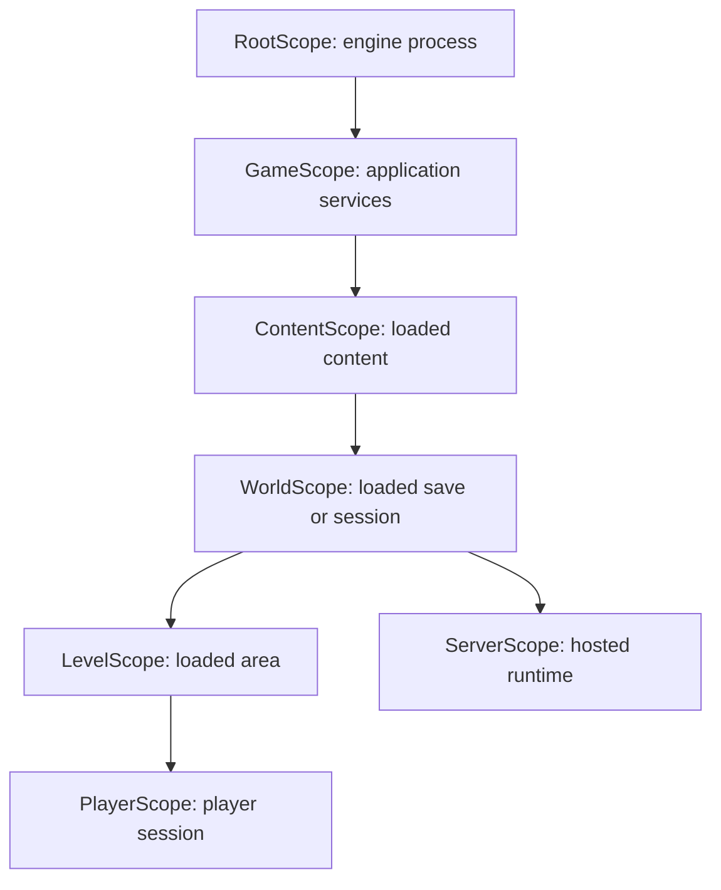

# Game Scope Organization

AlvorKit game code can be organized around explicit dependency-injection
scopes. Each scope owns a coherent lifetime and a vocabulary of services for
one layer of the game. The type names intentionally carry the scope name as a
prefix: `RootState`, `GameFiles`, `ContentLoader`, `WorldPaths`,
`LevelChunks`, and `PlayerRenderer` all tell the reader where the service
belongs.

This convention keeps large games navigable without creating generic
`Manager` or `Service` names. A constructor should usually read like a small
map of the game layer it participates in.

## Scope Prefixes

Use the scope name as the prefix for services owned by that scope.

```csharp
[Level]
public class LevelChunkStreamer(
    LevelChunks chunks,
    LevelConnections connections,
    WorldClock clock)
{
    public void Run() { }
}
```

The prefix is not cosmetic. It declares the lifetime, cache, and ambient
dependencies used by the service.

Common scope prefix choices:

- `Root`: engine root services that live for the game process.
- `Game` or `App`: application-wide configuration, logs, resource roots, and
  discovered content.
- `Content`, `Module`, or `Plugin`: loaded gameplay content, registries,
  asset catalogs, and content-defined factories.
- `World`, `Campaign`, or `Save`: one loaded save, campaign, or persistent
  simulation.
- `Level`, `Scene`, `Zone`, or `Dimension`: one loaded playable area inside a
  larger world.
- `Player`, `Client`, or `Avatar`: one player view, controller, or local
  session.
- `Server` or `Host`: server runtime services for a hosted world.

A voxel game might choose `App -> Module -> World -> Dimension -> Player`.
A space game might choose `Game -> Content -> Campaign -> Sector -> Ship`.
The important thing is that the prefix reflects the lifetime and domain.

Each scope has a matching attribute and scope type:

```csharp
[AttributeUsage(AttributeTargets.Class | AttributeTargets.Struct, Inherited = false)]
public class LevelAttribute : InjectorAttribute;

[Level]
public class LevelScope : InjectorScope<LevelAttribute>;
```

In game projects, put those two marker files in a `Scope/` directory, such as
`Scope/LevelAttribute.cs` and `Scope/LevelScope.cs`. They are registration
plumbing rather than primary domain files, so they should not take the most
visible root slots in a project folder. Keep the namespace flat unless the
project already uses folder-based namespaces.

Types that belong to the scope are marked with the matching attribute:

```csharp
[Level]
public class LevelBlocks;

[Level]
public class LevelMeshBuilder(RootCube cube, LevelBlocks blocks);
```

The scope prefix should normally match the attribute. A type named
`LevelMeshBuilder` should be `[Level]`, not `[World]` or `[Root]`.

## Root Scope

`Root` is the reserved prefix for engine root-scope services. Do not rename
root services just to make them sound more general. The prefix is the signal
that the service is available from the root engine scope.

Examples of root-scope services:

- `RootScope`: the root engine scope itself.
- `RootState`: owns the current top-level `State`.
- `RootScripts`: owns long-lived `Script` instances.
- `RootScreen`, `RootCanvas`, `RootKeyboard`, `RootMouse`: window facades.
- `RootSprites`, `RootFonts`, `RootText`: shared 2D rendering helpers.
- `RootMetrics`, `RootBackbuffer`, `RootScale`: frame and display helpers.
- `RootCube`, `RootQuadIndexBuffer`: shared rendering geometry resources.

Feature packages can add their own root services. For example, a UI package can
contribute `RootUi`, `RootUiMouse`, `RootUiDraw`, and `RootUiScript`. Those are
still root-scope services because the UI tree and its script are process-level
engine participants.

```csharp
[Root]
public class RootHudScript(
    RootCanvas canvas,
    RootHud hud,
    RootHudInput input,
    RootHudDraw draw) : Script
{
    public override Vec2? DrawArea => canvas.Size;

    public override void Frame(double time)
    {
        input.Update(hud);
        hud.Cleanup();
    }

    public override void Draw() => draw.Draw(hud);
}
```

## Scope Tree

A game normally starts at `RootScope`, enters an application-level scope, then
creates narrower scopes as the game loads content, worlds, levels, players, or
server runtime services.



Not every game path needs every scope. A tool might use only
`RootScope -> GameScope`. A dedicated server might use
`GameScope -> ContentScope -> WorldScope -> ServerScope`. A local client
usually adds a level or scene scope plus a player scope once play begins.

## Constructor Order

Primary constructor parameters should be ordered by scope from widest lifetime
to narrowest lifetime. A `[Level]` service that depends on root, world, and
level services should list them in that order: `Root`, then `World`, then
`Level`. A `[Player]` service can continue the chain with `Player` after
`Level`.

```csharp
[Level]
public class LevelSpawnPlanner(
    RootMetrics metrics,
    RootRandom random,
    WorldClock clock,
    WorldMapSize mapSize,
    WorldBiomeCatalog biomes,
    LevelBounds bounds,
    LevelChunks chunks,
    LevelSpawnRules spawnRules,
    LevelSpawnDebugOverlay debugOverlay)
{
    public void Plan() { }
}
```

Within each scope group, put the most general-purpose dependencies first. In
the world group above, `WorldMapSize` is broadly useful state, so it appears
before more specialized catalogs. In the level group, `LevelBounds` and
`LevelChunks` describe the level's basic shape and storage, while
`LevelSpawnRules` and `LevelSpawnDebugOverlay` are narrower feature helpers.

Narrower-scope parameters should appear only when the type itself is in that
narrower scope, or when the type's job is to create, seed, or transition into a
child scope. A world service should not depend on a player service just to keep
an ordering convention; the scope tree still defines what dependencies are
valid.

## Fluent Loading

AlvorKit's injector provides direct scope operations: `Scope<T>()`, `Add`,
`Handler`, `Get<T>()`, and `New<T>()`. It also includes small fluent helpers
for common setup chains: `Run` and `With`. They are extension methods in
`AlvorKit.Injection`, so they preserve the concrete scope type while reading
like part of the scope API.

```csharp
public static class InjectorScopeExtensions
{
    public static T Run<T>(this T scope, Action<T> action) where T : InjectorScope
    {
        action(scope);
        return scope;
    }

    public static T With<T>(this T scope, object instance) where T : InjectorScope
    {
        scope.Add(instance);
        return scope;
    }

    public static T With<T>(this T scope, Func<T, object> create) where T : InjectorScope
    {
        scope.Add(create(scope));
        return scope;
    }
}
```

Use `With` to seed a scope with data that was selected or loaded externally.
Use `Run` for ordered setup steps. The chain returns the same scope, so later
steps can keep adding dependencies, registering handlers, or entering child
scopes.

```csharp
public override void Load() => root.Scope<GameScope>()
    .With(x => new GameContentList(x.Get<GameContentFinder>().Find()))
    .Run(x => x.Scope<GameLoaderScope>()
        .Run(x => x.Get<GameLogLoader>().Run())
        .Run(x => x.Get<GameAssetLoader>().Run()))
    .Run(x => scripts.Add(x.Get<GameScript>()))
    .Run(x => state.Current = x.New<MainMenuState>());
```

The same setup without the fluent helpers is more explicit but equivalent:

```csharp
var game = root.Scope<GameScope>();
game.Add(new GameContentList(game.Get<GameContentFinder>().Find()));

var loader = game.Scope<GameLoaderScope>();
loader.Get<GameLogLoader>().Run();
loader.Get<GameAssetLoader>().Run();

scripts.Add(game.Get<GameScript>());
state.Current = game.New<MainMenuState>();
```

The chain should tell the story in lifetime order:

1. Create the child scope.
2. Seed it with required values.
3. Register scope-local handlers.
4. Run loader scopes.
5. Create or switch to the state that uses the loaded scope.

Keep this setup readable. A load chain is allowed to perform startup side
effects before the final state transition when that is the natural order for the
game. Do not contort ordinary application startup into transactional rollback
code just to cover unrecoverable constructor or loader failures. Add explicit
`try`/`catch` cleanup only when the program is expected to recover and keep
running in-process.

## Loader Scopes

Loader scopes separate setup/teardown objects from the long-lived runtime
scope. `WorldLoaderScope` contains services that load or unload a world, while
`WorldScope` contains the world after it is loaded.

```csharp
var world = content.Scope<WorldScope>()
    .With(paths)
    .With(worldMetadata.Read(paths))
    .Run(x => x.Scope<WorldLoaderScope>()
        .Run(x => x.Get<WorldCoreLoader>().Run())
        .Run(x => x.Get<WorldPersistenceLoader>().Run()));
```

Loader services can depend on their parent scope services. A `LevelLoader` can
consume `LevelChunks`, `LevelPlayerBagMut`, or other `[Level]` services while
itself being cached in `LevelLoaderScope`.

```csharp
[LevelLoader]
public class LevelLoader(
    LevelEntityContext context,
    LevelChunkBagMut chunkBag,
    LevelPlayerBagMut playerBag)
{
    public void Run()
    {
        context.AddBag(chunkBag);
        context.AddBag(playerBag);
    }
}
```

Use loader scopes for ordered side effects, not for every helper method. A
loader should have a small public surface, usually `Run`, `Start`, `Stop`,
`Load`, or `Unload`.

Loader scopes do not need to make each startup step failure-atomic by default.
For normal boot, content load, or state-entry failures, fail fast and let the
process or root loop shutdown path handle teardown. Reserve compensating
unloaders for normal state transitions, hot reload, recoverable loading errors,
or other flows where the application deliberately continues after a failed
load.

## Child Scope Seeding

When a scope represents a concrete runtime selection, seed it immediately. A
level scope should know which level descriptor it owns before its loaders run.

```csharp
var level = world.Scope<LevelScope>()
    .With(new LevelDescriptor(selectedLevel))
    .With(x => new LevelTerrainSource(
        (ITerrainSource)x.Get(selectedLevel.TerrainSourceType)))
    .With(x => new LevelWeatherSource(
        (IWeatherSource)x.Get(selectedLevel.WeatherSourceType)))
    .Run(x => x.Scope<LevelLoaderScope>()
        .Run(x => x.Get<LevelCoreLoader>().Run())
        .Run(x => x.Get<LevelBackendLoader>().Run())
        .Run(x => x.Get<LevelFrontendLoader>().Run()));
```

Use `With(Func<TScope, object>)` when the seed value depends on services inside
the new scope. This keeps dynamic choices local to the scope being initialized.

## Service Bindings

Use `Bind<TImplementation>()` when a scope-specific implementation should
provide one or more marked interfaces or abstract base classes. This is useful
for extension points where the constructor should depend on the public contract,
while the scope decides which concrete provider belongs to that lifetime.

```csharp
[Dimension]
public interface DimensionBiomeGeneratorApi
{
    Biome PickBiome(int x, int z);
}

[Dimension]
public abstract class DimensionBiomeGeneratorBase
{
    public abstract Biome PickBiome(int x, int z);
}

[Dimension]
public class DimensionBiomeGenerator(
    WorldBiomeCatalog catalog,
    DimensionClimate climate) : DimensionBiomeGeneratorBase, DimensionBiomeGeneratorApi
{
    public override Biome PickBiome(int x, int z) =>
        catalog.Pick(climate.Sample(x, z));
}
```

Register the concrete implementation once during scope setup:

```csharp
var dimension = world.Scope<DimensionScope>()
    .Run(x => x.Bind<DimensionBiomeGenerator>())
    .With(dimensionDescriptor)
    .Run(x => x.Get<DimensionLoader>().Run());
```

Both marked service surfaces resolve to the same cached implementation:

```csharp
[Dimension]
public class DimensionTerrain(DimensionBiomeGeneratorApi biomes);

[Dimension]
public class DimensionDebugPanel(DimensionBiomeGeneratorBase biomes);
```

Automatic binding only includes service surfaces that are themselves marked with
the same scope attribute as the implementation. It does not infer an unmarked
interface through a marked abstract base class, and it does not bind interfaces
or base classes that have no scope attribute.

Use `Bind(instance)` when the provider was already created outside the scope,
and use explicit `Bind<TService, TImplementation>()` or `Add<TService>()` for
unmarked contracts that should still resolve through a service type. Explicit
service bindings are exact, so bind each unmarked service surface that
constructors are allowed to request.

## States And Scripts

`State` is the top-level mode currently owned by `RootState`. Assigning
`RootState.Current` unloads the previous state and loads the new one.

```csharp
[Level]
public class LevelEnterAction(RootState state, LevelScope scope)
{
    public void Run(Entity playerEntity)
    {
        scope.Scope<PlayerScope>()
            .With(new PlayerEntity(playerEntity))
            .Run(x => x.Get<PlayerMetrics>().Start())
            .Run(x => state.Current = x.New<PlayerExplorationState>());
    }
}
```

Use `Get<T>()` for cached services owned by a scope. Use `New<T>()` for states,
menus, one-shot actions, or other objects that should be constructed fresh.

`Script` is for long-lived frame/update behavior that runs alongside the
current state. Add scripts through `RootScripts` when a system must stay alive
across state transitions.

```csharp
scripts.Add(game.Get<GameScript>());
scripts.Add(root.Get<RootHudScript>());
```

## Scoped Facades

Scoped facades are useful when a narrower scope should expose a parent resource
under a narrower type. For example, a rendering stack can narrow root graphics
access as scopes become more specific:

```csharp
[Root]
public class RootGraphics(GlLayer gl)
{
    public GlLayer GL => gl;
}

[Game]
public class GameGraphics(RootGraphics graphics)
{
    public GlLayer GL => graphics.GL;
}

[World]
public class WorldGraphics(GameGraphics graphics)
{
    public GlLayer GL => graphics.GL;
}

[Level]
public class LevelGraphics(WorldGraphics graphics)
{
    public GlLayer GL => graphics.GL;
}

[Player]
public class PlayerGraphics(LevelGraphics graphics)
{
    public GlLayer GL => graphics.GL;
}
```

This style avoids passing the whole parent scope into rendering services. A
`PlayerRenderer` can request `PlayerGraphics`, while level mesh transfer code
can request `LevelGraphics`.

## Controls

Named controls can be grouped into a scope-specific record. The constructor
parameter names become the control names, and the root control table supplies
the `Control` instances.

```csharp
public record PlayerControls(
    Control Sprint,
    Control MoveForward,
    Control MoveRight,
    Control MoveBack,
    Control MoveLeft,
    Control Jump,
    Control Crouch) : ControlList;

[Player]
public class PlayerMovement(PlayerControls controls)
{
    public void Update(double time)
    {
        if (controls.MoveForward.Run())
        {
            // Move forward.
        }
    }
}
```

Keep control loading separate from control use. A root-level control loader can
read bindings during application initialization; player and menu code should
consume named `Control` objects.

## Unloading

Teardown is explicit and usually runs through loader scopes again. This keeps
unload ordering visible and lets unloaders resolve the same scoped resources as
loaders.

```csharp
foreach (var level in worldLevels.Loaded)
{
    var loader = level.Scope<LevelLoaderScope>();
    loader.Get<LevelFrontendUnloader>().Run();
    loader.Get<LevelBackendUnloader>().Run();
    loader.Get<LevelCoreUnloader>().Run();
}

var worldLoader = world.Scope<WorldLoaderScope>();
worldLoader.Get<WorldFrontendUnloader>().Run();
worldLoader.Get<WorldPersistenceUnloader>().Run();
worldLoader.Get<WorldCoreUnloader>().Run();
```

Unload in the opposite conceptual order from load: player-facing/frontend
systems first, backend or persistence systems next, core ownership last.

## Practical Rules

- Keep the scope prefix on services that belong to a scope. `RootText` and
  `LevelChunks` are clearer than `TextService` or `ChunkManager`.
- Put each game scope's `*Attribute` and `*Scope` marker files in a `Scope/`
  directory.
- Use `Root*` only for engine root-scope services.
- Pick domain-specific scope names. `Level`, `Scene`, `Ship`, `Match`, and
  `Player` are all better than generic tiers when they match the game.
- Order primary constructor parameters by scope from widest to narrowest, and
  order dependencies within each scope from most general-purpose to most niche.
- Use child scopes to model real lifetimes, not folders or namespaces.
- Use loader scopes for ordered setup and teardown.
- Seed scopes with `With` before running loaders when using the fluent helper.
- Use `Run` to make side effects visible in the loading chain.
- Inject services directly by constructor. Pass a scope only to code whose job
  is to create child scopes, seed them, or switch states.
- Prefer `New<T>()` for transient states, menus, and one-shot objects.
- Prefer `Get<T>()` for cached scoped services.
- Keep optional dependencies in optional loader or asset packages. A root
  control TOML loader should not force every engine user to depend on TOML.
