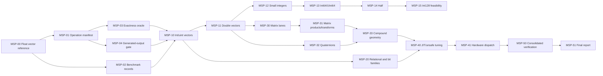

# Epic: Maths SIMD and Runtime Performance

> Status: checkpoint concluded on 2026-07-12. Float, selected double—including
> exact Vec2d/Vec4d Int32 conversion—natural Int32/Int64, matrix, and
> quaternion waves are retained. Unfinished candidates remain documented as an
> optional backlog; no claim is made that every theoretical public-surface
> experiment was completed.

## Related Documents

- [Performance theory and cost model](Maths.PerformanceTheory.md)
- [MSP-00 float-vector baseline](Maths.PerformanceBaseline.md)
- [Exhaustive public-surface manifest](Maths.PerformanceSurfaceManifest.md)
- [Current visual performance report](Maths.PerformanceReport.html)
- [Generated output checks](GeneratedOutputChecks.md)
- [Maths generator](../scripts/AlvorKit.Script.MathsGen/)
- [Maths benchmark project](../demos/AlvorKit.Maths.Demo.Bench/)
- [Maths runtime tests](../tests/AlvorKit.Maths.Test/)

## Outcome

The public maths API and every published value layout remain unchanged. The
generator selects the fastest measured exact implementation for each scalar
family, vector dimension, matrix shape, quaternion operation, and compound
primitive. Hot operations allocate zero managed bytes.

The epic is complete only when the published operation manifest has no
unclassified entries and final Release measurements record every retained and
rejected candidate.

## Priority Order

1. Exact behavior and layout compatibility are absolute gates.
2. Complete public caller latency and throughput select implementations.
3. Zero allocation and safe standalone-value memory access are mandatory.
4. Code size, fallback speed, and generator simplicity select among otherwise
   equivalent candidates.
5. Cold parsing, formatting, and construction are optimized only when profiles
   show material cost.

## Stable Public API

No public type, member, overload, interface, generic constraint, conversion,
field, or layout changes are permitted. In particular, this epic introduces no
new bulk, aligned, padded, or fast-math public types. Workload benchmarks may
exercise internal loops, but production optimizations remain behind existing
members.

## Epic Invariants

### Semantics

- Component results match current scalar expressions by raw bits.
- C# numeric promotion and unchecked narrowing remain authoritative.
- Reduction and matrix multiplication order is not reassociated casually.
- Exceptions and invalid-enum behavior remain identical.
- Hardware-intrinsic-disabled execution remains correct.

### Layout and memory

- `SizeInBytes`, field order, alignment assumptions, and interop layouts remain
  unchanged.
- A partial-register optimization never reads beyond a standalone value.
- Maths hot paths allocate no arrays, collections, closures, iterators, strings,
  boxes, or defensive copies.
- Unsafe code has a measured purpose and a focused layout test.

### Measurement

- Every accepted/rejected performance claim comes from optimized Release code.
- Baseline and candidate run in the same benchmark source and environment.
- Timed loops perform one named operation and write observable preallocated
  output.
- Disassembly and code size are inspected when a result is surprising or when
  a wrapper/helper shape changes.
- A repeatable regression rejects the candidate for that exact shape even when
  other shapes improve.
- The ordinary retention threshold is at least 5%; smaller wins require repeat
  confirmation and a consistently better code shape. A related regression
  above 3% rejects the candidate unless explicitly accepted and recorded.

## Progress

| Task | Status | Result |
| --- | --- | --- |
| MSP-00 | Complete | Float vector benchmark harness and exact SIMD pass; retained gains of roughly 13–75% depending on operation and shape |
| MSP-01 | In progress | Full generated operation inventory and classification manifest; Dot throughput/reduction split complete |
| MSP-02 | Complete | Screen/Quick/Full/Disasm profiles, unique artifact roots, run manifest, environment/source identity, and usage guide |
| MSP-03 | In progress | Numeric vector layout oracle complete; semantic/exception oracle expansion remains |
| MSP-04 | Planned | Repeatable generated-output baseline and diff gate |
| MSP-10 | Complete | `Vec4i`/`Vec4u` screened and retained: every selected operation improved 34–61%; no regressions |
| MSP-11 | Complete | Selected double lanes, Saturate/Step, and exact Vec2d/Vec4d Int32 conversions retained; invalid raw-x86 exceptional semantics rejected |
| MSP-12 | Planned | 8-bit and 16-bit promoted integer vectors |
| MSP-13 | Complete | Natural-register `Vec2/4i64` and `Vec2/4u64` arithmetic, bit, shifts, and bounds retained with exact fallback tests |
| MSP-14 | Planned | Half vectors and conversion-heavy operations |
| MSP-15 | Planned | 128-bit integer feasibility and rejection record |
| MSP-20 | Planned | Relational, mask, equality, bit, shift, min/max, and clamp families |
| MSP-30 | Complete | Column-vector lane operations retained across all float shapes and selected natural-width double shapes |
| MSP-31 | Complete | Ordered float matrix-vector, vector-matrix, and matrix-matrix column products retained; reductions and double products stay scalar |
| MSP-32 | Complete | Packed quaternion lanes plus scalar-ILP compound interpolation/rotation decisions retained for `Quat` and `Quatd` |
| MSP-33 | Planned | Plane, bounds, ray, frustum, and compound geometry callers |
| MSP-40 | Planned | JIT call-shape, inlining, struct-copy, and unsafe reinterpretation experiments |
| MSP-41 | Planned | Hardware-width and x64/ARM64 dispatch experiments |
| MSP-50 | Planned | Full exactness, fallback, allocation, and generated-output verification |
| MSP-51 | Planned | Final measurements and documentation reconciliation |

## Dependency Overview

## Task Summary

| ID | Task | Depends on | Primary result |
| --- | --- | --- | --- |
| MSP-00 | Float vector reference pass | — | Proven workflow and current System.Numerics parity |
| MSP-01 | Published operation manifest | MSP-00 | Every operation classified and owned |
| MSP-02 | Benchmark profiles and result schema | MSP-00 | Reproducible measurements instead of overwritten ad hoc reports |
| MSP-03 | Exactness oracle | MSP-01 | Shared raw-bit, overflow, exception, and layout cases |
| MSP-04 | Generated-output gate | MSP-01 | Before/after review for each emitter lane |
| MSP-10 | Int32/UInt32 vectors | MSP-02–04 | Vector128 candidates for arithmetic and bit operations |
| MSP-11 | Double vectors | MSP-02–04 | Vector128/256 exact floating-point lanes |
| MSP-12 | Small integer vectors | MSP-10 | Promotion-correct narrow or widened SIMD decisions |
| MSP-13 | Int64/UInt64 vectors | MSP-10 | Exact arithmetic/bit candidates and unsupported-operation record |
| MSP-14 | Half vectors | MSP-11 | Conversion/packing cost decisions |
| MSP-15 | Int128/UInt128 vectors | MSP-10 | Measured feasibility or explicit scalar retention |
| MSP-20 | Relational and bit families | MSP-10–15 | Mask conversion and comparison decisions |
| MSP-30 | Matrix lane operations | MSP-11 | Per-column or System matrix implementation decisions |
| MSP-31 | Matrix algebra/transforms | MSP-30 | Complete-caller product and transform decisions |
| MSP-32 | Quaternion operations | MSP-11 | System Quaternion and exact-formula decisions |
| MSP-33 | Compound geometry | MSP-31–32 | End-to-end caller improvements |
| MSP-40 | JIT and unsafe tuning | MSP-20, MSP-33 | Evidence-based call-shape and reinterpretation choices |
| MSP-41 | Hardware dispatch | MSP-40 | Width-specific selection without per-call regressions |
| MSP-50 | Consolidated verification | MSP-41 | Correct, allocation-free generated package |
| MSP-51 | Final report | MSP-50 | Reproducible outcome and remaining frontier |

## Phase 0: Inventory and Measurement Infrastructure

### MSP-01 — Published Operation Manifest

Purpose: make the scope mechanical rather than relying on a handwritten list.

Deliverables:

- Enumerate generated vector, matrix, quaternion, and compound types.
- Enumerate public methods, properties, operators, conversions, and overload
  families from generated Release output.
- Group equivalent overloads by implementation shape without hiding distinct
  promotion or layout behavior.
- Record one owner and classification for every entry.

Acceptance:

- Regeneration produces the same manifest deterministically.
- No generated public operation is unclassified.
- Manifest generation is outside timed benchmark loops.

### MSP-02 — Benchmark Profiles and Durable Results

Purpose: keep comparable results across hundreds of cases without relying on
BenchmarkDotNet's overwritten default report names.

Deliverables:

- Quick development, acceptance, and final measurement profiles.
- Environment metadata and intrinsic-support header.
- Result directories keyed by phase, baseline/candidate identity, runtime, and
  timestamp or explicit run identifier.
- Machine-readable CSV/JSON and concise Markdown summaries.
- Category filters for scalar family, dimension, type shape, and operation.
- Separate Quick, Full, Disasm, dependency-chain, scalar-fallback, and focused
  ISA profiles so comprehensive runs do not attach disassembly to every case.
- A corrected independent Dot-throughput case plus a separately named Dot
  reduction/dependency workload.

Acceptance:

- A baseline and candidate can be compared after later runs.
- Failed or incomplete runs cannot be mistaken for accepted evidence.
- Every timed case reports zero allocation unless allocation is the named
  operation, which no current maths operation is.

### MSP-03 — Cross-Family Exactness Oracle

Purpose: reuse strong semantic cases without creating weak smoke bundles.

Deliverables:

- Raw-bit floating-point component assertions.
- Unchecked integer reference expressions and boundary pattern sets.
- Exception parity helpers.
- Standalone and array layout tests for unsafe candidates.
- Intrinsics-enabled and `DOTNET_EnableHWIntrinsic=0` execution.

Acceptance:

- Each candidate adds focused assertions for the behavior it could break.
- The oracle does not replace operation-specific expected results.

### MSP-04 — Generated-Output Gate

Purpose: review what consumers compile, not only emitter source.

Deliverables:

- Ignored before/after snapshots for the active maths generation.
- Shape-focused diffs for affected types.
- Checks that non-target scalar families remain unchanged.
- Cleanup of disposable snapshots after each decision.

## Phase 1: Remaining Vector Scalar Families

### MSP-10 — Int32 and UInt32

Start with `Vec4i`/`Vec4u`, then `Vec2`, then `Vec3`.

Candidate operations:

- add, subtract, multiply, negate where signed;
- bitwise AND, OR, XOR, complement;
- scalar and uniform shifts supported exactly by intrinsics;
- min, max, clamp, abs where semantics match;
- comparisons and conditional selection;
- component multiply and selected dot/cross operations only when reduction
  order and overflow match.

Division and remainder begin as expected scalar rejections.

### MSP-11 — Double Vectors

Prioritize `Vec2d` with `Vector128<double>` and `Vec4d` with
`Vector256<double>`. `Vec3d` receives split/padded candidates only after the
natural shapes establish the ceiling.

Cover the exact float-vector operation families again; do not assume a float
winner transfers to double. Record AVX/AVX2 availability and fallback code.

Defined Double-to-Int32 conversion follows the public saturating exceptional
contract. Raw x86 conversion timings are non-evidence when NaN, infinity, or
out-of-range behavior differs. The retained Vec2d/Vec4d paths passed the
saturating validation probe and production Quick; Vec3d remained scalar.

### MSP-12 — Int8/UInt8/Int16/UInt16

Compare:

- narrow packed wraparound;
- widening to 32-bit lanes followed by exact narrowing;
- current scalar promoted code.

Each overload must preserve C# promotion. Cheap two-component operations are
expected to remain scalar unless measurement proves otherwise.

### MSP-13 — Int64 and UInt64

Benchmark exact add/subtract/bitwise/shift/comparison support by hardware ISA.
Multiplication, min/max, and comparisons require runtime/architecture-specific
evidence. Division and remainder remain scalar unless the runtime exposes an
exact packed implementation.

### MSP-14 — Half

Measure native Half vector support against widening to float and narrowing back.
NaN payload and double-rounding risks are explicit gates. Retain scalar code
when conversion dominates or changes results.

### MSP-15 — Int128 and UInt128

Treat each component as a scalar multiword integer unless a whole-operation
implementation can reuse 64-bit lanes without changing carry, borrow, shift,
comparison, division, or exception semantics. An explicit measured rejection
is a successful outcome.

### MSP-20 — Relational, Mask, and Bit Families

Boolean public vectors use Boolean fields rather than native all-bits-set
masks. Measure mask materialization and extraction costs. Optimize only shapes
where those costs do not exceed scalar comparisons. Whole-vector equality and
hashing retain their published behavior.

## Phase 2: Matrices and Quaternions

### MSP-30 — Matrix Lane Operations

Benchmark all eighteen shapes for:

- component add/subtract/divide/remainder and scalar operations;
- component multiply, min/max-like helpers, and interpolation;
- transpose, row/column access, and outer product;
- System `Matrix3x2`/`Matrix4x4` bit-cast or conversion paths where layouts
  match exactly;
- per-column vector composition for other shapes.

`Mat3x2` has matching physical field order with System `Matrix3x2`. `Mat4`
requires a transpose-aware conversion; direct bit-casting is ineligible.

### MSP-31 — Matrix Products and Transforms

Measure every valid matrix-product shape, matrix-vector direction, transform,
projection, determinant, inverse, affine inverse, and orthonormalization caller.
Reduction and multiplication order remain fixed unless an existing System path
already owns the contract.

Prefer column-linear-combination products because they preserve each result
component's existing multiplication and addition order while evaluating rows
in parallel. System `Matrix4x4` multiplication is experiment-only: transpose
mapping reverses matrix operands and can also reverse scalar multiplication
operands, affecting NaN payload propagation.

### MSP-32 — Quaternions

Benchmark float and double construction, arithmetic, product, dot, normalize,
inverse, conjugate, interpolation, vector rotation, and matrix conversion.
Float System `Quaternion` paths require bit/layout tests and formula comparison;
double uses internal vector lanes where profitable.

### MSP-33 — Compound Geometry

Benchmark public callers that compose optimized primary types:

- plane transforms and intersections;
- box, sphere, capsule, OBB, triangle, and quad distance/containment helpers;
- ray and segment intersection;
- frustum extraction and containment;
- viewport projection/unprojection.

Prefer gains inherited from vectors/matrices. Add custom intrinsics only when
the full caller remains materially hot after those dependencies improve.

## Phase 3: JIT, Unsafe, and Hardware Width

### MSP-40 — Call-Shape and Unsafe Experiments

Test direct emitted expressions, helper calls, local copies, `in`/value use,
`Unsafe.BitCast`, `Unsafe.As`, `MemoryMarshal`, unaligned loads, and evidence-
based `MethodImplOptions`. Inspect complete caller disassembly. Revert neutral
or noisy annotations.

### MSP-41 — Hardware Dispatch

Prefer portable intrinsic APIs whose JIT expands appropriately. When explicit
dispatch is required, select outside repeated component work and measure both
accelerated and fallback paths. Do not repeat the rejected float-operator guard
pattern that slowed the common accelerated path.

## Phase 4: Final Gates

### MSP-50 — Consolidated Verification

- Regenerate active maths output.
- Inspect all generated shape diffs.
- Run the complete MathsGen and maths test projects.
- Run exactness tests with hardware intrinsics disabled.
- Build the benchmark project in Release.
- Run acceptance and final benchmark profiles.
- Confirm zero allocation and review disassembly/code size for retained lanes.
- Run scoped lint and coverage only when Commit Mode is requested.

### MSP-51 — Final Report

Reconcile this task table, theory document, operation manifest, benchmark
results, retained implementation, rejected experiments, hardware coverage, and
remaining frontier. Report both gains and unchanged scalar lanes; scalar
retention is correct when SIMD cannot win without changing the API or results.
