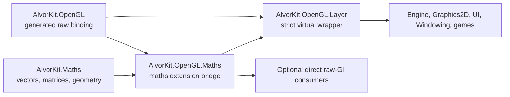

# OpenGL Maths Integration Implementation Plan

## Status and objective

This document is the implementation specification for the accepted
`AlvorKit.OpenGL.Maths` companion package. The package will add allocation-free
OpenGL overloads for AlvorKit vectors, matrices, quaternions, intervals, and
spatial values without changing the generated, C-shaped OpenGL binding.

The first release has a normative catalog of **226 public extension methods**.
The catalog in this document is the API lock for implementation and for the
public-API shape test.

The implementation must satisfy four goals:

1. Let rendering code pass AlvorKit maths values without manually splitting
   components, copying matrices, or casting spans.
2. Preserve the generated `AlvorKit.OpenGL` package as a faithful OpenGL 4.6
   binding.
3. Preserve `GlLayer` virtual dispatch, validation, state tracking, and object
   ownership.
4. Keep every success path suitable for render-loop use: no managed
   allocations, no defensive copies, and no hidden normalization.

This is an additive API. Existing scalar and pointer calls remain valid and
continue to bind to `Gl` instance methods.

## Accepted package boundary

Create a hand-authored package at:

```text
src/AlvorKit.OpenGL.Maths/AlvorKit.OpenGL.Maths.csproj
```

Its dependency graph will be:



Each arrow points from a dependency to its dependent; it does not show runtime
call direction. At runtime, every extension calls a public virtual method on
the supplied `Gl` object. A `GlLayer` receiver therefore dispatches through the
layer override before the raw backend.

The bridge must not reference `AlvorKit.OpenGL.Layer`. That would reverse the
dependency, prevent use with a raw `Gl`, and risk a cycle.

### Why this is a new package

- Putting the methods in `AlvorKit.Maths` would make the general maths package
  depend on OpenGL.
- Putting them in generated `AlvorKit.OpenGL` would mix hand-authored policy
  with registry-derived native bindings.
- Putting them in `AlvorKit.Engine` or `AlvorKit.Graphics2D` would make the API
  unavailable to lower-level OpenGL consumers.
- A companion package makes the dependency optional while allowing
  `AlvorKit.OpenGL.Layer` to expose it transitively to normal AlvorZone
  frontends.

## Audited baseline

The plan is based on the following repository state:

- `AlvorKit.OpenGL` 4.6.14 is generated from the core OpenGL 4.6 profile. Its
  published XML surface contains 707 unique `Gl` method names and 1,033 method
  definitions/overloads.
- The generated binding already supplies pointer and scalar-span convenience
  overloads for the relevant native calls.
- `GlLayer` derives from `GlWrapper` and overrides raw virtual calls such as
  `Viewport`, `Scissor`, `ClearColor`, depth-range methods, and resource
  allocation methods.
- AlvorKit maths provides contiguous explicit/sequential layouts for the
  required `Vec*`, `Quat*`, `Interval*`, and all 18 float/double matrix shapes.
- Generated matrices are column-major, and matrix names use the same
  columns-by-rows convention as OpenGL.
- Existing raw generic span calls already accept maths structs as buffer and
  pixel payloads. The bridge does not need duplicate `BufferData`,
  `BufferSubData`, or generic payload-only APIs.

## Project and file plan

### Source project

Add `src/AlvorKit.OpenGL.Maths/AlvorKit.OpenGL.Maths.csproj` with:

- inherited `net10.0`, nullable analysis, XML documentation, package-on-build,
  root README, and repository metadata from `src/Directory.Build.props`;
- a project reference to `src/AlvorKit.Maths/AlvorKit.Maths.csproj`;
- the same conditional raw OpenGL dependency used by
  `AlvorKit.OpenGL.Layer`:
  - `PackageReference` to `AlvorKit.OpenGL` at `$(GlBindVer)` when the local
    generated project is absent;
  - `ProjectReference` to
    `$(BindingsRoot)\AlvorKit.OpenGL\AlvorKit.OpenGL.csproj` when present;
- package description: `Allocation-free AlvorKit maths overloads for the
  generated OpenGL API.`;
- package tags: `alvorkit;opengl;math;vectors;matrices`;
- project and repository URLs matching `AlvorKit.Maths`;
- project-level usings for `AlvorKit.Maths` and any broadly used runtime
  namespace not already supplied by `src/Directory.Build.props`.

Do not add a bridge-package version property to `AlvorKit.Packages.props`.
That file remains focused on generated inputs and package pins. The bridge uses
the normal hand-authored source-package version inherited from the source
build.

Use namespace `AlvorKit.OpenGL` for every extension. Consumers already import
that namespace for `Gl`, so no additional namespace import is required.

Use conventional `this Gl` extension methods. Do not use C# extension blocks
for the first release; the repository verification workflow currently has
cross-platform Roslyn/formatting compatibility concerns around that syntax.

### Source files

Keep files at the project root and split the surface into cohesive top-level
extension containers:

```text
GlStateMathsExtensions.cs                         18 methods
GlFloatUniformMathsExtensions.cs                  16 methods
GlDoubleUniformMathsExtensions.cs                 16 methods
GlIntUniformMathsExtensions.cs                    12 methods
GlUIntUniformMathsExtensions.cs                   12 methods
GlFloatUniformMatrixMathsExtensions.cs            18 methods
GlDoubleUniformMatrixMathsExtensions.cs           18 methods
GlFloatProgramUniformMatrixMathsExtensions.cs     18 methods
GlDoubleProgramUniformMatrixMathsExtensions.cs    18 methods
GlTextureImageMathsExtensions.cs                   8 methods
GlTextureStorageMathsExtensions.cs                 8 methods
GlTextureSubImageMathsExtensions.cs               12 methods
GlTextureCopyMathsExtensions.cs                    9 methods
GlTextureRegionMathsExtensions.cs                  4 methods
GlFramebufferMathsExtensions.cs                   14 methods
GlComputeMathsExtensions.cs                        1 method
GlVertexFormatMathsExtensions.cs                   9 methods
GlVertexValueMathsExtensions.cs                   15 methods
GlMathsConversions.cs                       internal helper
GlVertexFormatInfo.cs                       internal helper
```

This split avoids a large partial extension class and keeps each hand-authored
source file under the 250-line Commit Mode target. If XML documentation makes
one listed file exceed the target, split it by bound/direct-state-access or
current-program/program-uniform family without changing the public catalog.

Every public method must inherit or link to the matching raw member and retain
the exact C symbol in its remarks, for example `glUniformMatrix4fv`.

### Layer wiring

Update `src/AlvorKit.OpenGL.Layer/AlvorKit.OpenGL.Layer.csproj` to reference the
new bridge project. Keep Layer's existing direct raw-OpenGL dependency because
Layer itself compiles against raw `Gl` members.

The resulting package dependency is intentional:

- consumers of `AlvorKit.OpenGL.Layer` receive `AlvorKit.OpenGL.Maths` and
  `AlvorKit.Maths` transitively;
- consumers using only raw `Gl` add `AlvorKit.OpenGL.Maths` directly;
- pure game packages do not add OpenGL dependencies.

Add the source and test projects to `AlvorKit.slnx`.

## Normative public API catalog

The following table is the exact first-release count.

| Area | Public methods |
|---|---:|
| State, regions, colors, and masks | 18 |
| Vector and quaternion uniforms | 56 |
| Matrix uniforms | 72 |
| Texture and image spatial overloads | 41 |
| Framebuffer and renderbuffer overloads | 14 |
| Compute dispatch | 1 |
| Vertex attribute formats and values | 24 |
| **Total** | **226** |

All signatures below implicitly begin with `this Gl gl`. Parameter order not
replaced by a maths value stays identical to the raw API.

### State, colors, masks, and regions: 18

Add these four color and mask overloads:

```csharp
ClearColor(this Gl gl, Vec4 color);
BlendColor(this Gl gl, Vec4 color);
ColorMask(this Gl gl, Vec4b mask);
ColorMaski(this Gl gl, uint index, Vec4b mask);
```

Add these five viewport overloads:

```csharp
Viewport(this Gl gl, Vec2u size);
Viewport(this Gl gl, Vec2i origin, Vec2u size);
ViewportIndexedf(this Gl gl, uint index, Vec4 viewport);
ViewportIndexedf(this Gl gl, uint index, Vec2 origin, Vec2 size);
ViewportArrayv(this Gl gl, uint first, ReadOnlySpan<Vec4> viewports);
```

For the `Vec4` forms, components mean `(x, y, width, height)`.

Add these five scissor overloads:

```csharp
Scissor(this Gl gl, Vec2u size);
Scissor(this Gl gl, Vec2i origin, Vec2u size);
ScissorIndexed(this Gl gl, uint index, Vec2u size);
ScissorIndexed(this Gl gl, uint index, Vec2i origin, Vec2u size);
ScissorArrayv(this Gl gl, uint first, ReadOnlySpan<Vec4i> scissors);
```

Each `Vec4i` scissor is `(x, y, width, height)`. Because the packed GL array
shape cannot express signed origins and unsigned sizes with one existing maths
type, the implementation scans the span and rejects negative `Z` or `W` with
`ArgumentOutOfRangeException` before dispatch. It does not allocate or rewrite
the span.

Add these four depth-range overloads:

```csharp
DepthRange(this Gl gl, Intervald range);
DepthRangef(this Gl gl, Intervalf range);
DepthRangeIndexed(this Gl gl, uint index, Intervald range);
DepthRangeArrayv(this Gl gl, uint first, ReadOnlySpan<Intervald> ranges);
```

`Min` maps to the near value and `Max` to the far value. Do not reject a
reversed interval; reversed depth ranges are valid OpenGL state.

### Vector uniforms: 48

For each row, add all four schema forms shown after the table.

| GLSL value | Maths type | Scalar name | Array name |
|---|---|---|---|
| `vec2` | `Vec2` | `Uniform2f` | `Uniform2fv` |
| `vec3` | `Vec3` | `Uniform3f` | `Uniform3fv` |
| `vec4` | `Vec4` | `Uniform4f` | `Uniform4fv` |
| `dvec2` | `Vec2d` | `Uniform2d` | `Uniform2dv` |
| `dvec3` | `Vec3d` | `Uniform3d` | `Uniform3dv` |
| `dvec4` | `Vec4d` | `Uniform4d` | `Uniform4dv` |
| `ivec2` | `Vec2i` | `Uniform2i` | `Uniform2iv` |
| `ivec3` | `Vec3i` | `Uniform3i` | `Uniform3iv` |
| `ivec4` | `Vec4i` | `Uniform4i` | `Uniform4iv` |
| `uvec2` | `Vec2u` | `Uniform2ui` | `Uniform2uiv` |
| `uvec3` | `Vec3u` | `Uniform3ui` | `Uniform3uiv` |
| `uvec4` | `Vec4u` | `Uniform4ui` | `Uniform4uiv` |

For every row, `TVector`, `N`, and `Suffix` expand to the closed values in that
row:

```csharp
Uniform{N}{Suffix}(this Gl gl, int location, TVector value);
Uniform{N}{Suffix}v(
    this Gl gl,
    int location,
    ReadOnlySpan<TVector> values);

ProgramUniform{N}{Suffix}(
    this Gl gl,
    GlProgramHandle program,
    int location,
    TVector value);

ProgramUniform{N}{Suffix}v(
    this Gl gl,
    GlProgramHandle program,
    int location,
    ReadOnlySpan<TVector> values);
```

This expansion is 12 rows times four forms, or 48 methods. Unsigned scalar
names use `ui`; unsigned array names use `uiv`.

Do not add `Uniform1*` methods. There is no `Vec1`, and wrapping an ordinary
scalar would not integrate a maths primitive.

### Quaternion uniforms: 8

Add the following exact overloads:

```csharp
Uniform4f(this Gl gl, int location, Quat value);
Uniform4fv(this Gl gl, int location, ReadOnlySpan<Quat> values);
ProgramUniform4f(
    this Gl gl,
    GlProgramHandle program,
    int location,
    Quat value);
ProgramUniform4fv(
    this Gl gl,
    GlProgramHandle program,
    int location,
    ReadOnlySpan<Quat> values);

Uniform4d(this Gl gl, int location, Quatd value);
Uniform4dv(this Gl gl, int location, ReadOnlySpan<Quatd> values);
ProgramUniform4d(
    this Gl gl,
    GlProgramHandle program,
    int location,
    Quatd value);
ProgramUniform4dv(
    this Gl gl,
    GlProgramHandle program,
    int location,
    ReadOnlySpan<Quatd> values);
```

`Quat` and `Quatd` have canonical contiguous `(X, Y, Z, W)` storage matching a
four-component shader value. The documentation must state that OpenGL/GLSL
does not define a quaternion type: these overloads upload the four AlvorKit
quaternion components without normalization, conversion, or reordering.

### Matrix uniforms: 72

The shape mapping is exact:

| OpenGL shape | Float maths type | Double maths type |
|---|---|---|
| `Matrix2` | `Mat2` | `Mat2d` |
| `Matrix2x3` | `Mat2x3` | `Mat2x3d` |
| `Matrix2x4` | `Mat2x4` | `Mat2x4d` |
| `Matrix3x2` | `Mat3x2` | `Mat3x2d` |
| `Matrix3` | `Mat3` | `Mat3d` |
| `Matrix3x4` | `Mat3x4` | `Mat3x4d` |
| `Matrix4x2` | `Mat4x2` | `Mat4x2d` |
| `Matrix4x3` | `Mat4x3` | `Mat4x3d` |
| `Matrix4` | `Mat4` | `Mat4d` |

For each of the nine float rows, add these four forms:

```csharp
UniformMatrix{Shape}fv(this Gl gl, int location, in TMatrix value);
UniformMatrix{Shape}fv(
    this Gl gl,
    int location,
    ReadOnlySpan<TMatrix> values);
ProgramUniformMatrix{Shape}fv(
    this Gl gl,
    GlProgramHandle program,
    int location,
    in TMatrix value);
ProgramUniformMatrix{Shape}fv(
    this Gl gl,
    GlProgramHandle program,
    int location,
    ReadOnlySpan<TMatrix> values);
```

For each double row, add the same forms with the `dv` suffix. This is 18 types
times four forms, or 72 methods.

There is deliberately no `transpose` parameter. AlvorKit matrix storage is
column-major, so every bridge overload forwards `transpose: false`. A caller
that intentionally needs the raw transpose argument retains the generated raw
span overload.

### Texture and image spatial overloads: 41

Every `Vec2u` or `Vec3u` passed to a raw `GLsizei` parameter is validated as
`<= int.MaxValue` before conversion. Signed offsets are forwarded unchanged.

#### Image definitions: 8

```csharp
TexImage2D(
    this Gl gl,
    GlTextureTarget target,
    int level,
    GlInternalFormat internalFormat,
    Vec2u size,
    int border,
    GlPixelFormat format,
    GlPixelType type,
    nint pixels);

TexImage2D<T>(
    this Gl gl,
    GlTextureTarget target,
    int level,
    GlInternalFormat internalFormat,
    Vec2u size,
    int border,
    GlPixelFormat format,
    GlPixelType type,
    ReadOnlySpan<T> pixels)
    where T : unmanaged;

TexImage3D(
    this Gl gl,
    GlTextureTarget target,
    int level,
    GlInternalFormat internalFormat,
    Vec3u size,
    int border,
    GlPixelFormat format,
    GlPixelType type,
    nint pixels);

TexImage3D<T>(
    this Gl gl,
    GlTextureTarget target,
    int level,
    GlInternalFormat internalFormat,
    Vec3u size,
    int border,
    GlPixelFormat format,
    GlPixelType type,
    ReadOnlySpan<T> pixels)
    where T : unmanaged;

CompressedTexImage2D(
    this Gl gl,
    GlTextureTarget target,
    int level,
    GlInternalFormat internalFormat,
    Vec2u size,
    int border,
    int imageSize,
    nint data);

CompressedTexImage3D(
    this Gl gl,
    GlTextureTarget target,
    int level,
    GlInternalFormat internalFormat,
    Vec3u size,
    int border,
    int imageSize,
    nint data);

TexImage2DMultisample(
    this Gl gl,
    GlTextureTarget target,
    int samples,
    GlInternalFormat internalFormat,
    Vec2u size,
    bool fixedSampleLocations);

TexImage3DMultisample(
    this Gl gl,
    GlTextureTarget target,
    int samples,
    GlInternalFormat internalFormat,
    Vec3u size,
    bool fixedSampleLocations);
```

#### Texture storage: 8

```csharp
TexStorage2D(
    this Gl gl,
    GlTextureTarget target,
    int levels,
    GlSizedInternalFormat internalFormat,
    Vec2u size);
TexStorage3D(
    this Gl gl,
    GlTextureTarget target,
    int levels,
    GlSizedInternalFormat internalFormat,
    Vec3u size);
TexStorage2DMultisample(
    this Gl gl,
    GlTextureTarget target,
    int samples,
    GlSizedInternalFormat internalFormat,
    Vec2u size,
    bool fixedSampleLocations);
TexStorage3DMultisample(
    this Gl gl,
    GlTextureTarget target,
    int samples,
    GlSizedInternalFormat internalFormat,
    Vec3u size,
    bool fixedSampleLocations);

TextureStorage2D(
    this Gl gl,
    GlTextureHandle texture,
    int levels,
    GlSizedInternalFormat internalFormat,
    Vec2u size);
TextureStorage3D(
    this Gl gl,
    GlTextureHandle texture,
    int levels,
    GlSizedInternalFormat internalFormat,
    Vec3u size);
TextureStorage2DMultisample(
    this Gl gl,
    GlTextureHandle texture,
    int samples,
    GlSizedInternalFormat internalFormat,
    Vec2u size,
    bool fixedSampleLocations);
TextureStorage3DMultisample(
    this Gl gl,
    GlTextureHandle texture,
    int samples,
    GlSizedInternalFormat internalFormat,
    Vec3u size,
    bool fixedSampleLocations);
```

#### Texture subimages: 12

Add pointer and generic-span forms for each uncompressed 2D/3D call:

```csharp
TexSubImage2D(
    this Gl gl,
    GlTextureTarget target,
    int level,
    Vec2i offset,
    Vec2u size,
    GlPixelFormat format,
    GlPixelType type,
    nint pixels);
TexSubImage2D<T>(
    this Gl gl,
    GlTextureTarget target,
    int level,
    Vec2i offset,
    Vec2u size,
    GlPixelFormat format,
    GlPixelType type,
    ReadOnlySpan<T> pixels)
    where T : unmanaged;

TexSubImage3D(
    this Gl gl,
    GlTextureTarget target,
    int level,
    Vec3i offset,
    Vec3u size,
    GlPixelFormat format,
    GlPixelType type,
    nint pixels);
TexSubImage3D<T>(
    this Gl gl,
    GlTextureTarget target,
    int level,
    Vec3i offset,
    Vec3u size,
    GlPixelFormat format,
    GlPixelType type,
    ReadOnlySpan<T> pixels)
    where T : unmanaged;

TextureSubImage2D(
    this Gl gl,
    GlTextureHandle texture,
    int level,
    Vec2i offset,
    Vec2u size,
    GlPixelFormat format,
    GlPixelType type,
    nint pixels);
TextureSubImage2D<T>(
    this Gl gl,
    GlTextureHandle texture,
    int level,
    Vec2i offset,
    Vec2u size,
    GlPixelFormat format,
    GlPixelType type,
    ReadOnlySpan<T> pixels)
    where T : unmanaged;

TextureSubImage3D(
    this Gl gl,
    GlTextureHandle texture,
    int level,
    Vec3i offset,
    Vec3u size,
    GlPixelFormat format,
    GlPixelType type,
    nint pixels);
TextureSubImage3D<T>(
    this Gl gl,
    GlTextureHandle texture,
    int level,
    Vec3i offset,
    Vec3u size,
    GlPixelFormat format,
    GlPixelType type,
    ReadOnlySpan<T> pixels)
    where T : unmanaged;
```

Add these four compressed pointer forms:

```csharp
CompressedTexSubImage2D(
    this Gl gl,
    GlTextureTarget target,
    int level,
    Vec2i offset,
    Vec2u size,
    GlInternalFormat format,
    int imageSize,
    nint data);
CompressedTexSubImage3D(
    this Gl gl,
    GlTextureTarget target,
    int level,
    Vec3i offset,
    Vec3u size,
    GlInternalFormat format,
    int imageSize,
    nint data);
CompressedTextureSubImage2D(
    this Gl gl,
    GlTextureHandle texture,
    int level,
    Vec2i offset,
    Vec2u size,
    GlInternalFormat format,
    int imageSize,
    nint data);
CompressedTextureSubImage3D(
    this Gl gl,
    GlTextureHandle texture,
    int level,
    Vec3i offset,
    Vec3u size,
    GlInternalFormat format,
    int imageSize,
    nint data);
```

#### Texture copies: 9

The 1D destination calls still benefit from a 2D framebuffer source origin.
Their scalar width stays scalar because AlvorKit has no `Vec1`.

```csharp
CopyTexImage1D(
    this Gl gl,
    GlTextureTarget target,
    int level,
    GlInternalFormat internalFormat,
    Vec2i sourceOrigin,
    uint width,
    int border);
CopyTexImage2D(
    this Gl gl,
    GlTextureTarget target,
    int level,
    GlInternalFormat internalFormat,
    Vec2i sourceOrigin,
    Vec2u size,
    int border);

CopyTexSubImage1D(
    this Gl gl,
    GlTextureTarget target,
    int level,
    int destinationOffset,
    Vec2i sourceOrigin,
    uint width);
CopyTexSubImage2D(
    this Gl gl,
    GlTextureTarget target,
    int level,
    Vec2i destinationOffset,
    Vec2i sourceOrigin,
    Vec2u size);
CopyTexSubImage3D(
    this Gl gl,
    GlTextureTarget target,
    int level,
    Vec3i destinationOffset,
    Vec2i sourceOrigin,
    Vec2u size);

CopyTextureSubImage1D(
    this Gl gl,
    GlTextureHandle texture,
    int level,
    int destinationOffset,
    Vec2i sourceOrigin,
    uint width);
CopyTextureSubImage2D(
    this Gl gl,
    GlTextureHandle texture,
    int level,
    Vec2i destinationOffset,
    Vec2i sourceOrigin,
    Vec2u size);
CopyTextureSubImage3D(
    this Gl gl,
    GlTextureHandle texture,
    int level,
    Vec3i destinationOffset,
    Vec2i sourceOrigin,
    Vec2u size);

CopyImageSubData(
    this Gl gl,
    uint sourceName,
    GlCopyImageSubDataTarget sourceTarget,
    int sourceLevel,
    Vec3i sourceOffset,
    uint destinationName,
    GlCopyImageSubDataTarget destinationTarget,
    int destinationLevel,
    Vec3i destinationOffset,
    Vec3u size);
```

Validate each scalar `uint width` against `int.MaxValue` before calling the raw
method.

#### Texture subregions and reads: 4

```csharp
ClearTexSubImage(
    this Gl gl,
    GlTextureHandle texture,
    int level,
    Vec3i offset,
    Vec3u size,
    GlPixelFormat format,
    GlPixelType type,
    nint data);

InvalidateTexSubImage(
    this Gl gl,
    GlTextureHandle texture,
    int level,
    Vec3i offset,
    Vec3u size);

GetTextureSubImage(
    this Gl gl,
    GlTextureHandle texture,
    int level,
    Vec3i offset,
    Vec3u size,
    GlPixelFormat format,
    GlPixelType type,
    int bufferSize,
    nint pixels);

GetCompressedTextureSubImage(
    this Gl gl,
    GlTextureHandle texture,
    int level,
    Vec3i offset,
    Vec3u size,
    int bufferSize,
    nint pixels);
```

The compressed and `Get*SubImage` calls retain raw buffer sizes and pointers
because OpenGL 4.6.14 has no corresponding safe generic-span convenience
overload. A safe pixel-buffer abstraction belongs in the generated binding,
not in this maths bridge.

### Framebuffers and renderbuffers: 14

Add these four renderbuffer-storage overloads:

```csharp
RenderbufferStorage(
    this Gl gl,
    GlRenderbufferTarget target,
    GlInternalFormat internalFormat,
    Vec2u size);
RenderbufferStorageMultisample(
    this Gl gl,
    GlRenderbufferTarget target,
    int samples,
    GlInternalFormat internalFormat,
    Vec2u size);
NamedRenderbufferStorage(
    this Gl gl,
    GlRenderbufferHandle renderbuffer,
    GlInternalFormat internalFormat,
    Vec2u size);
NamedRenderbufferStorageMultisample(
    this Gl gl,
    GlRenderbufferHandle renderbuffer,
    int samples,
    GlInternalFormat internalFormat,
    Vec2u size);
```

Add pointer and generic-span `ReadPixels` forms, each with explicit and
zero-origin variants:

```csharp
ReadPixels(
    this Gl gl,
    Vec2i origin,
    Vec2u size,
    GlPixelFormat format,
    GlPixelType type,
    nint pixels);
ReadPixels<T>(
    this Gl gl,
    Vec2i origin,
    Vec2u size,
    GlPixelFormat format,
    GlPixelType type,
    Span<T> pixels)
    where T : unmanaged;
ReadPixels(
    this Gl gl,
    Vec2u size,
    GlPixelFormat format,
    GlPixelType type,
    nint pixels);
ReadPixels<T>(
    this Gl gl,
    Vec2u size,
    GlPixelFormat format,
    GlPixelType type,
    Span<T> pixels)
    where T : unmanaged;
```

Add two robust pointer-read variants:

```csharp
ReadnPixels(
    this Gl gl,
    Vec2i origin,
    Vec2u size,
    GlPixelFormat format,
    GlPixelType type,
    int bufferSize,
    nint pixels);
ReadnPixels(
    this Gl gl,
    Vec2u size,
    GlPixelFormat format,
    GlPixelType type,
    int bufferSize,
    nint pixels);
```

Add two origin-plus-size blit forms:

```csharp
BlitFramebuffer(
    this Gl gl,
    Vec2i sourceOrigin,
    Vec2u sourceSize,
    Vec2i destinationOrigin,
    Vec2u destinationSize,
    GlClearBufferMask mask,
    GlBlitFramebufferFilter filter);
BlitNamedFramebuffer(
    this Gl gl,
    GlFramebufferHandle sourceFramebuffer,
    GlFramebufferHandle destinationFramebuffer,
    Vec2i sourceOrigin,
    Vec2u sourceSize,
    Vec2i destinationOrigin,
    Vec2u destinationSize,
    GlClearBufferMask mask,
    GlBlitFramebufferFilter filter);
```

Add two exact-endpoint forms so callers can retain reversed/flipped blits:

```csharp
BlitFramebuffer(
    this Gl gl,
    Vec4i sourceEndpoints,
    Vec4i destinationEndpoints,
    GlClearBufferMask mask,
    GlBlitFramebufferFilter filter);
BlitNamedFramebuffer(
    this Gl gl,
    GlFramebufferHandle sourceFramebuffer,
    GlFramebufferHandle destinationFramebuffer,
    Vec4i sourceEndpoints,
    Vec4i destinationEndpoints,
    GlClearBufferMask mask,
    GlBlitFramebufferFilter filter);
```

An endpoint vector is `(x0, y0, x1, y1)` and is forwarded exactly without
sorting or normalization.

### Compute dispatch: 1

```csharp
DispatchCompute(this Gl gl, Vec3u groupCounts);
```

Do not clamp to context-specific work-group limits. The raw API or `GlLayer`
continues to own context-dependent validation.

### Typed vertex attribute declarations: 9

Add these generic definitions:

```csharp
VertexAttribPointer<TVector>(
    this Gl gl,
    uint index,
    bool normalized,
    int stride,
    nint pointer)
    where TVector : unmanaged;
VertexAttribIPointer<TVector>(
    this Gl gl,
    uint index,
    int stride,
    nint pointer)
    where TVector : unmanaged;
VertexAttribLPointer<TVector>(
    this Gl gl,
    uint index,
    int stride,
    nint pointer)
    where TVector : unmanaged;

VertexAttribFormat<TVector>(
    this Gl gl,
    uint attributeIndex,
    bool normalized,
    uint relativeOffset)
    where TVector : unmanaged;
VertexAttribIFormat<TVector>(
    this Gl gl,
    uint attributeIndex,
    uint relativeOffset)
    where TVector : unmanaged;
VertexAttribLFormat<TVector>(
    this Gl gl,
    uint attributeIndex,
    uint relativeOffset)
    where TVector : unmanaged;

VertexArrayAttribFormat<TVector>(
    this Gl gl,
    GlVertexArrayHandle vertexArray,
    uint attributeIndex,
    bool normalized,
    uint relativeOffset)
    where TVector : unmanaged;
VertexArrayAttribIFormat<TVector>(
    this Gl gl,
    GlVertexArrayHandle vertexArray,
    uint attributeIndex,
    uint relativeOffset)
    where TVector : unmanaged;
VertexArrayAttribLFormat<TVector>(
    this Gl gl,
    GlVertexArrayHandle vertexArray,
    uint attributeIndex,
    uint relativeOffset)
    where TVector : unmanaged;
```

The internal closed-generic format lookup supports only these exact families:

| Maths family | Normal format | Integer format | Long format |
|---|---|---|---|
| `Vec2/3/4` | `Float` | unsupported | unsupported |
| `Vec2/3/4d` | `Double` | unsupported | `Double` |
| `Vec2/3/4h` | `HalfFloat` | unsupported | unsupported |
| `Vec2/3/4i8` | `Byte` | `Byte` | unsupported |
| `Vec2/3/4u8` | `UnsignedByte` | `UnsignedByte` | unsupported |
| `Vec2/3/4i16` | `Short` | `Short` | unsupported |
| `Vec2/3/4u16` | `UnsignedShort` | `UnsignedShort` | unsupported |
| `Vec2/3/4i` | `Int` | `Int` | unsupported |
| `Vec2/3/4u` | `UnsignedInt` | `UnsignedInt` | unsupported |

Reject bool, 64-bit integer, 128-bit integer, arbitrary unmanaged, and packed
`2_10_10_10` types before calling `Gl`. Normal-format integer vectors remain
valid because the normal pointer/format API can convert integer storage to a
floating shader input; the caller controls normalization.

The helper must cache component count and raw enum once per closed `TVector`.
Unsupported combinations throw a direct `NotSupportedException` from the
extension call, not a `TypeInitializationException` from a failing static
constructor.

### Constant vertex attribute values: 15

```csharp
VertexAttrib2f(this Gl gl, uint index, Vec2 value);
VertexAttrib3f(this Gl gl, uint index, Vec3 value);
VertexAttrib4f(this Gl gl, uint index, Vec4 value);

VertexAttrib2d(this Gl gl, uint index, Vec2d value);
VertexAttrib3d(this Gl gl, uint index, Vec3d value);
VertexAttrib4d(this Gl gl, uint index, Vec4d value);

VertexAttribI2i(this Gl gl, uint index, Vec2i value);
VertexAttribI3i(this Gl gl, uint index, Vec3i value);
VertexAttribI4i(this Gl gl, uint index, Vec4i value);

VertexAttribI2ui(this Gl gl, uint index, Vec2u value);
VertexAttribI3ui(this Gl gl, uint index, Vec3u value);
VertexAttribI4ui(this Gl gl, uint index, Vec4u value);

VertexAttribL2d(this Gl gl, uint index, Vec2d value);
VertexAttribL3d(this Gl gl, uint index, Vec3d value);
VertexAttribL4d(this Gl gl, uint index, Vec4d value);
```

Normalized byte/short constant setters and packed constant formats are
deferred. Their native surface is irregular and no audited consumer needs
them.

## Deliberate exclusions

### No direct `Maths.Viewport` overload

Do not add this superficially attractive signature:

```csharp
Viewport(this Gl gl, Viewport viewport);
```

`AlvorKit.Maths.Viewport` stores floating `Box2 Bounds` plus an `Intervalf`
depth range. `glViewport` takes integer origin/extent and does not update depth.
An overload would have to truncate values, ignore depth, or conceal two state
changes.

Callers instead use `viewport.ToViewportVector()` with an indexed floating
viewport overload when appropriate, and apply `viewport.Depth` separately with
`DepthRangef`.

### No `Box2i` region overloads

`Box2i.Max` is documented as inclusive. OpenGL viewport/scissor/read calls use
origin plus extent, while blits use endpoint pairs and may be reversed to flip
an image. Converting `Box2i` would require an inclusive-bound adjustment, risk
overflow, and erase the direction of flipped endpoints.

Use origin-plus-size vectors or the explicitly documented `Vec4i` endpoint
forms.

### No enum-dependent vector pointer arities

Do not add unrestricted `Vec4` overloads for:

- `ClearBuffer*v` or `ClearNamedFramebuffer*v`;
- `TexParameter*v`, `TextureParameter*v`, or `SamplerParameter*v`;
- `PatchParameterfv` or `PointParameterfv`;
- query/output methods such as `GetUniform*`, `GetVertexAttrib*`, and texture
  parameter queries.

The number or interpretation of pointed values depends on another enum or on
shader state. A fixed vector overload would compile for invalid combinations.
If color-clear helpers are later desirable, add distinctly named
`ClearColorBuffer` and `ClearNamedColorBuffer` methods rather than weakening
the raw-name contract.

### No arbitrary geometry-to-uniform mapping

Do not upload planes, rays, spheres, frustums, triangles, or boxes merely
because their storage could fit a shader vector. Their representation is
application-specific. Quaternions are the one included domain value because
AlvorKit defines a canonical contiguous `(X, Y, Z, W)` representation and the
method documents that representation explicitly.

### No duplicate payload-only methods

Do not add bridge overloads when the only distinction would be
`ReadOnlySpan<Vec*>` or another unmanaged payload for a raw generic span API.
The existing `BufferData`, `BufferSubData`, mapped-memory, and generic pixel
payload methods already accept those structs.

One-dimensional image/storage APIs stay scalar unless another parameter in the
same call is genuinely two-dimensional, as with framebuffer source origins in
the included 1D copy methods.

## Implementation contracts

### Dispatch

- Every public receiver is `this Gl gl`, never `GlLayer`.
- Call the matching public virtual member on `gl`.
- Never access `GlLayer.Inner`, call a backend object, or invoke a native
  function directly.
- Never use an extension from inside a same-name `GlLayer` override. Layer
  implementation and reset code remains on the raw scalar surface.
- Test at least color, viewport, scissor, depth range, and renderbuffer paths
  through a real `GlLayer` wrapper.

### Scalar and layout forwarding

- By-value vectors and masks unpack components and call the scalar virtual
  method directly.
- `ReadOnlySpan<Vec*>`, `ReadOnlySpan<Quat*>`,
  `ReadOnlySpan<Intervald>`, and matrix spans are reinterpreted with
  `MemoryMarshal.Cast`; do not allocate or copy.
- A single `in Mat*` is exposed as a one-element read-only span with
  `MemoryMarshal.CreateReadOnlySpan`, cast to its scalar type, and forwarded to
  the generated raw span overload.
- Matrix methods always pass `transpose: false`.
- Counts come from the number of maths values, never the resulting scalar-span
  length. Where the raw span helper infers count, tests must prove the inferred
  value for every shape.
- Empty spans remain valid and forward count zero without dereferencing data.
- `Vec4b` is unpacked component-by-component; do not reinterpret bool-vector
  memory.

### Dimension conversion

`GlMathsConversions` will provide central, non-allocating conversion helpers
for `uint`, `Vec2u`, and `Vec3u` values that feed `GLsizei`:

1. Compare every component with `int.MaxValue`.
2. Throw `ArgumentOutOfRangeException` naming the public parameter if any
   component is too large.
3. Convert components with ordinary casts after validation.
4. Preserve zero; individual OpenGL calls decide whether zero is legal.

Do not clamp, sort, normalize, or silently coerce caller values. Signed offsets,
floating viewport values, colors, depth ranges, and exact blit endpoints are
forwarded unchanged.

### Allocation discipline

Success paths must contain no arrays, `List<T>`, LINQ, iterator blocks,
closures, boxing, string formatting, or defensive copies. Exceptions may
allocate. Do not add receiver null checks beyond normal non-nullable analysis.

Do not apply `AggressiveInlining` indiscriminately. It may be used on a small
measured conversion or format-lookup path if it materially improves generated
code.

### Hand-authored implementation

Implement the first release by hand. Do not modify OpenGL bindgen or MathsGen.

The state, spatial, signedness, overflow, and exclusion decisions cannot be
derived safely from registry arity. A new generator would add templates,
generator tests, source-distribution policy, and output review work for a
finite surface that can be protected by an API-catalog test.

Because this release does not change a generator or generated output, the
generated-output snapshot workflow is not required. If a later release
automates the repetitive families, templates must live under `res/templates`,
generation must not run during build/restore, and
`docs/GeneratedOutputChecks.md` applies.

## Usage examples

### State and layer dispatch

```csharp
Vec2u framebufferSize = canvas.Size;
Vec4 clear = (0.05f, 0.07f, 0.1f, 1f);

gl.Viewport(framebufferSize);
gl.ClearColor(clear);
gl.Clear(GlClearBufferMask.ColorBufferBit);
```

The code is identical for `Gl` and `GlLayer`. With a `GlLayer`, the extension's
call to the virtual scalar method updates the layer's tracked state.

### Uniform vectors and matrices

```csharp
Vec3 lightDirection = (0f, -1f, 0.25f);
gl.ProgramUniform3f(program, lightDirectionLocation, lightDirection);

Mat4 clipFromWorld = projection * view;
gl.ProgramUniformMatrix4fv(program, matrixLocation, in clipFromWorld);

ReadOnlySpan<Mat4> jointMatrices = mesh.JointMatrices;
gl.UniformMatrix4fv(jointMatricesLocation, jointMatrices);
```

No consumer-owned `stackalloc`, `CopyToColumnMajor`, or
`MemoryMarshal.Cast<Mat4, float>` is needed.

### Texture upload

```csharp
Vec2i destinationOffset = (atlasX, atlasY);
Vec2u glyphSize = ((uint)glyphWidth, (uint)glyphHeight);

gl.TexSubImage2D(
    GlTextureTarget.Texture2D,
    level: 0,
    destinationOffset,
    glyphSize,
    GlPixelFormat.Red,
    GlPixelType.UnsignedByte,
    glyphPixels);
```

The bridge groups offset and size. Pixel-span pinning and forwarding remain the
responsibility of the generated raw overload.

### Typed vertex layout

```csharp
gl.VertexAttribPointer<Vec3>(
    index: 0,
    normalized: false,
    stride: PositionColorVertex.Size,
    pointer: PositionColorVertex.PositionOffset);

gl.VertexAttribPointer<Vec4u8>(
    index: 1,
    normalized: true,
    stride: PositionColorVertex.Size,
    pointer: PositionColorVertex.ColorOffset);
```

The vector type supplies component count and storage type. The normal-format
method retains the explicit normalization choice.

### Maths viewport caveat

```csharp
Viewport viewport = camera.Viewport;

gl.ViewportIndexedf(index: 0, viewport.ToViewportVector());
gl.DepthRangef(viewport.Depth);
```

This explicit pair avoids pretending that one OpenGL viewport call also
applies the maths viewport's depth interval.

## Test implementation plan

Create:

```text
tests/AlvorKit.OpenGL.Maths.Test/AlvorKit.OpenGL.Maths.Test.csproj
```

Reference the bridge source project and `AlvorKit.OpenGL.Layer`. The Layer
reference is used only for dispatch-integration tests. Add project-level usings
for `AlvorKit.Maths`, `AlvorKit.OpenGL`, and `AlvorKit.OpenGL.Layer`.

Use generated `GlNoop` subclasses and override only calls observed by a test.
No test requires a native OpenGL library, context, window, or graphics device.

Suggested test files:

```text
Support/RecordingStateGl.cs
Support/RecordingUniformGl.cs
Support/RecordingMatrixGl.cs
Support/RecordingSpatialGl.cs
Support/CountingGl.cs
StateMathsExtensionsTest.cs
UniformMathsExtensionsTest.cs
MatrixMathsExtensionsTest.cs
TextureMathsExtensionsTest.cs
FramebufferMathsExtensionsTest.cs
ComputeMathsExtensionsTest.cs
VertexMathsExtensionsTest.cs
GlLayerMathsDispatchTest.cs
LayoutContractTest.cs
AllocationTest.cs
PublicApiShapeTest.cs
```

Every runnable test method receives the required XML summary.

### Required behavior coverage

- Every by-value vector, quaternion, mask, and constant vertex family forwards
  distinct components in exact order.
- Every vector/quaternion span family forwards two or more values with the
  correct native vector count and scalar order.
- Every float and double matrix shape forwards non-symmetric values in
  column-major order with `transpose == false`.
- Single `in` matrix calls do not copy, mutate, or allocate.
- Empty spans forward safely.
- Viewport, scissor, texture, framebuffer, copy, and read origins/extents map
  to the correct raw argument positions.
- `uint` dimensions at `int.MaxValue` forward; `int.MaxValue + 1u` throws before
  backend invocation.
- `ScissorArrayv` rejects a negative packed width/height before backend
  invocation.
- Reversed depth intervals and exact blit endpoint vectors are not normalized.
- Every supported vertex storage family selects the exact raw component count
  and enum for normal, integer, and long formats.
- Every unsupported vertex type/format combination throws before backend
  invocation and does not surface `TypeInitializationException`.
- `Gl gl = new GlLayer(recordingBackend)` calls through the layer override for
  state and storage families, preserving set/reset and conflict behavior.
- A warmed-up loop over representative scalar, matrix, span, spatial, and
  vertex-format calls reports zero bytes from
  `GC.GetAllocatedBytesForCurrentThread`.

### Layout contract coverage

Assert unmanaged size, component count, and scalar-cast length for every type
used in reinterpretation:

- `Vec2/3/4`, `Vec2/3/4d`, `Vec2/3/4i`, and `Vec2/3/4u`;
- `Quat` and `Quatd`;
- `Intervald`;
- all nine float and nine double matrix shapes.

`Vec4b` needs component-order coverage but no cast-layout assertion because it
is deliberately unpacked.

### Public API shape coverage

`PublicApiShapeTest` will reflect over the bridge assembly and compare all
public extension signatures with a checked-in expected catalog. It must verify:

- exactly 226 public extension definitions;
- receiver type, method name, generic arity, parameter order, `in` modifiers,
  and span element types;
- all 48 vector-uniform, 8 quaternion, and 72 matrix expansions;
- absence of forbidden `Viewport(Viewport)`, `Box2i`, and enum-dependent
  overloads.

This is a compatibility invariant, not a coverage-only smoke test.

## AlvorKit migration plan

Migrate call sites only when a maths value already exists or the grouping
removes real conversion/copy code. Do not create throwaway vectors around
unrelated scalar literals merely to exercise the API.

### Production code

| Location | Migration |
|---|---|
| `src/AlvorKit.Engine/RootBackbuffer.cs` | Pass existing `Vec2u size` to `Viewport` and existing `Vec4 color` to `ClearColor`. |
| `src/AlvorKit.Engine.Loop/RootGraphics2D.cs` | Pass `canvas.Size` to `Viewport`. |
| `src/AlvorKit.Engine/Rendering/RenderProgram3D.cs` | Remove the 16-float `stackalloc` and copy; pass `in Mat4` to `ProgramUniformMatrix4fv`. |
| `src/AlvorKit.Engine/Rendering/PositionColorVertex.cs` | Replace component-count/type pairs with `VertexAttribPointer<Vec3>`. |
| `src/AlvorKit.Engine/Rendering/PositionColorTextureVertex.cs` | Use typed `Vec3`, `Vec3`, and `Vec2` declarations. |
| `src/AlvorKit.Graphics2D/Texture2D.cs` | Pass the existing `Vec2u size` to `TexImage2D`; retain byte-count validation. |
| `src/AlvorKit.Graphics2D/SpriteBatch/SpriteBatchShaderDescriptor.cs` | Use typed `Vec2`, `Vec4`, and `Vec2` declarations; keep the one-component float declaration raw. |
| `src/AlvorKit.Graphics2D.Fonts/FontAtlas.Placement.cs` | Use `Vec2i` destination offset and the existing `Vec2u` glyph size with `TexSubImage2D`. |
| `src/AlvorKit.Graphics2D.Fonts/FontAtlas.Pack.cs` | Pass the texture's existing `Vec2u` size to `Viewport`. |
| `src/AlvorKit.Windowing.Agent/AgentWindowScreenshot.cs` | After its existing minimum-one normalization, pass a `Vec2u` size to the zero-origin `ReadPixels` span overload. |

Leave `FontTablet.cs` scalar unless it gains a named size for another reason;
wrapping two identical constants adds no clarity.

### Demos and templates

Migrate the new-game template first so newly generated games demonstrate the
bridge:

- `res/templates/new-game/source/src/AlvorStarter.App.Frontend/AppGlTriangle.cs`
  passes `canvas.Size` to `Viewport`.

Then migrate maths-backed call sites in:

- Engine Triangle, Triangle3D, and TextureCube demos;
- AzureTentacle scene viewport, matrix uploads, joint-matrix span, and vertex
  declarations;
- TestCube matrix upload and vertex declarations;
- GlyphRenderer vector uniform and vertex declarations;
- AlvorEye demo vertex declarations.

In AzureTentacle, change `AnimatedGlbMesh.JointMatrices` from
`ReadOnlySpan<float>` to `ReadOnlySpan<Mat4>` and remove the consumer-owned
`MemoryMarshal.Cast`. In TestCube, retain the `Mat4` and remove its temporary
scalar buffer.

Viewport callbacks that expose only signed scalar dimensions remain raw unless
the code already validates them and creates a meaningful `Vec2u`. Literal
`ClearColor` calls generally remain raw; `ClearColor(Vec4)` is most valuable
when a color vector already exists.

Do not migrate:

- `AlvorKit.OpenGL.Demo.HelloTriangle`, whose purpose is to teach the raw
  C-shaped `Gl` surface;
- `AlvorKit.Engine.Demo.RawApis`, whose purpose is explicitly raw API use;
- `src/AlvorKit.OpenGL.Layer/**`, where raw overrides and `base.*` calls define
  the tracking boundary;
- existing Layer tests that intentionally verify raw overrides and reset
  behavior.

## Sibling AlvorZone rollout

`AlvorGalaga`, `AlvorInvaders`, `AlvorPong`, and `Rombadil` have no direct
scalar OpenGL maths seams. They receive the bridge transitively from Layer and
need compatibility builds but no source migration.

`AlvorPong.App.Frontend` also has a direct raw OpenGL reference despite already
referencing Layer. Leave that unrelated dependency unchanged in this work.

### Craftdig source migrations

Craftdig is the only sibling with direct migration sites.

| Location | Migration |
|---|---|
| `Craftdig.Dimension.Frontend/Block/DimensionBlockProgram.cs` | Pass the existing `Vec3` to `ProgramUniform3f`. |
| `Craftdig.Dimension.Frontend/Block/BlockVertex.cs` | Replace three scalar declarations with `VertexAttribPointer<Vec3>`. |
| `Craftdig.Menus.Singleplayer/PlayerScreenshot.cs` | Pass existing `Vec2u size` to `RenderbufferStorage` and zero-origin `ReadPixels`. Keep width/height locals needed by allocation and PNG encoding. |
| `Craftdig.Module.Frontend/Faces/ModuleFaceAtlas.cs` | Use `Vec3i(0, 0, index)` plus a `Vec3u` extent for `TexSubImage3D`; use a `Vec3u` extent for `TexImage3D`. |
| `Craftdig.Player.Frontend/Renderer/PlayerRenderer.cs` | Pass the existing `Vec4 clear` to `ClearColor`. Retain the scalar viewport call until its floating canvas has been explicitly validated and converted to `Vec2u`. |

Do not change `PlayerRenderer.Render(Vec2 canvas)` solely for this migration;
its projection calculation genuinely consumes a floating size.

### Sibling dependency compatibility

The following frontend paths already reach Layer and therefore the bridge:

- `AlvorGalaga.App.Frontend`;
- `AlvorInvaders.App.Frontend` and `AlvorInvaders.Run.Frontend`;
- `AlvorPong.App.Frontend`;
- `Rombadil`;
- `Craftdig.App.Frontend` through `AlvorKit.Engine.Loop`.

No sibling has `DisableTransitiveProjectReferences` enabled. Existing global
`AlvorKit.OpenGL` usings make the extension methods discoverable.

## Documentation deliverables

Implementation includes three documentation changes beyond this plan:

1. Add `docs/OpenGLMaths.md` as the public package guide. Cover raw `Gl` and
   `GlLayer`, package references, zero-copy matrix/count semantics, extent
   overflow, the maths `Viewport` caveat, vertex type support, and exclusions.
2. Add a concise package/link entry to the root README.
3. Add XML documentation to every extension and public extension-container
   type. Each member links to the raw overload and names its native C symbol.

Public documentation must describe only published API behavior. Generator and
maintainer details stay in this implementation plan.

## Implementation phases

### Phase 1: scaffold and API lock

1. Add source and test projects to `AlvorKit.slnx`.
2. Add project metadata and conditional raw-binding references.
3. Add the expected 226-signature fixture to `PublicApiShapeTest`.
4. Add conversion, layout, and vertex-format helpers with direct unit tests.

### Phase 2: state and shader values

1. Implement the 18 state/region methods.
2. Implement the 56 vector/quaternion uniform methods.
3. Implement all 72 matrix methods.
4. Add forwarding, span-count, empty-span, layout, transpose, and allocation
   tests before consumer migrations.

### Phase 3: spatial and vertex APIs

1. Implement the 41 texture/image methods.
2. Implement the 14 framebuffer/renderbuffer methods.
3. Implement compute dispatch.
4. Implement the 9 typed vertex declarations and 15 constant values.
5. Add overflow, offset/extent, exact-endpoint, type-mapping, unsupported-type,
   and allocation tests.

### Phase 4: Layer integration

1. Add the bridge reference to Layer while retaining Layer's direct raw
   dependency.
2. Add actual `GlLayer` dispatch and state-conflict tests.
3. Verify the source project in local-generated and published-package fallback
   modes.

### Phase 5: AlvorKit migration

1. Migrate production code, starting with `RootBackbuffer` and
   `RenderProgram3D`.
2. Migrate strict-layer demos and the new-game template.
3. Preserve the two deliberately raw demos and Layer internals.
4. Re-run the direct-call audit and classify every remaining scalar call as a
   deliberate raw use or a deferred no-`Vec1`/enum-dependent case.

### Phase 6: AlvorZone rollout

1. Publish or make locally available the raw binding version used by the
   bridge.
2. Publish `AlvorKit.OpenGL.Maths`.
3. Publish/update `AlvorKit.OpenGL.Layer` with the bridge dependency.
4. Migrate Craftdig's listed sites.
5. Build Galaga, Invaders, Pong, and Rombadil frontends as transitive
   compatibility checks.

### Phase 7: public documentation and release verification

1. Add `docs/OpenGLMaths.md`, README entry, and complete XML documentation.
2. Pack the bridge in Release and inspect the `.nuspec` dependency graph.
3. Run focused coverage and scoped lint in Commit Mode.
4. Confirm source/API file size, documentation, allocation, and public-catalog
   gates before publishing.

## Verification commands

During implementation, use focused checks:

```powershell
dotnet build src\AlvorKit.OpenGL.Maths\AlvorKit.OpenGL.Maths.csproj
dotnet test tests\AlvorKit.OpenGL.Maths.Test\AlvorKit.OpenGL.Maths.Test.csproj
dotnet test tests\AlvorKit.OpenGL.Layer.Test\AlvorKit.OpenGL.Layer.Test.csproj
```

Verify the local-generated dependency mode after preparing only the relevant
outputs:

```powershell
dotnet run --project scripts\AlvorKit.Script.MathsGen -- --setup-local
dotnet run --project scripts\AlvorKit.Script.Bindgen -- opengl --strict --setup-local
```

Also build with a non-active `BindingsRoot` and
`UseLocalMathsPrimitives=false` to exercise published-package fallback. Do not
delete or replace another worker's generated output to perform this check.

In Commit Mode, run focused coverage:

```powershell
dotnet run --project scripts\AlvorKit.Script.TestCoverage -- --agent `
  --source-project AlvorKit.OpenGL.Maths `
  --test-project AlvorKit.OpenGL.Maths.Test
```

Then run scoped lint over the bridge source/tests, Layer project file,
`AlvorKit.slnx`, and changed documentation/template files. Build affected
Engine, Graphics2D, Fonts, Windowing.Agent, demos, and the full solution after
migrations.

For sibling verification, build Craftdig's four affected frontend projects,
then representative frontend projects from Galaga, Invaders, Pong, and
Rombadil.

No native package build or native dependency installation is needed or
permitted for this work.

## Release order and compatibility

If packages are published independently, release in this order:

1. the raw `AlvorKit.OpenGL` version consumed by the bridge;
2. `AlvorKit.OpenGL.Maths`;
3. `AlvorKit.OpenGL.Layer` with its new dependency;
4. downstream AlvorKit runtime packages and sibling frontends.

Existing scalar calls are source-compatible. Instance methods take precedence
over extensions, so an existing call cannot silently change overload binding.
The only new exception behavior is on new unsigned-extent overloads when a
component exceeds `int.MaxValue`, and on explicitly validated packed scissor or
unsupported vertex-format calls.

## Completion criteria

The implementation is complete when all of the following are true:

- the bridge and test projects exist and are present in `AlvorKit.slnx`;
- the public-API test observes exactly 226 intended extension definitions;
- every method has native-symbol-linked XML documentation;
- all vector, quaternion, interval, and matrix layout/count tests pass;
- representative hot paths allocate zero bytes after warm-up;
- oversized dimensions and unsupported vertex types fail before backend calls;
- actual `GlLayer` integration tests prove tracked virtual dispatch;
- the bridge builds against local-generated and published binding/math modes;
- the packed bridge and Layer packages contain the intended dependency graph;
- listed AlvorKit and Craftdig migrations are complete;
- deliberately raw demos, Layer internals, and payload-only APIs remain raw;
- sibling frontend compatibility builds pass;
- the public guide and README entry are published with the package.
